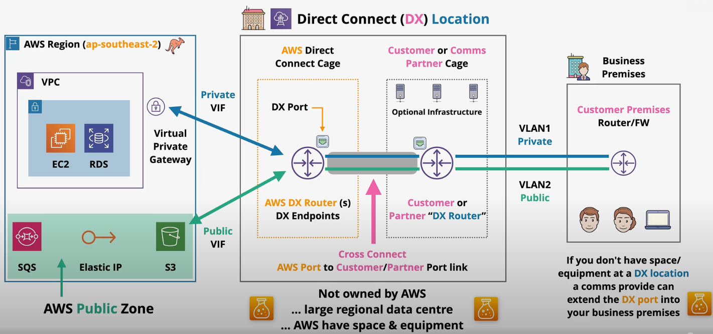
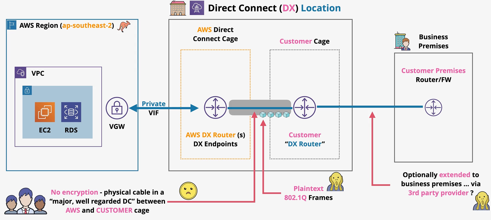
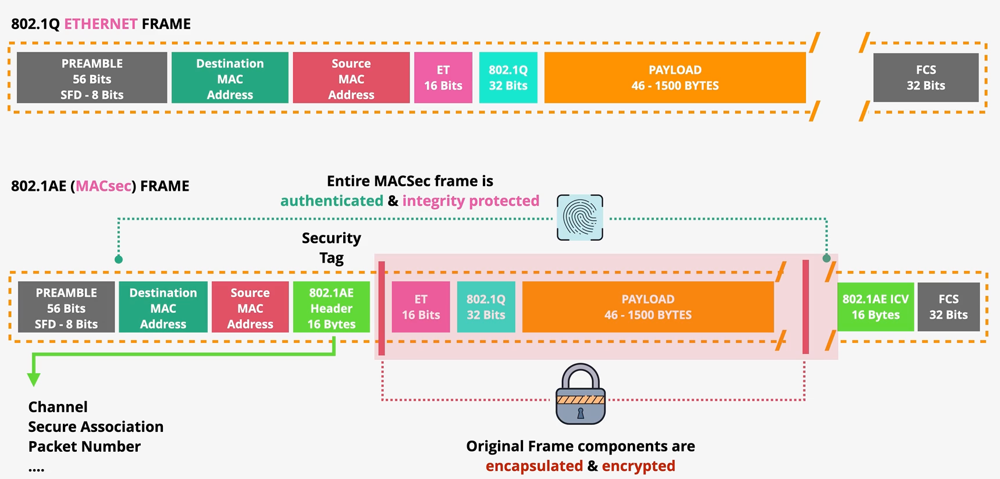

# Direct Connect

**Direct Connect (DX)** is a physical connection between a business premises, a DX location, and an AWS region.

DX allows for 1, 10, and 100 Gbps connections.

When you enable DX in AWS, you're simply reserving a port allocation at the DX location. It is the customers responsibility to physically connect to the DX location.

DX costs include hourly charges and outbound data transfer charges.

DX provides low and consistent latency. It also enables connection to AWS private services (VPCs) and AWS public services (e.g., S3, DynamoDB) without traversing the public internet.

DX locations are large regional data centers that are not owned by AWS, but rent space and equipment to AWS.

If you don't have space or equipment at a DX location, a comms partner can extend the DX port into your business premises.

DX requires some specific configurations:
- auto-negotiation must be disabled
- port speed and full-duplex manually set
- Must support BGP and BGP MD5 authentication

Additionally, there are some cable requirements:
- 1 Gbps connection: 1000BASE-LX (1310 nm) transceiver
- 10 Gbps connection: 10GBASE-LR (1310 nm) transciever
- 100 Gbps connection: 100GBASE-LR4

## DX Limitations
- DX uses physical cables so there is no inherent resilience based on a damage cable.
- DX only supports single-mode fibre (not copper wires).
- The time it takes AWS to allocate the port and the time it takes to physically connect your on-prem location to the DX location results in weeks to months of lead time.

## MACsec

By default, traffic flowing through a DX is unencrypted. Historically, the solution has been to run an end-to-end VPN over the DX connection, but speed suffers due to the heavy computational requirements of the VPN.

*Caption: There are some security problems with a DX connection without MACsec.*  
*1. Plaintext data is flowing over a physical cable between AWS and a customer cage in the data center.*  
*2. Its common to use a 3rd party provider to establish the connection between the customer cage in the DX location and the customer premisis - another unknown party that must be trusted.*

DX with MACsec provides the confidentiality, data integrity, data origin authenticity, and replay protection lacking in DX without MACsec.

**MACsec** is a standard that extends the ethernet standard, allowing frames to be encrypted.

In order to use MACsec, two devices must be connected by switches or routers on the same L2 network (called *layer 2 adjacency*).

MACsec is designed to allow for super high speeds (e.g., terabit networks).

Components of MACsec:
- *Secure Channel* - unidirectional channels that are used to send data back and forth.
- *Secure Channel Identifiers (SCI)* - identifier for each channel.
- *Secure Associations* - communication over each channel takes place on transient sessions. Each secure channel generally only has one secure associations at a time.
- MACsec uses the *MACsec Key Agreement* protocol for key generation, discovery, and authentication.
- MACsec uses a *cipher suite* to determine how data is encrypted.

MACsec adds two 16 byte tags to the standard *802.1Q* ethernet frame:
- MACsec tag
- Integrity Check Value (ICV)

The original frame components are encapsulated, encrypted, and integrity protected.

> MACsec does not replace IPSEC over DX since it is not an end-to-end solution. MACsec only provides protection for devices on the same L2 network.