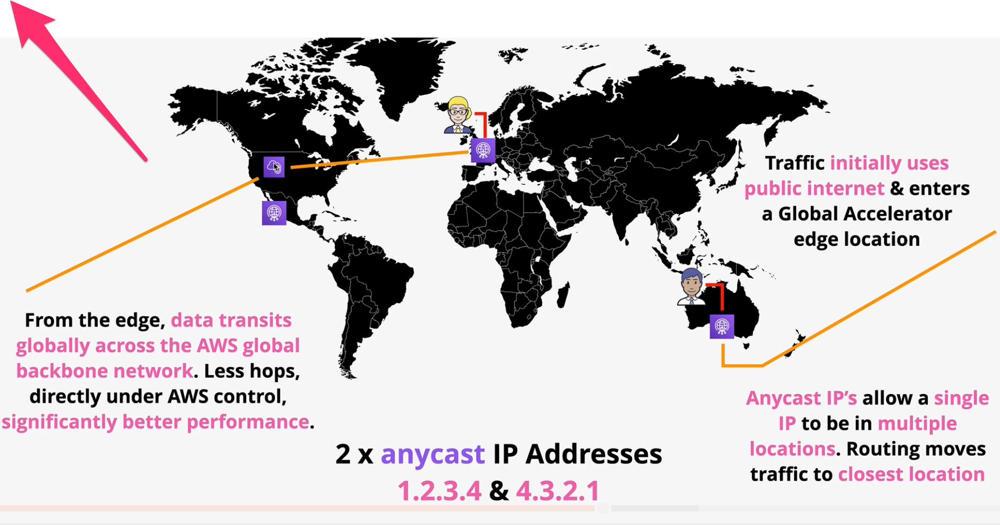

# Global Accelerator

Traffic flows on the internet by taking hops from network to network. Generally, the more hops a packet takes, the less reliability and slower response times.

Customers that are further away from the infrastructure tend to take more hops on its way to the servers.

**AWS Global Accelerator** is a networking service that improves the performance of user traffic using Amazon Web Services’ global network infrastructure.

Global accelerator uses two global, public anycast IP addresses that act as a fixed entry point for traffic to your application.

> Anycast IPs allow a single IP to be in multiple locations. Routing moves traffic to the closest location.

Traffic uses the public internet to find a Global Accelerator edge location. 
From that edge location, data transits globally across the AWS global backbone network to the closes application instance which results in less hops and significantly better performance.

*Table: Comparing CloudFront and AWS Global Accelerator:*

| AWS Global Accelerator | CloudFront |
| --- | --- |
| Improves performance by getting customer traffic on the AWS network as soon as possible. | Improves performance by serving content from the edge location. |
| Can be used for non-HTTP traffic (i.e., TCP/UDP) | Can only be used for HTTP traffic |