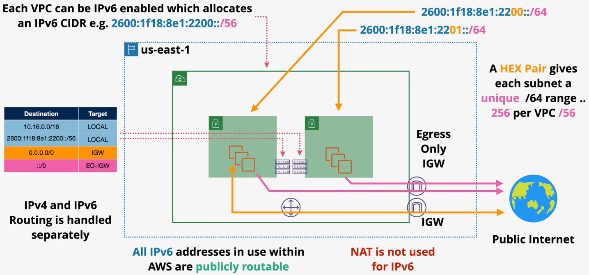
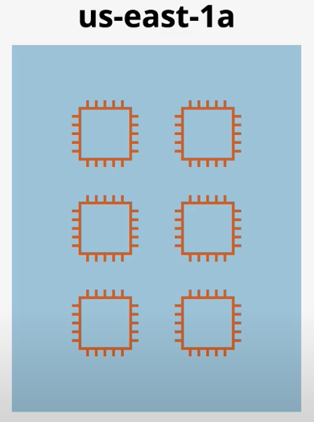
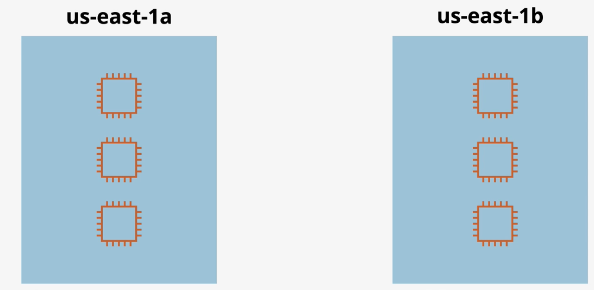
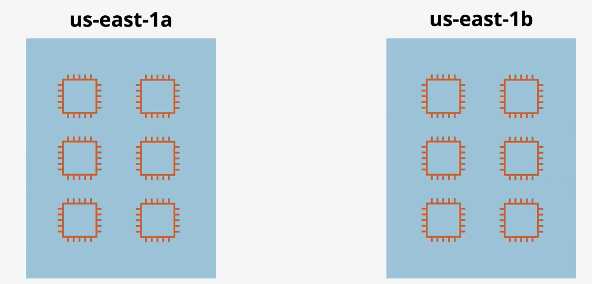
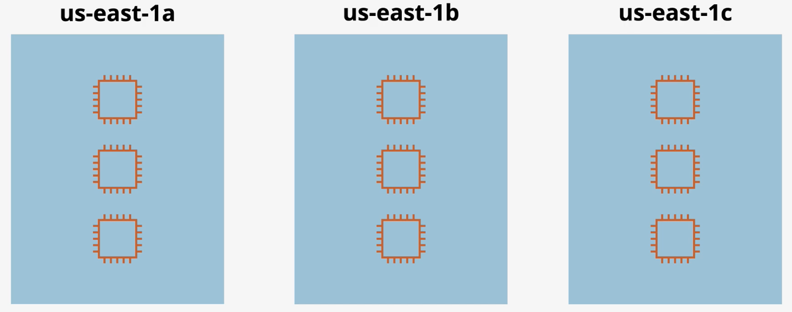

# Networking

## Public vs Private AWS Services

- **Public services** are accessed via public endpoints (e.g., S3).  
- **Private services** run in a private VPC and can only be accessed by devices that have been specifically allowed (e.g., EC2).

## DHCP

- **DHCP** stands for Dynamic Host Configuration Protocol. It is used to automatically configure network devices.
- The DHCP protocol starts with a layer 2 broadcast to request info from the DHCP server. At a minimum, the server responds with the IP address, subnet mask, and default gateway of the network.
- DHCP from within a VPC also contains:
  - DNS servers
  - Domain names
  - NTP server configuration
  - NetBios name servers & node type
- By default, VPCs use the Amazon provided DNS, but support custom DNS.
- **DHCP option sets** are used to control DHCP settings within a VPC.
- DHCP option sets are immutable.
- DHCP option sets can be assigned to zero or more VPCs. A VPC can only be assigned one option set.
- When a DHCP option set is assigned to a VPC, the association is immediate but the network changes require a DHCP Renew to occur (which may take some time).
- By default, AWS provides public and private DNS names.

`ip-private-ipv4-address.region.compute.internal`

- To use a custom domain, you must use custom DNS servers.

## Route Tables

- The VPC Router is an implicit virtual router within a VPC.
- VPC Routers are always highly available across all AZs in the region. It is also scalable so no performance management is required.
- The VPC Router is responsible for routing traffic between subnets, traffic from external networks into the VPC, and traffic from the VPC to external networks.
- The VPC Router has an interface in every subnet (subnet + 1 addresses) e.g., The `10.16.48.1` address in the `10.16.48.0/20` network.
- VPC routing logic is controlled via Route Tables.
- Every VPC is created with a main route table (RT), which is the default route table for every subnet in the VPC.
- Custom route tables can be created and associated with subnets (which removes the main route table).
- Subnets are associated with a single route table only.
- Best practice: Do not add routes to the main route table. Instead, create a custom route table.
- Route tables attempts to pick the most specific route first.
- Route tables can be associated with gateways.

- Route tables can contain two different types of routes: static and dynamic.
  - *Static* routes are added manually.
  - *Dynamic* routes are added automatically by a virtual private gateway. 
    - *Dynamic* routes are also called *propagated* routes. 
    - *Route propagation* must be enabled on the route table.

The following characteristics are preferred when selecting routes for traffic:
1. Longest prefix (e.g., a /32 route takes priority over a /28 route)
2. Static routes
3. Propagated routes
  - DX
  - VPN Static
  - VPN BGP
  - Shorter ASPATH

Public subnets have a default route with the IGW as a target.

`0.0.0.0/0 -> IGW`

Private subnets have a default route to a NAT gateway.

`0.0.0.0/0 -> NAT`

VPNs will have a route for traffic to the on-prem network via a virtual private gateway.

`192.168.10.0/24 -> VGW`

**Gateway Route Tables** can be used to direct a gateway (e.g., IGW) to take actions to *inbound traffic* - such as forwarding it to a security appliance.
  - This is also called an **ingress route table**.

## Firewalls

- Every connection has two parts: (1) REQUEST and (2) RESPONSE.
> Generally, TCP communication looks like:
> 1. The client picks a temporary (ephemeral) source port 1024-65535 (depends on OS).
> 2. [REQUEST] The client initiates a connection to the server on a well-known destination port (e.g., HTTPS tcp/443).
> 3. [RESPONSE] The server responds using the source port of tcp/443 and the destination ephemeral port picked by the client.
> 

- The **directionality** of TCP connection depends on the perspective of the sender or receiver. Traffic can either be *inbound* traffic or *outbound* traffic.
- A stateful firewall is intelligent enough to identify the request and response components as being related. As a result, you only need to explicitly allow traffic in one direction.

### NACLs

- **Network ACLs** are *stateless* firewalls that operate at the subnet level. NACLs will filter traffic crossing the subnet boundary, but will not evaluate traffic within the subnet.
- NACLs consist of *INBOUND* and *OUTBOUND* rules. INBOUND rules match traffic entering the subnet and OUTBOUND rules match traffic leaving the subnet.
- NACLs support explicit ALLOW and explicit DENY actions.
- NACL rules are processed in order based on the rule number in ascending order (lowest number first). Once a match occurs, processing stops.
- Since NACLs are stateless, you must allow traffic in both directions (INBOUND and OUTBOUND).
- VPCS are created with a default NACL with two *INBOUND* rules and two *OUTBOUND* rules. The result is that all traffic is ALLOWED (the NACL has no effect).

- When you create a NACL manually, it is created with a single `DENY ALL` rule. NACLs are not automatically associated with VPCs.
- NACLs can be used to block traffic based on IPs/CIDR, port, and protocol. They cannot be used to block logical resources.
- Each subnet can only be associated to a single NACL, but a NACL can be associated wtih multiple subnets.

### Security Groups

- **Security groups** are *stateful* firewalls that detect response traffic automatically.
- Security groups support an explicit ALLOW or an implicit DENY (not explicitly allowing traffic), but do not support explicit DENY. As a result, you cannot block specific bad actors.
- Security groups support IP/CIDRs and logical resources, including other security groups.
- Security groups are attached to ENIs (not the instance).

> BEST PRACTICE: In workload will well defined traffic patterns, reference security groups within the rules rather than an IP CIDR. Security groups are also able to reference themselves.

## Border Gateway Protocol (BGP)

- BGP consists of a number of networks called autonomous systems (AS) that is controlled by a single router (called the BGP router).
- Each AS is assigned an ASN (Autonomous System Number) by IANA. ASNs range from 0 - 65,535. 
  - 0 - 64511 are public ASNs that must be assigned by IANA to be used.
  - 64512 - 65534 are private and can be used within private peering arrangements that can be used without official assignment.
- BGP operates on port `tcp/179`.
- BGP connections are not automatic - peering must be manually configured.
- BGP is a *path-vector* protocol which means it exchanges the best path to a destination between peers. The path is called the **ASPATH** (Autonomous System Path).
- iBGP (internal BGP) focuses on routing within an AS. eBGP (external BGP) focuses on routing among different AS.
- BGP advertises the shortest ASPATH between peers, regardless of the latency characteristics of the path. **ASPATH prepending** can be used to artificially make a path seem longer. With ASPATH prepending, you can configure BGP routers to advertise certain paths.

## IPv4 and IPv6

The `IPv4` address space contains 4,294,967,296 addresses, which is fewer than the number of people alive today.

The IPv4 address space contains private addresses. Private addresses are used within private subnets. These IPs are not routable over the internet without first translating the private IP to a public IP using a NAT.

Services never have public IPv4 addresses configured on the OS within a VPC. Instead, it's handled through a gateway appliance. 

The `IPv6` address space contains 340,282,366,920,938,463,463,374,607,431,770,000,000 addresses. This allows each person alive to have 50 octillion addresses.

All IPv6 addresses are publicly routable. Therefore, NAT as a concept does not apply to IPv6 addresses. Consequently, NATs and NAT gateway do not support IPv6 addresses.

Each VPC can be IPv6-enabled which allocates an IPv6 CIDR (e.g., 2600:1f18:8e1:2200::/56). The VPC can be enabled at creation or updated after creation.

The same VPC can communicate via IPv4 or IPv6.

IPv4 and IPv6 routing is handled separately (via separate routes).

IPv6 traffic flows to the internet via an `Egress-only IGW`.

*Caption (below): The following architecture shows an example of a network profile that supports IPv4 and IPv6.*

- *Bi-directional IPv4 traffic is routed to the public internet via an internet gateway (IGW).*
- *Outbound-only IP6 traffic is routed to the public internet via an egress-only IGW. This type of gateway only supports IPV6 and only allows outbound traffic.* 

## Designing a VPC

### How many AZs should be use?

**Example**: An application requires six instances to operate reliable based on normal load.

**Single AZ** - run all six instances within a single AZ.

The application running in a single AZ would not be highly available. If the AZ becomes unavailable, the application also becomes completely unavailable.

**Two AZs** - split the required six instances between two availability zones.

If one availability zone fails, the application is still available at reduced capacity.

Since the application requires a minimum of six instances, this is not sufficient for high availability.

**Two AZs** - run a full workload in each AZ.

This design would meet the requirement of being highly avialable, but at the cost of being overprovsioned. 

If one of the AZs fail, the application would still be available in the other AZ at full capacity.

However, this requires 2x the number of instances than your application requires.

**Three AZs** - run 1.5x instances across three AZs.

This is highly available! By splitting the workload across three AZs, we can ensure high availability while only provisioning 1.5x instances.

### Subnets and Tiers

Traditional applications use an `n-tier architecture`. Each tier is responsible for a specific part of the app functionality (*e.g., presentation tier, logic tier, and data tier*).

In legacy infrastructure platforms, physical networking and security was built around these tier. Therefore, each tier had its own networking and security configurations. Each tier was isolated and data crossing tiers was tightly controlled using firewalls.

This structure is not necessary in AWS due to the security and network features AWS offers.
