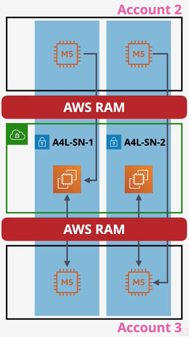
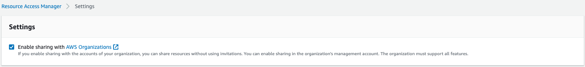

# Resource Access Manager

Before Resource Access Manager (RAM), VPC and VPC peering were required in order to share resources with other accounts.

RAM enables sharing of AWS resources between AWS Accounts. Supported resources can be shared with AWS Organizations, Organizational Units, or individual AWS accounts. When a resource is shared with an account, it can be accessed in the same ways as account-owned resources (e.g., via the CLI).

Some resources can be shared with *any* AWS account. Other resources can only be shared with AWS accounts within the same Organization.

There is no additional fee for using Resource Access Manager.

The **owner account** creates a resource, and creates `Resource Share` to share that resource. The owner account retains full ownership of the resource.  

The **participant account** cannot view the resource, but cannot modify it. Participants can indepently name the resource.

One of the most common use case for RAM is **shared networking**. 

RAM can be used for shared networking infrastructure like VPCs and subnets. Participants can provision services into the shared subnets, read and reference network objects, but cannot modify or delete resources owned by the owner or other participants.

  
*Caption: Account 1 (owner account) creates a VPC and subnets and shares it with Accounts 2 & 3 (participant accounts). Accounts 2 and 3 may deploy resources into the shared subnets and interact with other resources via L3 networking, but cannot view or manage other participants' resources.*

## Accepting RAM Requests

Participants need to explicitly accept the invitation for the resource share.

If the participant is inside the same Organization with sharing enabled, the invite will be automatically accepted.

## A Note about Availability Zones

When coordinating resources between AWS accounts (using RAM or otherwise), its important to use AZ identifiers instead of AZ names.

For every AWS account, AWS rotates which physical datacenter is associated with an AZ name. Therefore, the us-east-1a AZ most likely represents a different physical data center in *account A* than it does in *account B*.

This presents a challenge when coordinating resources between accounts.

To solve this problem, AWS introduced AZ identifiers that are consistent across all AWS accounts.

In this example, account A's `us-east-1a` AZ points to `use1-az1` AZ, but account B points to `use1-az2`: 
| | us-east-1a | us-east-1b |
| --- | --- | --- |
| Account A | use1-az1 | use1-az2 |
| Account B | use1-az2 | use1-az1 |
