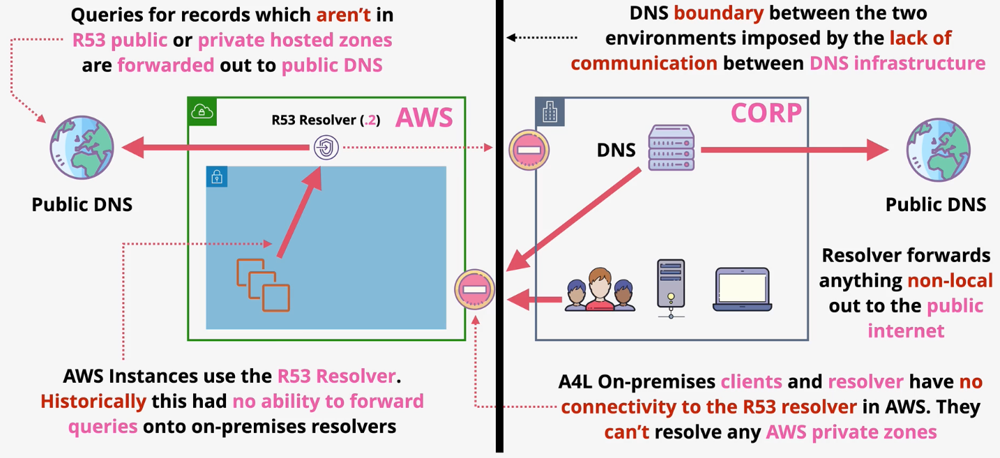
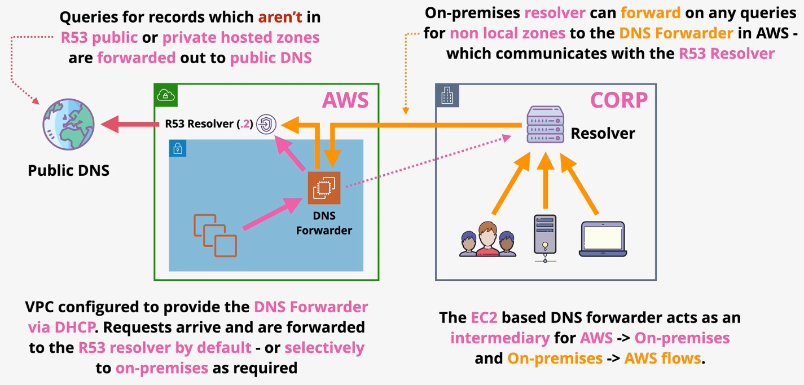
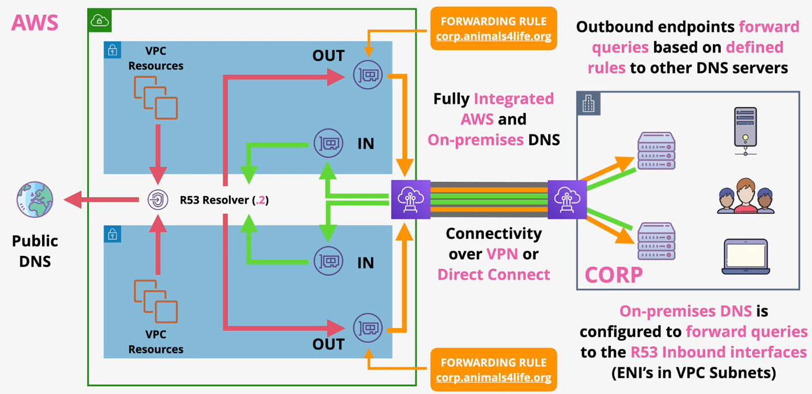

# Route53

## DNS

DNS is a discovery service that translates machine addresses (i.e., IP addresses) into human-readable addresses (e.g., www.google.com) and vice versa.

Since there are so many addresses, DNS must be distributed.

DNS records are distributed into `zones` represented by `zone files`. In each zone file, there are DNS records associated with specific domains and subdomains. Zone files are hosted by special DNS servers called `Nameservers`.

`DNS resolvers` are responsible for translating a human-readable address to an IP address, and vice versa. It does this by querying the zone file associated with that domain.

A `DNS client` is a piece of software running on an OS in some device (e.g., laptop, phone, tablet, PC) that queries the DNS resolvers.

DNS is a distributed database. At the top of the DNS tree are the `root nameservers`. The root nameserver is represented as a `.` at the end of the domain name.

`www.amazon.com.`

There are 13 root nameservers that are the first hop in any DNS query. The DNS resolver in your OS contains as `root hints` file that points to the DNS root servers.

> In reality, each "root nameserver" is actually a cluster of servers for high throughput.
>
> You can view the root name servers on [iana.org](https://www.iana.org/domains/root/servers).

The `authoritative servers` are the name servers that are delegated to respond to DNS queries for a specific zone (e.g., the Amazon nameservers are the authoritative servers for amazon.com).

`gTLDs` are global top-level domain (TLD) names (e.g., .com, .org, .edu). `ccTLDs` are country code TLDs (e.g., .co.uk, .de).

## Route53

Route53 provides two main services:
- Domain registrar
- Host zones on managed nameservers

Route53 is a global service as a single database.

A `hosted zone` is hosted on four managed nameservers. Hosted zones can be public (available on the public internet) or private (associated with specific VPCs).

Hosted zones store `record sets` - nameserver records used to control DNS traffic.

### Hosted Zones

A `hosted zone` is a DNS database for a domain or subdomain. Hosted zones are globally resilient.

Hosted zones can be created explicitly in Route53. A hosted zone is automatically created for you after a Route53 domain registration.

By default, zones are hosted on four R53 nameservers.

`Public hosted zones` are accessible from the public internet and VPCs.

`Private hosted zones` are only accessible from its associated VPCs. Private hosted zones can be associated with VPCs in other accounts via the AWS CLI only.

The `split-view` (also called `split-horizon`) strategy involves having a public and private hosted zone for the same domain name. This allows you to specify different DNS behavior for internal users via the private hosted zone than for general public via the public hosted zone.

### R53 CNAME vs Alias

Canonical name records are used to specify an alias to another domain.

E.g., `www -> amazon.com.`

Problem statement: CNAME records do not support the apex domain name (e.g., amazon.com). Many AWS services do not give you a static IP address. Instead they give you a DNS name (e.g., ELBs). Therefore, while you can point a subdomain to the ELB (e.g., `www => ELB`), it is not possible to point the apex domain to an ELB (e.g., `catagram.io => ELB`).

`Alias` records map a name to an AWS resource and can be used for both the apex and subdomain. When alias records are applied to a subdomain, they behave exactly like a CNAME record.

Unlike most DNS queries, there is no charge for alias requests pointing to AWS resources.

Alias records can be of type `A` or `CNAME` records. The alias record should be the same "type" as what the record is pointing at.

Alias records support API Gateway, CloudFront, Elastic Beanstalk, ELB, Global Accelerator, S3, and more.

> [EXAM TIP]
> 
> AWS recommends using Alias records over CNAME records.

### Health Checks

Amazon Route 53 health checks monitor the health and performance of your web applications, web servers, and other resources. Health checks are used by Route53 to intelligently route traffic to healthy instances.

Route53 health checkers are deployed globally. By default, all these health checkers perform a health check every 30 seconds (can be decreased to 10 seconds for an extra cost). **If 18% or more of the health checkers report a healthy check, the health check is reported as healthy.**

Route53 health checks support TCP, HTTP/S, or HTTP/S with string matching.

HTTP health checks must return a result in the 200-300 response status range within 3 seconds.

Additionally, health checks can be configured against CloudWatch Alarms and other Route53 health checks (called *calculated health checks*).

The *failure threshold* of a health check is the number of consective checks that must pass or fail in order for Route53 to change the status of the endpoint to healthy or unhealthy.

### Simple Routing 

`Simple routing` supports one record per name (e.g., www), but each record can have multiple values. All values are returned in a random order.

Simple routing does not support health checks.

Use simple routing when you want to route requests toward one service (e.g., webserver).

### Failover Routing

`Failover routing` lets you route traffic to a resource when the resource is healthy or to a different resource when the first resource is unhealthy.

If the target of the health check is healthy, the primary record is used. If the target of the health check is unhealthy, any DNS queries return the secondary record of the same name.

Use failover routing when you need to configure active/passive failover.

### Multi-value Routing

`Multivalue answer routing` lets you configure Amazon Route 53 to return multiple values, such as IP addresses for your web servers, in response to DNS queries. 

You can specify multiple values for almost any record, but multivalue answer routing also lets you check the health of each resource, so Route 53 returns only values for healthy resources.

It's not a substitute for a load balancer, but the ability to return multiple health-checkable IP addresses is a way to use DNS to improve availability and load balancing.

Route53 responds to DNS queries with up to 8 healthy records. If more exist, Route53 will randomly select 8. The client must choose which to use.

### Weighted Routing

`Weighted routing` lets you associate multiple resources with a single domain name (example.com) or subdomain name (acme.example.com) and choose how much traffic is routed to each resource.

The weight of a record determines how often is used in routing. A weight of zero means a record is never returned (unless all records have a weight of zero).

The weight of a record is based on the record weight vs the total weight of all records.

If a chosen record is unhealthy, the process of selection is repeated until a healthy record is chosen so that weights of all records are considered regardless of health status.

Use weighted routing to load balance intelligently or test new versions of software (e.g., A/B testing).

### Latency-Based Routing

If your application is hosted in multiple AWS Regions, you can improve performance for your users by serving their requests from the AWS Region that provides the lowest latency.

To use `latency-based routing`, you create latency records for your resources in multiple AWS Regions. When Route 53 receives a DNS query for your domain or subdomain (example.com or acme.example.com), it determines which AWS Regions you've created latency records for, determines which region gives the user the lowest latency, and then selects a latency record for that region. Route 53 responds with the value from the selected record, such as the IP address for a web server.

AWS maintains a database of latency between the users general location and the regions tagged in records.

Use latency-based routing when optimizing for performance and user-experience, especially with a global user base.

### Geolocation Routing

`Geolocation routing` lets you choose the resources that serve your traffic based on the geographic location of your users, meaning the location that DNS queries originate from.

The location of the user is determined by the IP address on the query.

Geolocation records are tagged with locations: region, country, state, etc.

Geolocation does not return the "closest" record. It returns relevant records.

Route53 allows you to specify a default record that can be returned in the case that no relevant DNS records are found.

If no relevant records are found, and no default record is configured, a `NO ANSWER` is returned by Route53.

Use geolocation when its important to users interact with regional resources (e.g., regional compliance law).

### Geoproximity Routing

`Geoproximity routing` lets Amazon Route 53 route traffic to your resources based on the geographic location of your users and your resources. 

Records can be tagged with an AWS Region or latitude/longitude coordinates.

You can also optionally choose to route more traffic or less to a given resource by specifying a value, known as a `bias`. 

A bias expands or shrinks the size of the geographic region from which traffic is routed to a resource.

## Route53 Endpoints

Within every subnet, the second IP address is reserved for the DNS resolver (*e.g., 10.16.0.2*). This is called the `Route53 resolver`.

The Route53 resolver provides Route53 public and associate private zone DNS resolution. 

**By Default - DNS Boundaries**

Historically, the Route53 resolver has only been accessible from within a VPC. This is problematic in hybrid network integration because it creates DNS boundaries.

*Caption (below): Hybrid network with DNS boundaries*

- *DNS Queries originating from an AWS subnet are handled by the Route53 resolver. Any destinations that are not predefined are forwarded to public DNS for resolution.*
- *DNS queries originating from on-prem use an on-prem DNS resolver. Any destinations that are not predefined are forwarded to public DNS for resolution.*
- *Route53 DNS cannot conditionally forward requests to the on-prem DNS servers, and on the on-prem DNS servers cannot conditionally forward requests to the Route53 Resolver. This creates distrinct DNS boundaries.*

**Previous Solution - DNS Forwarder**

Until Route53 endpoints were introduced, this was the best practice for integrating an on-prem network with an AWS network.

*Caption (below): Hybrid network that uses a DNS forwarder running on EC2.*

- *A DNS Forwarder is deployed on EC2 and the `DHCP Option Set` for a VPC is modified. The forwarder can conditionally forward requests to an on-prem DNS server.*
- *Likewise, the on-prem resolver can selectively forward DNS queries to the Route53 resolver.*

**Best Solution - Route53 Endpoints**

A `Route53 endpoint` is a fully-managed feature that conditionally forwards DNS queries based on rules. The endpoint is available via an ENI injected into the subnet.

The Route53 endpoint ENI is available over VPN and DX.

Route53 endpoints come in two forms: inbound and outbound. 
- `Inbound endpoints` forward on-prem DNS queries to the Route53 Resolver.
- An `outbound endpoint` is a conditional forwarder that will forward DNS queries to an on-prem DNS resolver. `Rules` are used to determine which requests are forwarded (e.g., corp.animals4life.org => on-prem DNS nameservers).

*Caption (below): Using a Route53 endpoint to create a hybrid network.*

- *By enabling a Route53 outbound endpoint, an ENI is injected into the subnet. The Route53 resolver forwards requests to the ENI which conditionally forwards traffic over a VPN or DX to the on-prem DNS servers.*
- *Using a Route53 inbound endpoint, an ENI is injected into the subnet. The on-prem DNS server forwards requests to the inbound ENI, which forwards traffic to the Route53 Resolver.*
- *Route53 endpoints allow on-prem resources to access domains defined in Route53 hosted zones and AWS resources to access domains defined in on-prem zones.*