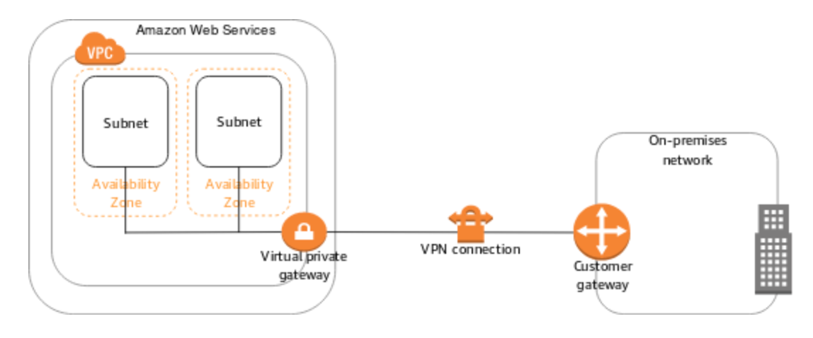
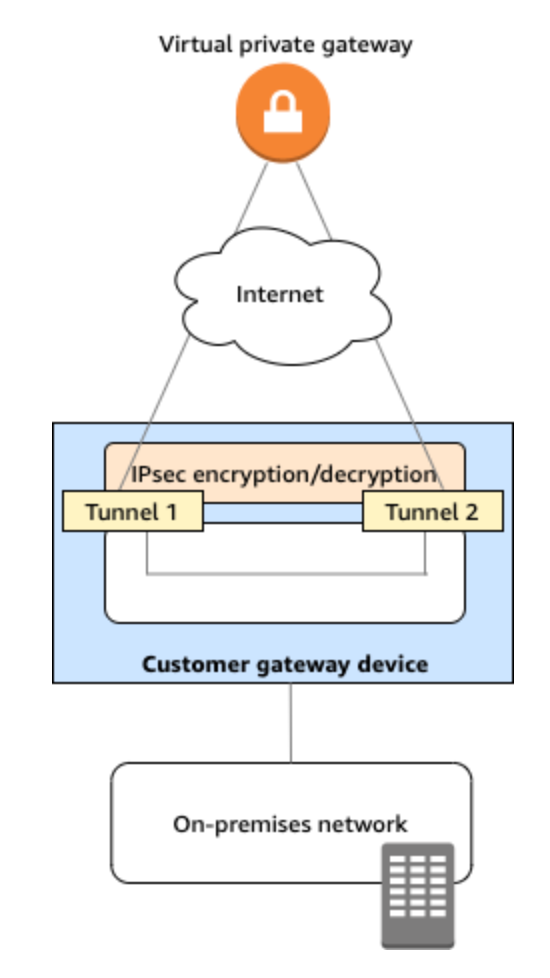

# S2S VPN

By default, instances that you launch into an Amazon VPC can't communicate with your own (remote) network. You can enable access to your remote network from your VPC by creating an AWS Site-to-Site VPN (S2S VPN) connection, and configuring routing to pass traffic through the connection.

Steps to create a S2S VPN Connection:

1. **Setup a customer gateway device on-prem**

    A **customer gateway device** is a physical or software appliance that you own or manage in your on-prem network. It is responsible for routing traffic from your on-prem network to an AWS VPC.

2. **Create a Customer Gateway (CGW) resource in AWS**

    In order to setup a S2S VPN connection, you must create a **customer gateway resource** in AWS, which provides information to AWS about yoru device, for example, its public-facing IP address.

3. **Create a Virtual Private Gateway (VGW)**

    A virtual private gateway is the VPN endpoint on the Amazon side of your Site-to-Site VPN connection that can be attached to a single VPC.

    The VGW is available via two highly available endpoints for redundancy.

4. **Establish a VPN Connection**

    Create the VPN connection between the customer gateway and virtual private gateway.

> For high availability, customers may choose to setup two S2S VPN connections that connect to two isolated consumer gateway devices.

5. **Update route tables to route traffic to the other network.**

    Finally, routes can be added to route tables in AWS and on-prem to direct traffic appropriately.

    Routes can be created in one of two ways:
    - *Static Routes* are added to the route table manually and do not change.
    - *Dynamic Routes* use a protocol called BGP to automatically exchange network information. By enabling **route propagation** on the route table, learned routes are automatically added and updated on the route table.

VPN Considerations:
- VPN speed is limited to 1.25 Gbps.
- VPNs typically run over the public internet, which exhibits inconsistent performance.
- VPNs are charged by the hour and by GB of data out
- VPNs are very quick to setup compared to other connection technologies.
- VPNs can be used as a backup for Direct Connect (DX), or used initially until DX is established.

## IPSEC VPN

- IPSEC is a protocol suite used to setup secure tunnels across insecure networks between two peers, usually the public internet.
    - One of the protocols within IPSEC is Internet Key Exchange (IKE) which is used to select the encryption algorithm and generate secure keys for encrypting data.
- IPSEC tunnels are created on the fly when *interesting traffic* is detected. If tunnels area idle for some amount of time, they are torn down.
    - *Interesting traffic* may be defined by the destination network, or a set of rules.

IPSEC consists of two phases: IKE phase 1 & IKE phase 2.

**IKE Phase 1**:
- Authenticate via a pre-shared key or certificate
- Diffie-Hellmen is used to generate asymmetric keys
- Using asymmetric encryption to agree on and create a shared symmetic key
- Phase one tunnel created

**IKE Phase 2**:
- Uses the keys agreed to in phase 1
- Agree on an encryption method and the keys used for bulk data transfer
- Phase 2 tunnel created

