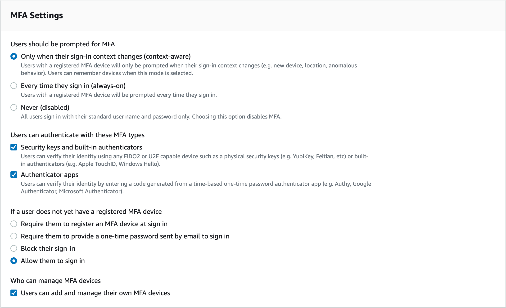
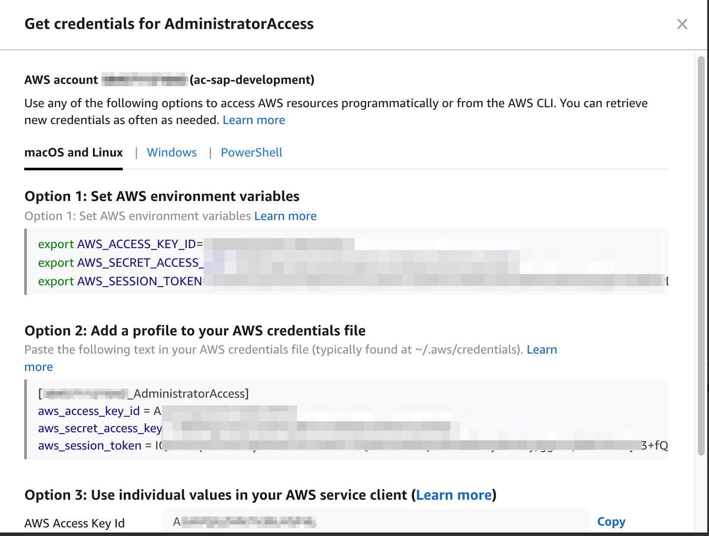
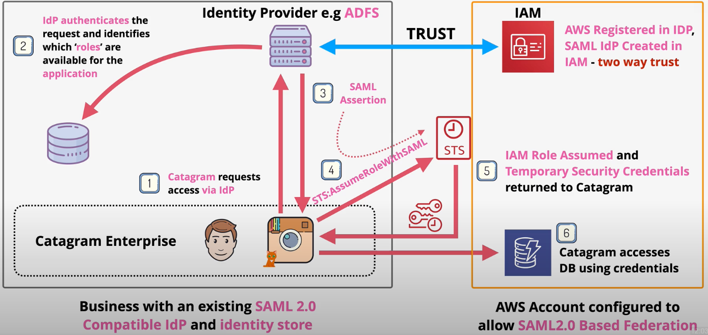
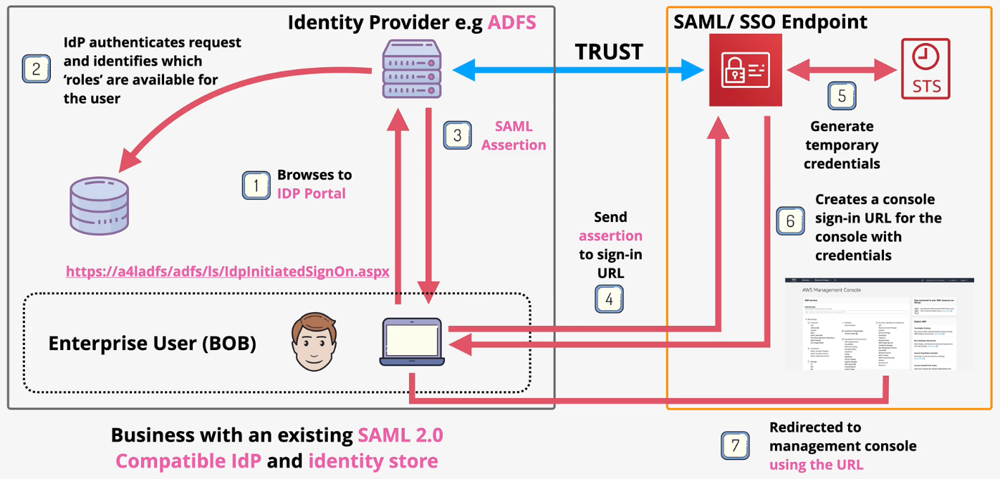

# Identity Federation

- [AWS SSO](#aws-sso)
- [SAML 2.0 Identity Federation](#saml-20-identity-federation)

## AWS SSO

AWS SSO allows users to manage SSO access between AWS accounts and external applications.

AWS SSO integrates with a wide range of workplace identity sources.

AWS SSO provides two high-level functions:
  - Single sign-on via SSO identity services
  - Centralized permissions management across accounts in an AWS Organization

AWS SSO identity services provides a built-in identity store, or provides a way to connect to external identity stores such as AWS Managed Microsoft AD, on-prem ADFS, or another SAML-based identity provider.

There is no charge for using AWS SSO.

An AWS SSO **permission set** contains policies that determine a user's permissions to access an AWS account. When you assign a user or group to a permission set in an AWS account, AWS SSO creates an IAM role in the account and attaches the policies specified in the permission set to that role.

AWS SSO offers many predefined permission sets such as:
- AdministratorAccess
- Billing
- DataScientist
- NetworkAdministrator
- PowerUserAccess

Alternatively, you can define a custom permission set.

Through the AWS SSO console, you can configure SSO access to multiple cloud applications and custom applications that support SAML-2.0 identity federation. AWS provides a list of presets for common SSO applications (e.g., Dropbox, ServiceNow) or you can provide the details for a custom application.

AWS SSO offers a built-in identity store in which you can create users and groups. Users can be assigned to groups. Both groups, users, and permission sets can be assigned to any subset of AWS accounts in the Organization.

You can configure the MFA settings for all users in the identity store, including whether users can manage their own MFA devices.

Once avaialble, the identity federation service is available via a customizable link (e.g., `https://animals4life234324.awsapps.com/start`).

From this console, users can jump into the AWS console, or obtain tokens for CLI use.

## SAML 2.0 Identity Federation

SAML 2.0 (*Security Assertion Markup Language*) is an open standard used by many idPs (e.g., Microsoft ADFS).

SAML-based identity federation allows users to indirectly use external credentials to access the AWS console and AWS resources via the CLI.

You cannot access the AWS console or resources using external credentials *directly*; Instead, you must exchange the external credentials for valid AWS STS tokens.

SAML-2.0 identity federation can be used with an Enterprise identity provider that is SAML 2.0 compliant.

Identity federation can be used when:
- desire to maintain an existing identity provider
- desire to maintain a single source of truth for all identities
- you have more than 5000 users

Identity federation uses IAM roles and AWS temporary credentials from STS to grant access to the AWS console and AWS resources. Tokens can remain valid for up to 12 hours.

SAML-based identity providers can be created and managed in the IAM console. Create an SAML-based ipP to establish trust between your AWS account and a SAML 2.0 compatible Identity Provider such as Shibboleth or ADFS.

**SAML for API access**

1. An app requests access via the off-cloud idP.
2. The idP (e.g., Microsoft ADFS) authenticates the request against some identity store. Additionally, it identifies which roles are available for the application.
3. The idP responds with a SAML assertion: a token that AWS trusts that proves the identity has been validated.
4. The app calls the `sts:AssumeRoleWithSAML` function to obtain valid STS tokens, passing in the SAML assertion.
5. STS creates temporary security credentials based on the role requested.
6. The app uses the temporary security credentials to access AWS resources via the CLI, API, or SDKs.

**SAML for Console access**

1. A user browses to the idP portal.
2. The idP authenticates the request against some identity store. Additionally, it identifies which roles are available for the application.
3. The idP responds with a SAML assertion: a token that AWS trusts that proves the identity has been validated.
4. The browser is redirected to the AWS SAML/SSO sign-on URL, passing along the SAML assertion.
5. The AWS sign-on service requests temporary credentials from AWS STS.
6. With the AWS STS temporary security credentials, the AWS sign-on service generates a console sign-in URL with the credentials encoded.
7. The user is redirected to the console sign-in URL.

> SAML-based federation is a legacy service. Instead, AWS recommends using AWS SSO for all workplace identity federation.