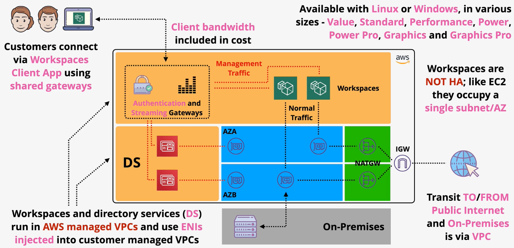
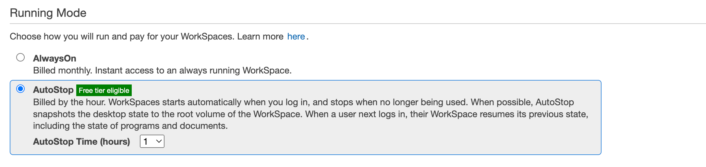
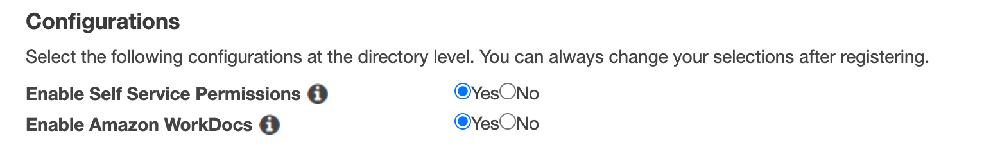

# Amazon WorkSpaces

Amazon WorkSpaces is a fully-managed desktop as a service (DaaS) offered by AWS. Amazon Workspaces enables companies to have a consistent desktop from anywhere in the world.

WorkSpaces supports both Linux and Windows in various sizes and configurations.

WorkSpaces is billed via a monthly fee or hourly prices in addition to the infrastructure costs.

Amazon WorkSpaces and directory services (DS) run in an AWS-managed VPC, but inject ENIs into customer-managed VPCS. Users connect to their desktop using the Workspaces Client app.

Amazon WorkSpaces uses a Directory Service (e.g. Simple AD, AD, AD Connector) for authentication and user management.

Windows desktops are able to access FSx and EC2 as windows resources.

AWS Workspaces **running mode** allows you to choose how you will run and pay for WorkSpaces.
- *Always On* (billed monthly) - Your WorkSpace will always be running and available.
- *AutoStop* (billed hourly) - WorkSpaces will start automatically when you log in and stops after a configurable number of hours.

> WorkSpaces desktops are not high availability by default since its running a single AZ.

A WorkSpace allows for a few configuration parameters:
- Enable Self Service Permissions: Enables users to rebuild their WorkSpace, change volume type, compute size, and running mode. These actions may affect cost.
- Enable Amazon WorkDocs - Amazon WorkDocs allows users to backup their documents and sync them between their WorkSpace and user devices.

