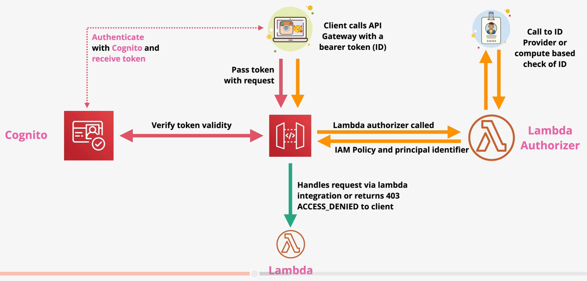
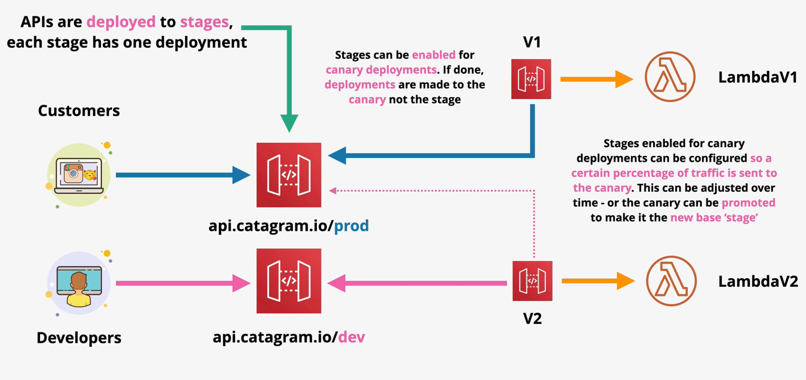
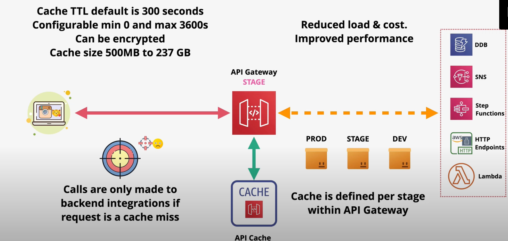

# API Gateway

Amazon API Gateway is a fully-managed service that allows you to create and manage APIs. By default, API Gateway is highly available, scalable, handles authorization, throttling,  caching, CORS, transformations, OpenAPI specification, direct integration with other AWS services, and more.

There are three phases in most API Gateway interactions:
- `Request` - authorizes, validates, and transforms the request
    - `Method Request`
    - `Integration Request`
- `Integrations` - invokes other AWS services (e.g., DynamoDB, Lambda, HTTP Endpoints, Step Functions)
- `Response` - transforms, prepares, and returns the response
    - `Integration Response`
    - `Method Response`

API Gateway integrations with CloudWatch Logs to store and manage full stage request and response logs. CloudWatch Metrics is used for capturing metrics.

The API Gateway can handle data caching.

## Authentication

API Gateway supports direct integration with `Cognito` to authenticate API requests.

API Gateway can also support a `custom Lambda authorizer`. When a request is received by the API Gateway, it invokes a Lambda authorizer that is responsible for validating the token supplied in the request. If successful, an IAM policy and principal identifier is returned.

If authentication fails, a 403 FORBIDDEN response is returned.

## API Types

## Endpoint Types

API Gateway supports multiple endpoint types:
- `Edge-optimized` endpoints route traffic to the nearest CloudFront point-of-presence. 
- `Regional` endpoints can be used to support API clients within the same region.
- `Private` endpoints are only accessible within a VPC through an interface endpoint.

## Stages & Deployments

APIs are deployed to a `stage`. A stage represents a snapshot of the API, including methods, integrations, models, mapping templates, and Lambda authorizers.

Each version of your API can be deployed to a different stage. In order for changes to an API to take effect, they must be deployed to an API.

It is common to use stages to represent environments (e.g., dev, test, and prod) or versions of an API (e.g., v1, v2, v3).

Stages are `not immutable` - they can be overwritten and rolled back.

You can use `stage variables` to configure dynamic integrations with Lambda aliases.

Stages can be enabled for `canary deployments`. Stages enabled for canary deployments can be configured so a certain percentage of traffic is sent to the canary. This can be adjusted over time - or the canary can be promoted to make it the new base stage.

## Errors

Error codes from API Gateway are either 400s (client errors) or 500s (server errors).

| | Likely Cause |
| --- | --- |
| 400 BAD REQUEST | Invalid Request |
| 403 ACCESS DENIED | Authentication or authorization failed |
| 429 TOO MANY REQUESTS | The API Gateway is throttling requests |
| 502 BAD GATEWAY | The backend system (e.g., Lambda function) is returning an error |
| 503 SERVICE UNAVAILABLE | Major servie issue |
| 504 GATEWAY TIMEOUT | Integration failure or timeout (29 seconds) |

## Caching

Caching is configured per stage within API Gateway.

The cache `TTL` default is 300 seconds, but is configurable from 0 to 3600 seconds. Cache can be `encrypted`.

## Integrations

There are several types of integrations available within the API Gateway:
- `Mock` - used for testing with no backend involvement
- `HTTP` - used for backend HTTP endpoints; This integration requires some transformation in the *integration request* and *integration response* stages so that the request conforms to the backend HTTP service.
- `HTTP Proxy` - The request and response are passed through to the integration and back to the client unmodified.
- `AWS` - Allows an API endpoint to integrate with another AWS service.
- `AWS Proxy` - Low admin overhead Lambda endpoint

`Mapping templates` are used to transform requests and responses in non-proxy integrations. Mapping templates are able to rename or modify parameters and filter out unneeded data. Mapping templates use `Apache VTL` (Velocity Template Language).

> [Exam Tip]
>
> A common exam scenario is to shim a backend SOAP API with a REST API Gateway API. In order to this, you must transform the request using a mapping template.