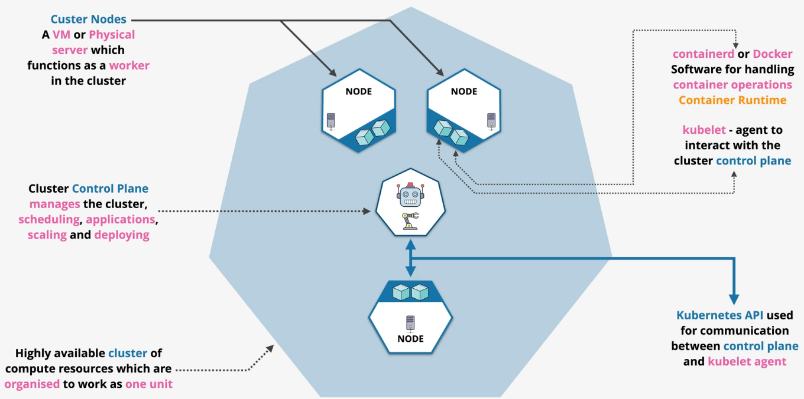
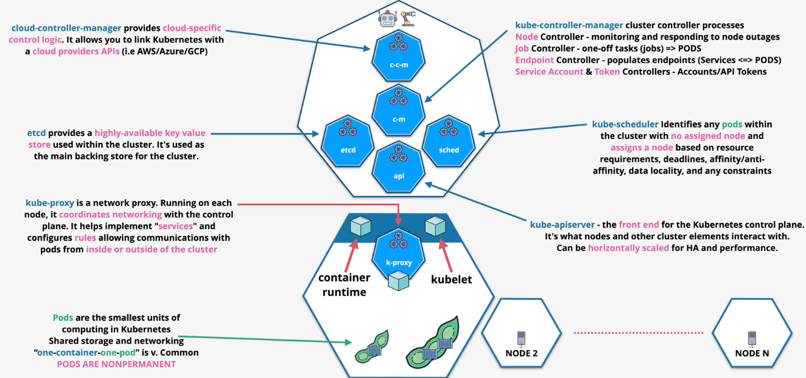

# Containers

A `container` provides an isolated environment in which an application can run. Unlike a hypervisor, the container runs as a process on the host OS with the assistance of a container image.

A container `image` is simply a stopped container. In docker, images are defined using a `Dockerfile`. Images are created from a `base image` or from scratch. Each command in a Dockerfile adds a new layer to the environment using a differential architecture.

A container is simply a running image. The container is identical to the image with an added read/write layer.

Container images are stored in a `container registry`.

**Container Key Concepts**:
- Dockerfiles are used to build images
- Containers are portable and self-contained
- Containers are lightweight that run on a shared parent OS
- Containers only run the application and environments that are needed
- Containers provides isolation
- Ports must be exposed to the host and beyond
- Application stacks can contain many containers

# ECS

## ECS Concepts

A `container definition` defines container settings like which container to use and which ports are exposed. 

ECS `task definitions` contain one or more containers and include parameter values such as CPU & memory, networking mode, logging configuration, the task role, and cluster mode.

`Task roles` define which AWS permissions are available to the container.

An ECS `service definition` defines a `service`. Service definitions grant scalability and high availability to a set of tasks. You can place a load balancer in front of a service to distribute load across multiple tasks.

Tasks and services are deployed into an ECS `cluster`.

## ECS Cluster Types

ECS is a container orchestration engine for running containers at scale.

ECS supports two cluster types:
- [EC2 Mode](#ec2-mode)
- [Fargate](#fargate)

### EC2 Mode

In EC2 Mode, EC2 instances are used to host the containers. Load balancing is controlled by an ASG.

When using ECS in EC2 mode, the customer is responsible for managing the EC2 instances.

When running in EC2 mode, you pay for the entire EC2 instance regardless of whether its fully utilized.

EC2 mode may be good for price-conscious customers that may benefit from spot instances.

### Fargate

In Fargate cluster mode, customers do not manage any EC2 instances. 

Fargate deploys containers to `shared infrastructure` and ENIs are injected into the customer's VPC. The containers can only be access via the ENIs.

When using Fargate, you only pay for the containers that are deployed.

Use Fargate for large workloads with lots of overhead, or small bursty workloads since you only pay for usage.

# Kubernetes

Kubernetes is an open-source container orchestration system. Kubernetes is cloud-agnostic.

Kubernetes allows you to define a highly available cluster of compute which are organized to work as one unit.

The cluster `control plane` manages the cluster, scheduling, applications, scaling, and deployments.

A Kubernetes `cluster` is made up of one or more `nodes`. Nodes are a VM or physical server which function as `workers` in the cluster.

Each node is running software to handle container operations (either `containerd` or `Docker`). Each node is also running an agent to interact wit hthe cluster control plane called `kubelet`.

The `Kubernetes API` is used for communication between the control plane and `kubelet agent`.

Kubernetes `pods` are the smallest unit of compute that share storage and networking. Typically, one container has one pod. Pods are nonpermanent.

The `kube-apiserver` is a front-end for the Kubernetes control plane. Nodes and other cluster elements interact with the kube-apiserver.

The `kube-scheduler` identifies any unassigned nodes within a cluster and assigns a node based on resource requirements, deadlines, data locality, and other contraints.

`ectd` is a highly-available key value store used within the cluster.. It is used as the main backing store for the cluster.

`kube-proxy` is a network proxy that runs on every node to coordinate networking with the control plane.

# EKS

EKS is an AWS-managed Kubernetes system in which the control plane scales and runs on multiple AZs for high availability.

EKS integrates with other AWS services such as ECR, ELB, IAM, and VPC.

An `EKS Cluster` consists of the EKS control plane and EKS nodes.

AWS also manages `etcd` across multiple AZs.

EKS nodes can be self-managed, managed node groups, or Fargate pods.

EKS can be use EBS, EFS, and FSx as a storage provider.