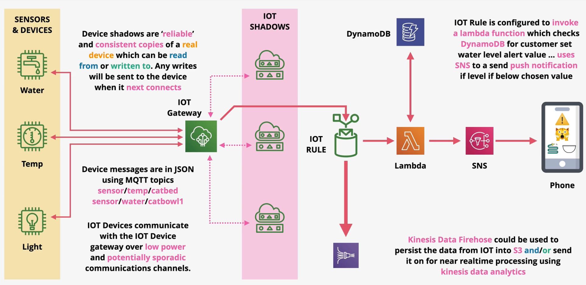

# AWS IOT

AWS `IOT Core` is a suite of products (not a single service) used for managing millions of IOT devices. AWS IOT enables provisioning, updating, and controlling devices.

IOT provides `device shadows` capabilitities, which are reliable and consistent copies of a real device. Developers can interact with a device shadow and IOT will ensure the real device is eventually updated. This is an important capability since connections to the real IOT devices are unreliable.

IOT enables event-driven integration with other AWS services using rules. Rules can be used to match events within the IOT Gateway bus and trigger custom actions involving other AWS services.

The AWS `IOT Gatway` is a component that the sensors interact with.

