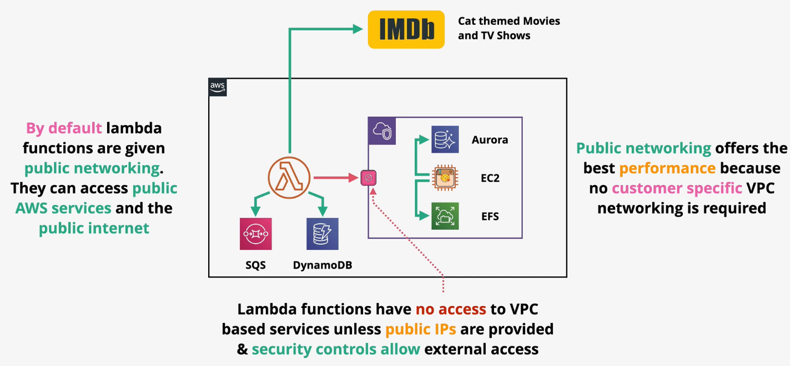
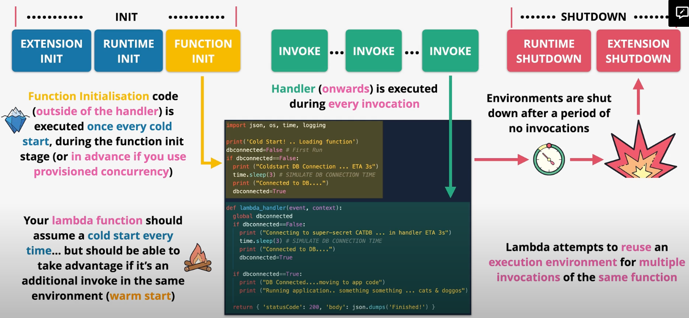

# Lambda

Lambda is a function-as-a-service (`FaaS`) that provides the infrastructure to create short running and focused pieces of code.

Lambda supports multiple `runtimes` including Python, Ruby, Java, Go, C#, and NodeJS. Custom runtimes, such as Rust, are possible using Lambda `layers`.

When invoked, functions are loaded and run into a `runtime environment`. The environment has a `direct memory` (indirect CPU) allocation. Developers directly control the memory allocated for Lambda functions. Based on the memory configuration, vCPU is allocated.

By default, Lambda functions have 512MB of storage available in the `/tmp` directory.

Lambda can run for up to 15 minutes.

You are billed for the duration of the function execution.

At its most basic, a Lambda function is a deployment package that the Lambda service executes. The deployment package must be smaller than `50 MB zipped` or `250 MB unzipped`.

> [Exam Tip]
>
> For the purposes of the exam, Docker is not supported in Lambda. Lambda supports containers, but the term Docker refers to a more traditional container runtime.

## Networking

Lambda has two networking modes: public and private.

By default, Lambda functions are given public networking and run within the AWS public zone. Public Lambda functions can access public AWS services and the public internet, but they cannot access private VPC resources.

Alternatively, Lambda functions can be configured to be accessible within a private VPC. Private Lambda functions must obey all VPC networking rules. Private Lambda functions can access private and public resources (using a NAT).

Private Lambda functions execute in the AWS Lambda Service VPC with an ENI injected into the customer VPC.

## Permissions

Lambda functions have permissions defined in the `execution role`. Lambda execution roles are IAM roles attached to a Lambda function which control the permissions the function receives.

Lambda functions also support a `resource policy`. The resource policy controls which services and accounts can invoke the Lambda function.

## Logging

Lambda uses CloudWatch, CloudWatch Logs, and X-Ray. Logs are ingested into CloudWatch Logs. Lambda is integrated with X-Ray for distributed tracing. Lambda also publishes metrics (e.g., invocation successes/failures, retries) to CloudWatch.

In order for Lambda to push logs to CloudWatch Logs, it must have the proper permissions in the execution role.

## Invocation

There are three types of invocation models:
- Syncronous
- Asynchronous
- Event-based

Lambda functions can be executed `synchronously`, in which the client waits for the function to complete execution.

A common pattern for synchronous execution is using the API Gateway to invoke a Lambda.

Lambda functions can also be executed `asynchronously`, in which the invoker does not wait for execution to complete. 

When execution failure occurs during asynchronous invocation, the Lambda service will retry execution between 0 and 2 times (configurable).

It is important that Lambda functions are idempotent to avoid unintended bugs.

Function invocations can also be `event-based`. Events typically come from streams or queues such as Kinesis, SQS, or DynamoDB streams.

Event-based invocation is faciliated through Lambda `event source mapping`. The event source mapping handler polls the stream or queue for messages, batches them, and invokes a function with a given batch.

Batches will succeed (`OK`) or fail (`FAIL`) as a batch.

Developers should be careful to limit batch sizes so that all execution is completed within 15 minutes.

When using an event source mapping, the functions execution role must have permissions to read from the event source.

SQS queues or an SNS topic can be used to handle any discarded or failed event batches.

## Versions

The Lambda services supports versioning of functions. The `version` of a function represents the code and configuration.

Lambda function versions are `immutable`. Once a version is created, it cannot be changed. Versions are given their own ARNs.

Lambda `aliases` can be created to point to a specific version. The `$latest` alias can be used to point to the latest version.

## Destinations

Lambda supports `destinations` such as SQS, SNS, Lambda, and EventBridge. Developers can configure behavior so that a successful or failed execution will be sent as an event to some AWS service.

## Failures

Lambda supports `dead-letter queues`, in which executions that repeatedly failure are sent to an SQS queue for manual processing.

## Cold Starts

A Lambda `execution context` is the environment in which a Lambda function runs. The environment must be prepared (e.g., downloading code & packages) before execution can take place.

A `cold start` is a full creation and configuration of a Lambda function, including downloading the code.

The same Lambda function may reuse an existing execution context, but the amount of time an execution context remains around is indeterminant.

When a Lambda function executes within an existing execution context, this is known as a `warm start`. Since warm starts do not need to download the deployment context, it starts much more quickly than a code start.

`Provisioned concurrency` can be used to keep execution contexts warm and ready to use to improve startup speeds.

## Handler

Lambda functions execute with a predictable `lifecycle`.
1. **Initialization** - Creates or unfreezes execution environment. 
    1A. Extension Init  
    1B. Runtime Init  
    1C. Function Init. 
2. **Invocation** - Runs the function handler  
3. **Shutdown** - The execution environment is shut down.  
    3A. Runtime shutdown. 
    3B. Extension shutdown. 

Function initailization code (code that is written outside the handler) is executed once every cold start, during the `function init` phase.

Lambda attempts to reuse an execution environment for multiple invocations of the same function. After a period of inactivity, the execution environment is shut down (unless using provisioned concurrency).

To improve initialization time, put as much code into the initialization code (outside the handler function) as possible.

