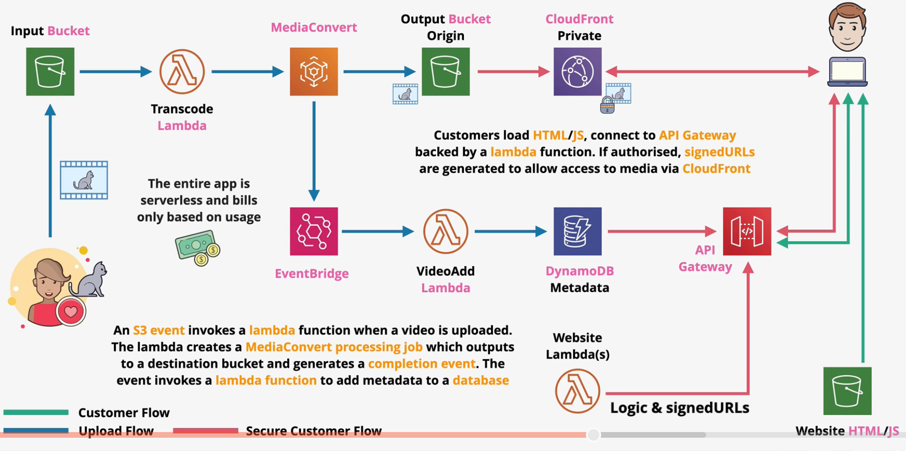

# Elastic Transcoder & MediaCovert

Both `Elastic Transcoder` and `MediaConvert` are serverless pay-per-use file-based transcoding services.

Compared to Elastic Transcoder, MediaConvert supports more codecs and is designed for larger volume and parallel processing.

Videos are added to pipelines (ET) or queues (MC). Files are loaded from S3, processed, and stored on S3.

MediaConvert supports reserved pricing and EventBridge for job signalling.

> [Exam Tip]
>
> Elastic Transcoder is a legacy service that is replaced by MediaConvert. For exam questions, default to MediaConvert.
> There are a few situations in which Elastic Transcoder should be chosen:
> - `WebM` is required
> - Animated GIFs
> - MP3, FLAC, Vorbis, and WAV
> 
> For all other situations, choose MediaConvert.