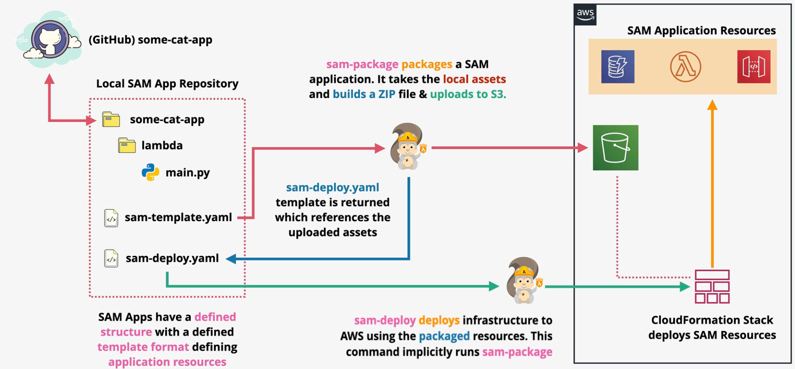

# SAM

Serverless applications are often build with front-end code and assets that may be delivered from S3 via CloudFront. It may also contain APIs using AWS API Gateway, compute with Lambda, and data storage using S3 and DynamoDB. It will also likely include events, messages, permissions and more.

Managing all these components in a coherent way can be challenging.

SAM is an open-source framework used to build serverless applications on AWS.

The `AWS template specification` is a CloudFormation extension that enables developers to define serverless resources.

The `SAM CLI` is used locally to build SAM applications. Using the CLI, you can deploy and invoke Lambda functions and interact with other serverless resources. This is useful for testing locally and deploying AWS resources.

`SAM apps` have a defined structure with a defined template format.

The `sam-package` command packages a SAM application by collecting local assets, builds a ZIP file, and uploads it to S3.

The `sam-deploy` deploys a SAM package to AWS. This command will implicitly run the `sam-package` operation.

