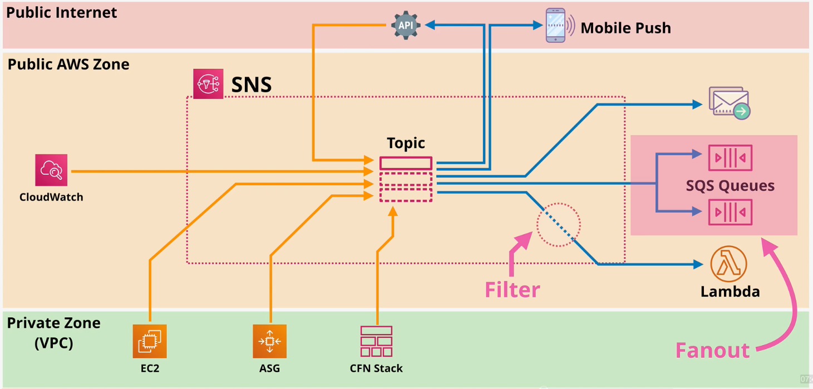

# SNS

SNS is a fully-managed pub-sub messaging service. SNS runs in the public zone.

SNS supports messages up to 256KB payloads. Alternatively, a larger message can be saved in an S3 bucket and a reference to the S3 object can be added to the payload.

In SNS, `publishers` send messages to a `topic` where it can recieved by one or more `subscribers`. SNS supports many subscriber protocols including HTTP(S), email, SQS, mobile push, SMS messages, and Lambda. 

SNS offers several key features:

**Delivery Status** - Some subscriber protocols support delivery status (e.g., HTTP, Lambda, SQS).

**Delivery Retries** - Reliable delivery is achieved via an automatic retry strategy.

**Regionally Resilience** - SNS data is automatically replicated across multiple AZs in a region to provide in-region scalability and high availability.

**Server Side Encryption (SSE)** - SNS can be configured to encrypt data.

**Topic Policy** - SNS supports resource policies to define access permissions for the topic. Using a topic policy, you can enable cross-account access.