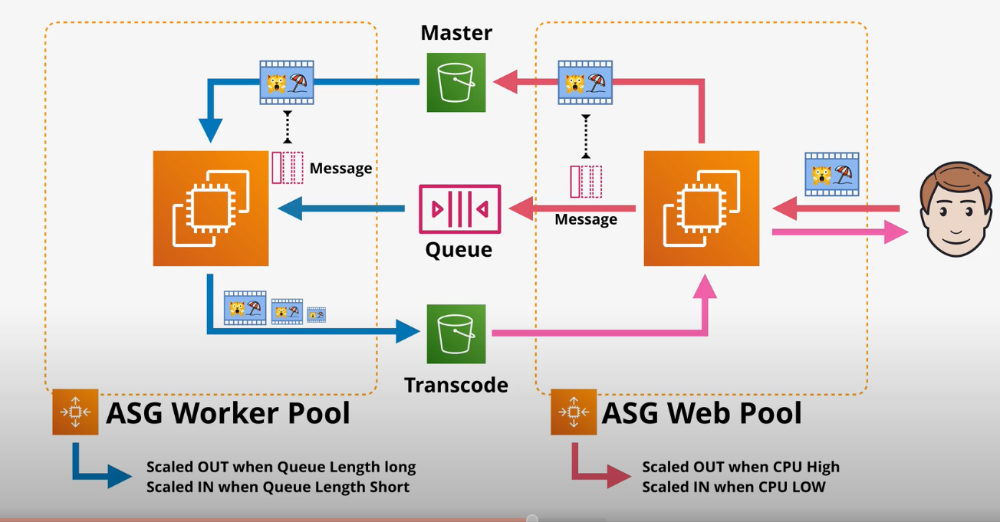
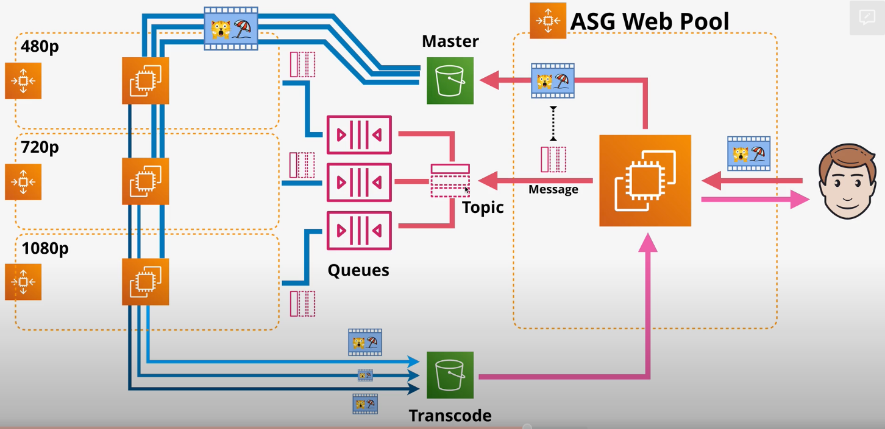
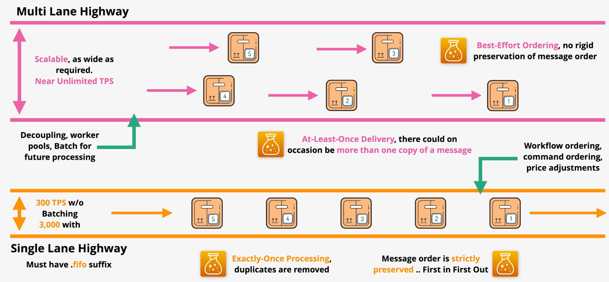
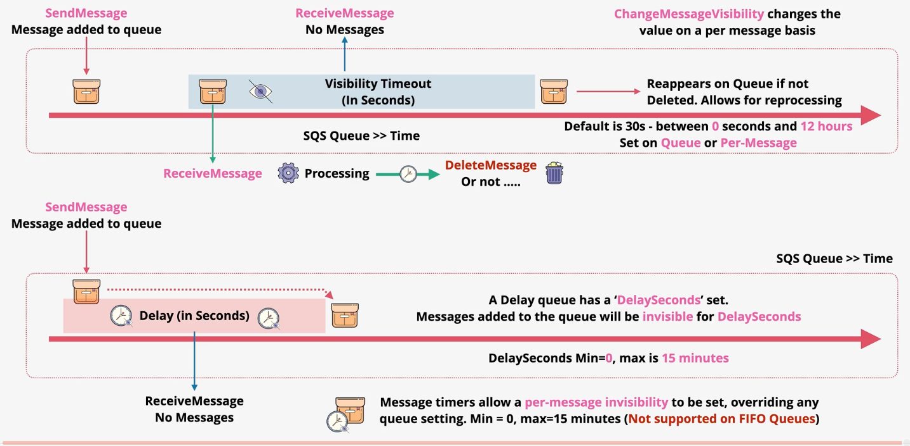
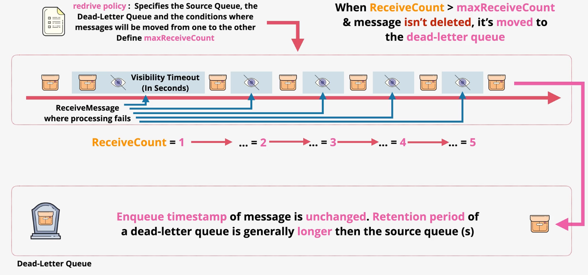

# SQS

SQS provides fully-managed message queues that runs in the public zone. SQS queues are highly available within a region.

SQS can be used to decouple components of an architecture.

Messages in SQS can be up to 256 KB in size.

SQS charges based on the number of requests. A single request can result in 0-10 messages, up to 64KB total. SQS is more cost-efficient when polling requests are reduced.

Workers can poll SQS using `short polling` or `long polling`. In a short polling request, SQS will check for messages and quickly return 0 or more messages. With long polling, SQS will wait up to 20 seconds (configurable via the `waitTimeSeconds` configuration parameter) for new messages before delivering messages. It is a best practice to use long polling.

`Queue policies` can be used to control access. Queue policies must be used to enable cross-account access.

SQS supports encryption at rest using KMS. By default, all traffic is encrypted in transit.

> [Exam Tip]
>
> A common pattern is to scale worker nodes based on the size of an SQS queue.

*Caption (below): Using SQS, the worker pool (responsible for processing SQS messages) and the web pool (responsible for publishing SQS messages) are completely decoupled. The worker pool can be scaled based on the queue length.*

*Caption (below): The fanout architecture involves a single SNS topic with multiple SQS subscribers. Each subscriber is responsible for processing the video in a slightly different way (e.g., resolution). This work is done in parallel for efficiency.*

## Queue Types

SQS `queues` come in two types:
- Standard
- FIFO

`Standard` queues ordering is done on a best-effort basis. Standard queues guarentee delivery of each message `at-least-once`. Standard queues scale better than FIFO queues.

FIFO queues guarentee the ordering of messages and guarentee `exactly-once` delivery. **FIFO queues must be suffixed with .fifo.**

| | Ordering | Delivery | Scalability |
| --- | --- | --- | --- | 
| Standard | Best-effort | At least once | Near infinite scalability |
| FIFO | Order guarenteed | Exactly once (duplicates are removed) | 300 TPS w/o batching; 3,000 with batching |

## Extended Client Library

The `Extended Client Library` can be used when handling messages over the SQS max (256KB). 

When using the library, the library `SendMessage` operation will upload the payload to S3, writes a reference to the S3 object in the message, and publishes the message to the queue. 

The `ReceiveMessage` operation will automatically and transparently retrieve the payload from S3 based on the reference within the message.

The `DeleteMessage` operation will automatically and transparently delete the payload in S3.

## Retention Period

A queue is configured with a `retention period`. This period defines the amount of time a message can stay on the queue without being read before being dropped.

## VisibilityTimeout

SQS supports a `VisibilityTimeout`. After a messag eis received by a worker, the message remains in a hidden state for a configurable amount of time. While hidden, no other workers can receive the message. 

After successfully processing of the message, the worker is responsible for explicitly deleting the message from the queue. If a message is not deleted, and its *VisibilityTimeout* period expires, it will reappear in the queue and be available to other workers.

The VisibilityTimeout feature is designed to facilitate the retry of messages due to failed workers.

The VisibilityTimeout setting can be configured on the queue, or on a per-message basis using the `ChangeMessageVisibility` operation.

VisibilityTimeout supports values from 0 seconds to 12 hours.

## Delay Queues

Delay queues allow you to initially delay the delivery of messages to consumers.

When a message is added to a delay queue, the message is not available to workers until `DelaySeconds` has passed. Therefore, messages added the queue will be initially invisible for `DelaySeconds`.

DelaySeconds supports values from zero to 15 minutes.

DelaySeconds can also be set on a per-message basis. This overrides the queue setting (not supported on FIFO queues).

Delay queues can bee used when it is desirable to delay processing of the message.

## Dead Letter Queue

SQS can be configured to utilize a `Dead-Letter Queue`. When using a DLQ, messages that cannot be processed will be sent to the DLQ for special handling.

DLQs are configured via a `Redrive policy`. This policy specifies the source queue, the DLQ, and the conditions in which a message should be moved from one to the other.

The `maxReceiveCount` defines how many times a message can be received (without being deleted) before moving to the DLQ.

Wen using DLQs, you can configure an alarm to alert you when a message ends on the DLQ.

When messages are written to a queue, they contain a `enqueue timestamp` that represents the time they were published. When moving a message to a DLQ, that enqueue timestamp remains unchanged so the retention period of a DLQ is generally longer than the source queue.

One DLQ can be used for multiple source queues.

