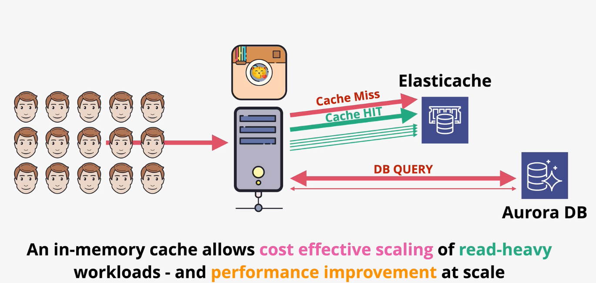
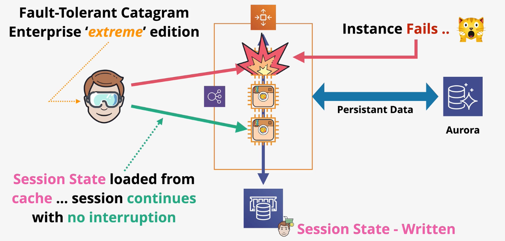

# ElastiCache

ElastiCache is a high-performance non-persisting `in-memory database` that use a `Redis` or `Memcached` engine.

ElastiCache is ideal for read heavy workloads with low latency requirements. It can be used to reduce database workloads (which are expensive). ElastiCache can also be used to store session data to achieve stateless services.

> [Exam Tip]
>
> Using ElastiCache within a service requires application code changes!

*Caption (below): ElastiCache can be used to reduce load on backend datastores like AuroraDB.*

*Caption (below): ElastiCache can be used to offload session state, enabling stateless architectures for highly scalable applications.*

ElastiCache supports the `Redis` and `Memcached` engines.

| Memcached | Redis |
| --- | --- |
| Simple data structures | Advanced data structures |
| No replication | Multi-AZ via replication for HA |
| Sharding across multiple nodes | Replication across nodes for scalability |
| No backups | Backup & Restore |
| Multi-threaded by design for higher performance in multi-core CPUs | Supports transactions | 