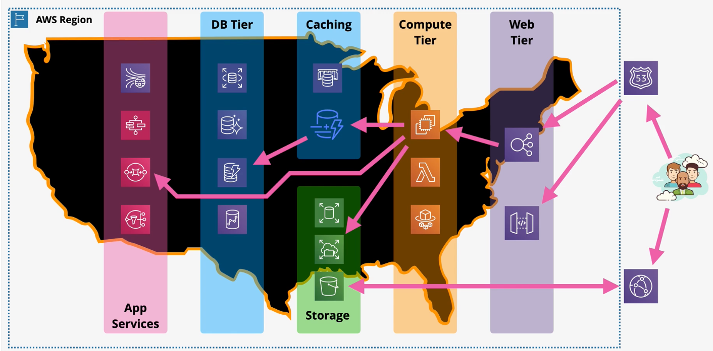
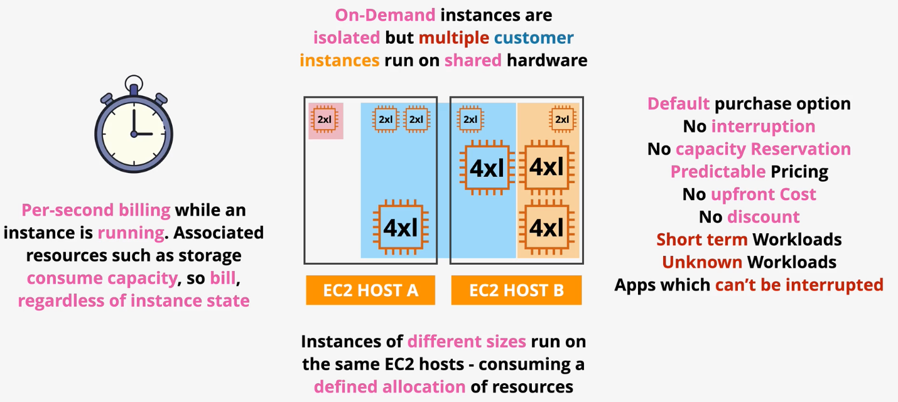
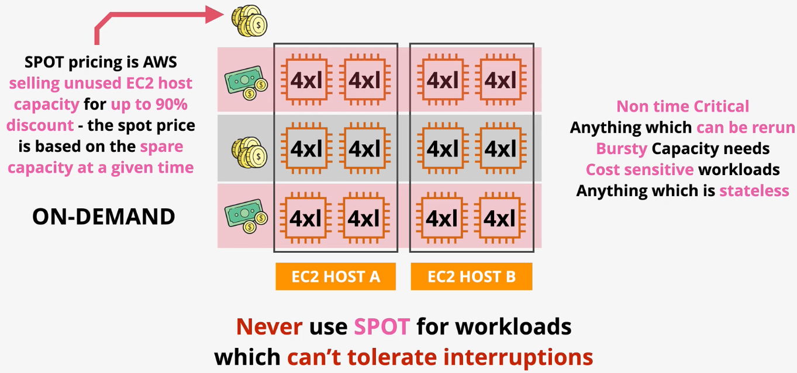
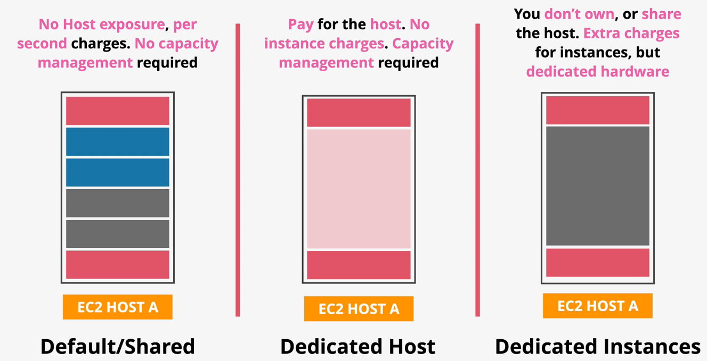

# EC2

*Caption (below): A picture of the various layers of a modern application.*

## Purchase Options

**On-Demand**

- On-demand is the default purchase option.
- On-demand uses per-second billing while the instance is running.
- On-demand instances are logically isolated but multiple consumer instances run on shared hardware.
- Great for short-term workloads, unknown capacity workloads, or apps that cannot be interrupted.

**Spot Instances**

- Spot is the cheapest EC2 purchase option.
- The `spot price` is the price AWS is currently selling unused EC2 host capacity. This can result in up to a 90% discount.
- Spot instances can be terminated at any time.
- Spot instances should be used for non-time critical worklaods, anything that can be rerun, bursty capacity needs, cost-sensitive workloads, and workloads that are stateless. Spot instances should never be used for workloads that cannot tolerate interruptions.

**Reserved**

- Users can purchase reservations within an AZ to reduce or remove the per second cost of EC2 which results in deep discounts.
- Reservations can be purchased for 1 year or 3 year terms.
- When purchasing a reservation, users can choose whether they want to pay nothing upfront, pay some upfront, or pay everything upfront. Commiting funds up front results in better discounts.
- Users are charged for the reservation whether or not they are used.
- Reservations can be used to partially cover capacity for a workload.
- Reservations should be used for long-term workloads in which capacity is well-known.

**Dedicated Hosts**

- The EC2 dedicated host purchase options reserves a physical host that is dedicated to you. No other AWS customers will be deployed on that host.
- When choosing dedicated hosts, users pay for the host. There are no per-instance charges.
- When licenses are based on the socket/cores of a physical machine, it may be more cost-effective to use a dedicated host rather than the default multi-tenant host.
- `Host affinity` links instances to hosts.

**Dedicated Instances**

- Similar to dedicated hosts, the EC2 dedicated instances purchase option reserves a physical host that is dedicated to you. Unlike dedicated hosts, you do not have to manage the underlying host.

*Caption (below): Comparing EC2 purchase options.*
