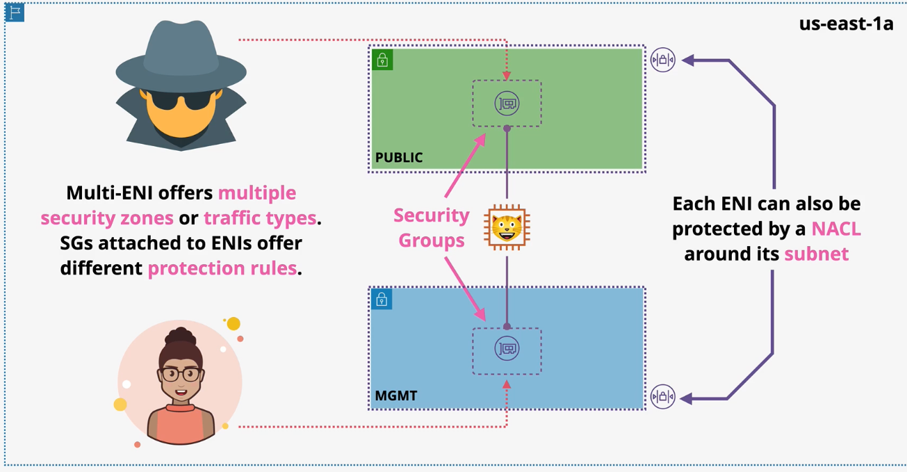
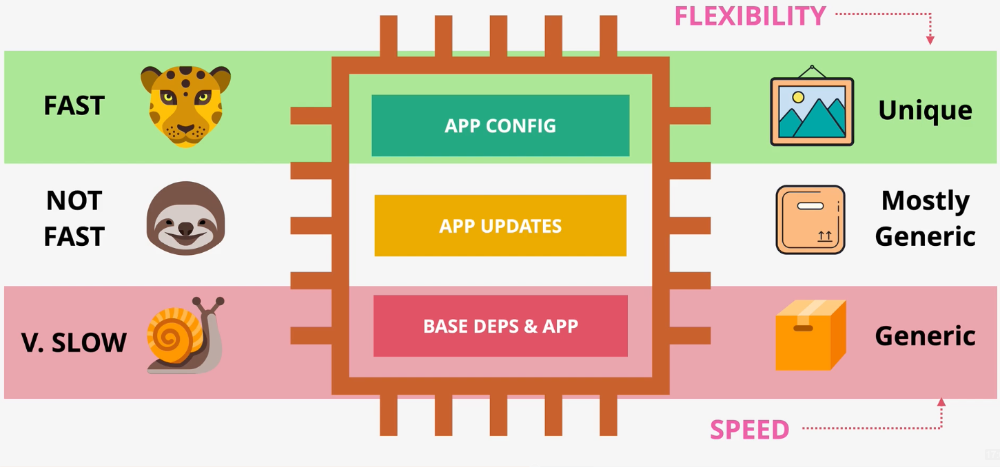
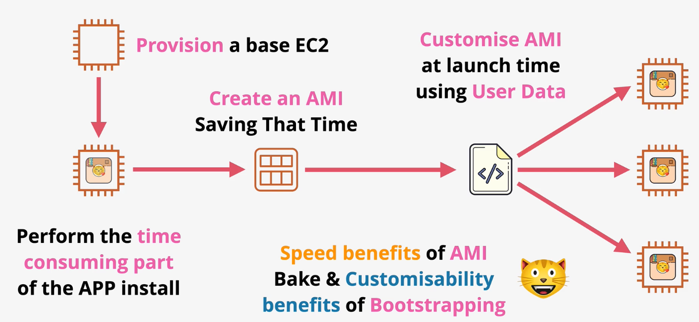
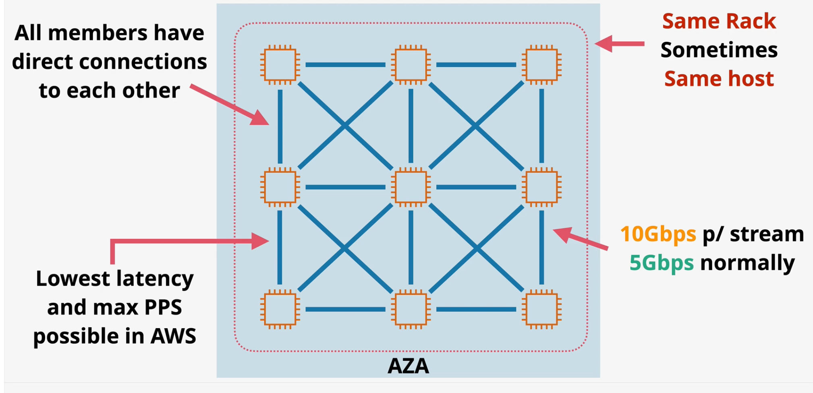
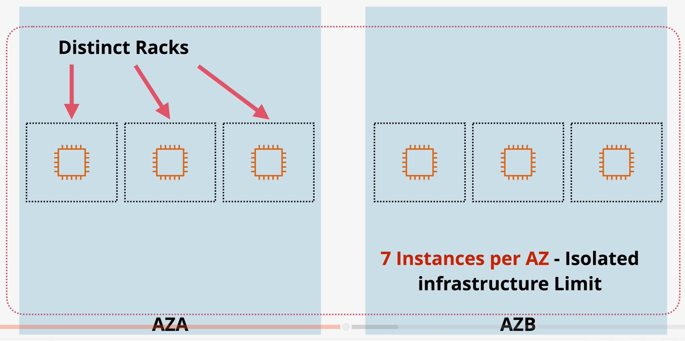

# EC2

*Caption (below): A picture of the various layers of a modern application.*

## Purchase Options

**On-Demand**

- On-demand is the default purchase option.
- On-demand uses per-second billing while the instance is running.
- On-demand instances are logically isolated but multiple consumer instances run on shared hardware.
- Great for short-term workloads, unknown capacity workloads, or apps that cannot be interrupted.

**Spot Instances**

- Spot is the cheapest EC2 purchase option.
- The `spot price` is the price AWS is currently selling unused EC2 host capacity. This can result in up to a 90% discount.
- Spot instances can be terminated at any time.
- Spot instances should be used for non-time critical worklaods, anything that can be rerun, bursty capacity needs, cost-sensitive workloads, and workloads that are stateless. Spot instances should never be used for workloads that cannot tolerate interruptions.

**Dedicated Hosts**

- The EC2 dedicated host purchase options reserves a physical host that is dedicated to you. No other AWS customers will be deployed on that host.
- When choosing dedicated hosts, users pay for the host. There are no per-instance charges.
- When licenses are based on the socket/cores of a physical machine, it may be more cost-effective to use a dedicated host rather than the default multi-tenant host.
- `Host affinity` links instances to hosts.

**Dedicated Instances**

- Similar to dedicated hosts, the EC2 dedicated instances purchase option reserves a physical host that is dedicated to you. Unlike dedicated hosts, you do not have to manage the underlying host.

*Caption (below): Comparing EC2 purchase options.*

**Reserved**

| | Description | Use Case | Term Limits | Limitations |
| --- | --- | --- | --- | --- |
| Standard Reserved | Provides deep billing discounts and reserves capacity for workloads running in a specific AZ. | Ideal for long-term workloads in which capacity requirements are well-known. | 1 to 3 years | Long term commitment. |
| Scheduled Reserved | Users specify a time window in which their workloads will run. When running workloads during that time, users get a slightly cheaper rate. | Long term workloads that run on a predictable schedule. | Minimum of 1200 hours per year (100 hours per month) and 1 year minimum | Not available for all instance types or AWS Regions. |
| Regional Reserved | Users are given a billing discount for valid instances launched in any AZ within the region. | Cost effective when running workloads in a specific region. | 1 to 3 years | Does not reserve capacity. |
| Zonal Reserved | Provides billing discounts and **capacity reservation** within one specific AZ. | To reserve capacity and benefit from billing reductions for workloads in a specific AZ. | 1 to 3 years | Only applies to workloads in the chosen AZ. |
| On-Demand Reserved | Reserves capacity within an AZ, but does not provide any billing discounts. There are no term limits. | Ensure workload capacity is available in an AZ when you need it without term limits. | None | No discounts. |

- When purchasing a reservation, users can choose whether they want to pay nothing upfront, pay some upfront, or pay everything upfront. The more money committed up front, the greater the discount.
- Users are charged for the reservation whether or not they are used.
- Reservations can be used to partially cover capacity for a workload.

## EC2 Savings Plan

`Savings Plans` is a flexible pricing model offering lower prices compared to On-Demand pricing, in exchange for a specific usage commitment (measured in $/hour) for a one or three-year period.

AWS offers three types of Savings Plans – Compute Savings Plans, EC2 Instance Savings Plans, and Amazon SageMaker Savings Plans.
- `Compute Savings Plans` apply to usage across Amazon EC2, AWS Lambda, and AWS Fargate.
- `EC2 Instance Savings Plans` apply to EC2 usage.
- `Amazon SageMaker Savings Plans` apply to Amazon SageMaker usage.

## EC2 Networking

EC2 instances have a `primary ENI` that is created with the instance. This ENI cannot be removed.

`Additional ENIs` can be added or removed in other subnets (known as `multi-home`) within the same AZ. ENIs cannot be added in other AZs. 

Security groups are associated with an ENI, not the instance itself. This allows for different security requirements based on the ENI.

NACLs can also be used to secure traffic around each subnet.

The primary ENI is allocated a primary private IPv4 address within the subnet CIDR. Additional ENIs can also be allocated private IP addresses.

If an instance is configured to have a public IP address, the ENI is configured with a public IP. If you choose to allocate an `Elastic IP address`, it will take the place of the default public IP.

You can allocate one EIP per private IPv4 address. EIPs are billed only if they are allocated to an account, but not in use.

ENIs can also have one or more IPv6 addresses, 1 MAC address, and one or more security groups.

By default, each ENI performs `SRC/DST checks`. SRC/DST checks inspects each packet and drops traffic for which it is not the destination. This behavior can be configured.

## Bootstrapping & AMI Baking

As applications scale out, new EC2 instances are launched. These instances will not be available to accept traffic until the instance has launched, base dependencies and apps are installed, and apps have been updated and configured on the instance.

If this process is happening in real time, it could represent a significant lag between the time the instance is needed and the time its available.

To solve for this problem, we can use bootstrapping or AMI baking.

## Bootstrapping

`Bootstrapping` is the process of running scripts in user data once an EC2 instance is provisioned.

Boostrapping is very flexibile, but takes time.

## AMI Baking

When using AMI baking, you launch a master EC2 instance and perform all the time consuming tasks one time.

Once the master instance is configured properly, you can create an AMI that can be used for future instances.

Bootstrapping and AMI baking can be used together.

## Placement Groups

By default, the placement of EC2 instances is handled by AWS. `EC2 Placement Groups` allow you to influence this process.

There are three types of placement groups:
- `Cluster`
- `Spread`
- `Partition`

### Cluster

The `Cluster` placement group specifies that instance should be launched within the same rack (and sometimes the same host) within a single AZ. `Cluster` placement groups are used to achieve the maximum network performance available on AWS.

Notes about Cluster placement groups:
- Because all instances are clustered, this type of deployments offers very little resilience to failures.
- The Cluster placement group can span VPCs at the cost of reduced performance.
- This placement group requires a supported instance type.
- It is recommended that all instances in a placement group are the same instance type, and they are all launched together.

### Spread

The `Spread` placement group maximizes resilience to failures by spreading instances across multiple AZs, ensuring they do not end up on the same rack.

The spread placement group is limited to 7 instances per AZ to ensure there are enough unique racks to handle the workload.

The spread placement group does not support dedicated instances or hosts.

### Partition

The `Partition` placement group allows you define a maximum of 7 partitions per AZ. Each partition is guarenteed to run on separate hardware from other partitions. Unlike the spread placement group, a partition can support any number of instances.

Instances can be manually assigned to partition, or AWS can auto-distribute instances between partitions. 

The partition placement group is useful for large scale applications in which you need to assign instances to partitions (topology aware).