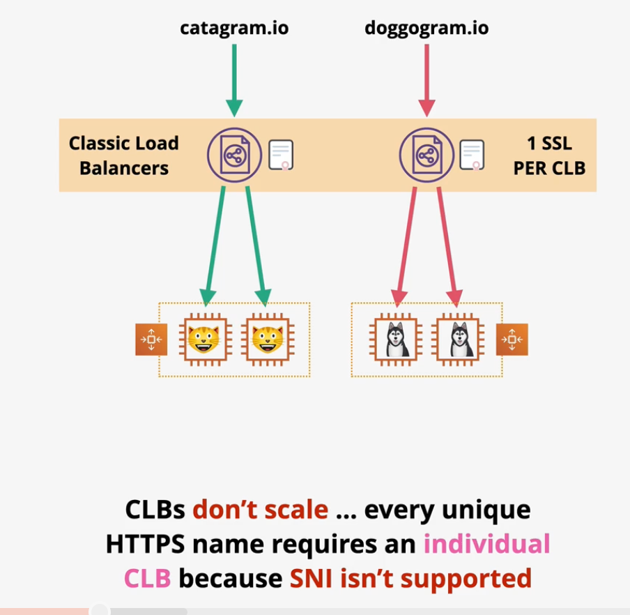
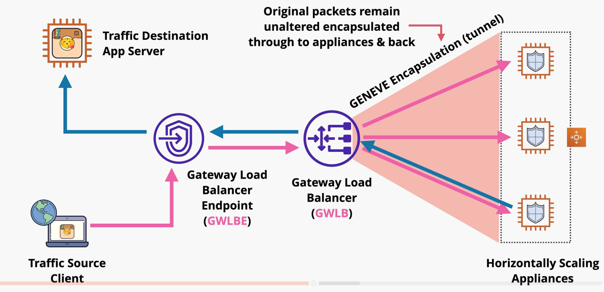

# Elastic Load Balancers (ELB)

ELBs monitor for, and accept, connections on a specific port from clients and distribute the traffic among one or more backend compute.

ELBs can support `IPv4` or `support dual stack` (IPv4 and IPv6).

ELBs are created with a DNS name (A record) that resolve to all the `nodes` of an ELB. The ELB will automatically scale (add more nodes) as traffic requires.

ELB nodes are configured in all AZs within a region (at least 2 AZs).

ELBs can be `internet-facing`, which means it is accessible from the public internet, or `internal`, which means it is only accessible from within the VPC by a private IP address.

ELBs require 8+ free IP addresses in a subnet in order to operate. AWS recommends a subnet with at least a /27 subnet mask.

ELBs allow architecture teirs to scale independent of each other.

Originally, each ELB node could only distribute load to compute within the same AZ. However, ELBs now support `cross-zone load balancing`. This enhancement allows the load balancer to distribute load across zones.

## Session Stickiness

Session data is stored on a specific server that persists while you have a valid session with the application.

If an application does not store session state, it is known as `stateless`.

`Session stickiness` is a feature supported by ALBs that temporarily maps users to instances on which their session is stored. As a result, all requests from the same user will be forwarded to the same instance.

Session stickiness is enabled at a `target group` level.

This feature generates a `cookie` (called `AWSALB`) which temporarily locks the user to a specific backend instance. Cookies can last any duration from 1 second to 7 days.

If the cookie fails or expires, a new instance will be chosen for that user.

Session stickiness can result in uneven loads on backend instances.

## Load Balancer Types

Load balancers are split between two versions: v1 (deprecated) and v2 (standard).

There are three types of load balancers on AWS:
- Classic Load Balancer (v1)
- Network Load Balancer (v2)
- Application Load Balancer (v2)

### Classic Load Balancers

Classic Load Balancers are a v1 product that is deprecated. CLBs can only be used with the Classic VPC architecture.

*Caption (below): CLBs do not scale efficiently because they only support 1 SSL and one domain name per load balancer.*

### Application Load Balancer

Application Load Balancers (`ALB`) are layer-7 load balancers that have advanced HTTP features. 

ALBs support `HTTP` and `HTTPS` protocol. They cannot support other layer-7 protocols such as SMTP, SSH, or gaming protocols. ALBs also do not support layer-4 protocols such as TCP, UDP, or TLS.

ALBs require `SSL termination`. SSL termination is a situation in which SSL connections are terminated on the load balancer and the traffic is forwarded to the target on a brand new connection. As a result, the ALB must have an SSL if HTTPS is used.

ALB processing is slower than NLBs.

ALBs support health checks.

You are able to create `load balancing rules`. Rules determine what happens to the connection when it arrives at the load balancer. Rules are processed in priority order. The last rule is always a "catch-all" default rule.

ALB rules support conditions that analyze host headers, http headers, http request method, path pattern, query string, and source IP address.

ALB rules can result in a one action: forward, redirect, fixed-response, authenticate-oidc, or authenticate-cognito.

> [Exam Tip]
>
> ALBs do not support end-to-end encryption!

### Network Load Balancer

NLBs are layer-4 load balancers that support the `UDP`, `TCP`, `TLS`, and `TCP_UDP` protocols. NLBs can be used to support `SMTP`, `SSH`, and game servers.

NLBs cannot support HTTP features such as conditional forwarding. They do not support features such as headers, cookies, or session stickiness.

NLBs are very fast and can support millions of requests per second.

NLBs support simple health checks based on `ICMP/TCP` handshakes.

NLBs can have static IPs which can be useful for whitelisting.

NLBs support end-to-end encryption by forwarding the SSL connection onto the target.

NLBs are used for private link to access many AWS services.

### Comparing Load Balancers

| | OSI Layer | Supported Protocols | Use Cases |
| --- | --- | --- | --- |
| Application Load Balancer | Layer 7 | HTTP/S | HTTP/S protocols, conditional forwarding based on HTTP, advanaced health checks |
| Network Load Balancer | Layer 4 | UDP, TCP, TLS | UDP/TCP/TLS protocols, Unbroken encryption, Static IP, Very high throughput, PrivateLink |

## Connection Draining

When instances are deemed unhealthy or deregistered, the default action is to close all connections and prevent any new connections to the instance from being established.

The `connection draining` feature allows all in-flight requests to complete. When enabled, connection draining can be configured to timeout after 1 - 3600 seconds.

> The term *connection draining* is only used in relation to Classic Load Balancers. The setting is applied directly on the CLB (since it does not use a target group architecture).

The `deregistration delay` feature is similar to connection draining. It is supported by ALBs, NLBs, and GWLBs.

The deregistration delay feature is configured on the target group (not the load balancer itself).

## X-Forwarded-For & Proxy Protocol

When a server receives a request, it has access to the clients IP address. When a load balancer is used, the client IP address represents the LB, not the end user.

### X-Forwarded-For

`X-FORWARDED-FOR` is an HTTP header. As traffic passes through a LB, the LB adds or appends its IP address to the header. The application server can use this header to see the full chain of clients involved in the request, including the end user.

The `X-Forwarded-For` header is supported by CLBs and ALBs, but not NLBs since it does not support Layer 7.

### PROXY Protocol

The `Proxy protocol` works at Layer 4 and therefore supports TCP, SMTP, HTTP, etc.

Similar to *X-Forwarded-For* header, the proxy protocol adds a header to track IPs of components traversed in a request.

The *proxy protocol* feature is supported by CLBs (v1) and NLBs.

### Comparing X-Forwarded-For and PROXY Protocol

| | OSI Layer | Support | Use Case |
| --- | --- | --- | --- |
| X-Forwarded-For | Layer 7 | ALB, CLB | HTTP applications that use ALBs or CLBs. |  
| PROXY Protocol | Layer 4 | NLBs, CLB (v1) | Applications that use NLB or CLB (v1).

## Gateway Load Balancers (GWLB)

A transparent security appliance scans data after it leaves the application instance and before it enters the application instance. Using this type of appliance does not scale well and becomes complex when protecting multiple applications.

The `Gateway Load Balancer` helps you run and scale 3rd party security appliances (e.g., firewalls, IDS, IPS). GWLBs provide transparent inspection for both inbound and outbound traffic.

GWLBs `endpoints` are used to ingress/egress traffic to/from the appliance. The GWLB load balances packets across the backend security appliances. Traffic and metadata are tunneled using the `GENEVE` protocol. Traffic is routed using `route tables`.

