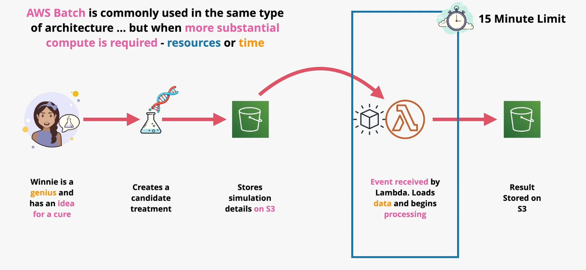

# AWS Batch

AWS Batch is a managed `batch processing` product.

Batch processing describes a job that can run without end user interaction, or can be scheduled to run as resources permit.

AWS Batch handles the underlying compute and orchestration leaving you to simply define the jobs.

An AWS Batch `job` is a script, executable, or Docker container that is responsible for doing the work.

The `job definition` is the metadata that describes the job. The job definition consists of IAM permissions, resource config, mount points, and more.

Jobs are submitted to `job queues`. Jobs wait on these queues until there is sufficient capacity to process them. Queues are associated with one or more compute environments.

A `compute environment` is a managed or unamanged compute. Users can configure instance type, size, vCPU amount, spot price, and more.

AWS Batch supports a `managed` mode and `unmanaged` mode. In the managed mode, AWS Batch manages capacity of compute baed on the workload. You can configure `managed` mode to use on-demand or spot instances. If spot instances are chosen, you can specify your max spot price.

AWS Batch supports both private and public VPCs, which may require VPC Gateways.

In unmanaged mode, you manage all compute.

*Caption (below): Consider a batch-type workload that does not use AWS Batch. Lambda cannot be used for compute-intensive batch-like scenarios due to its execution constraints.*

## Comparing Lambda and Batch

- Lambda has constraints that make it incompatible with large jobs.
    - 15 minute exection time limit
    - Limited disk space (Lambda can use EFS for more disk space, but this requires you to run Lambda within a VPC).
    - Lambda is fully serverless, but offers a limited runtime selection. 
- Batch does not have any time limit or effective resource limit and therefore is ideal for large batch processing jobs.
- Batch is not serverless, but supports Docker or any other runtime.

> [Exam Tip]
>
> If you can perform the batch processing job within the constraints of Lambda, choose Lambda.  
> If you cannot perform the batch processing job within the constraints of Lambda, choose AWS Batch.