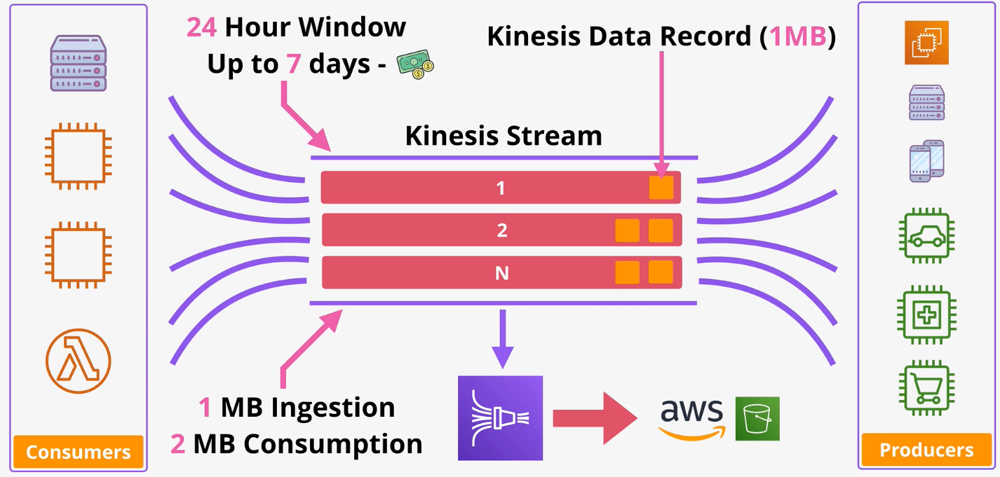
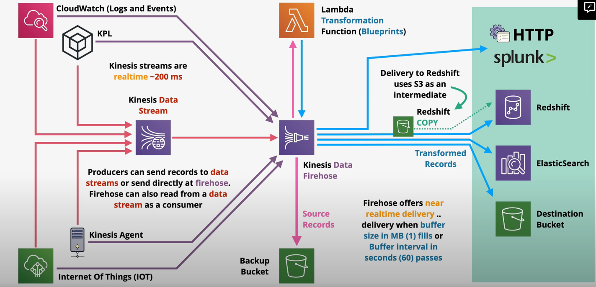
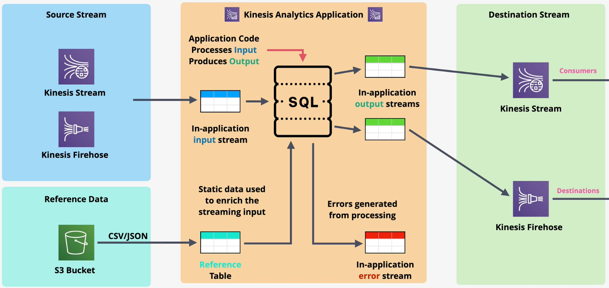

# Kinesis

Kinesis is a highly-scalable streaming service in which one or more `producers` send data in to a kinesis `stream` that can be processed by one or more `consumers`.

Kinesis streams can scale from low to near infinite data rates.

Kinesis is a highly-available public service.

In kinesis, kinesis `data records` (1 MB) are published to a `stream`. The stream consists of configurable `shards` to optimize throughput based on workload requirements.

A kinesis stream starts with a single shard. As required, additional shards are added to the stream to increase throughput. Each shard provides its own performance - 1 MB of ingestion capacity and 2 MB of consumption capacity.

Kinesis streams store a 24-hour moving window of data. Consumers can access any data within that 24 hours. For an additional cost, users can enable a 7-day moving window.

> [Exam Tip]
>
> It is important to understand when to pick Kinesis or SQS for a workload.
> - SQS is not designed to be highly scalable. Typically, SQS supports a small number of producers and consumers.
> - SQS is used to decouple components and facilitate asyncronous communication.
> - SQS does not support persistence of messages and there is no *window* in which the messages are available.
> - Once a message is read from an SQS queue, it is no longer available.
> - Kinesis is designed for *highly-scalable* data ingestion and thus supports many producers and consumers.
> - Kinesis data is persisted within a stream during the rolling data window.

## Firehose

Kinesis does not provide a way to persist data once the rolling data window expires.

Kinesis Firehose is a fully-managed service that can pump data from a Kinesis stream into supported destinations. This is useful to hydrate data lakes, populate data stores, and facilitate analytics services.

Kinesis Firehouse automatically scales to match the throughput requirements.

Kinesis Firehouse supports transformation of data on the fly using Lambda.

Kinesis Firehouse charges based on data volume.

Kinesis Firehose supports a limited number of destinations, including:
- Splunk
- ElasticSearch
- Redshift
- S3
- HTTP data

Note: When pushing data into Redshift, the data is actually written to an intermediate S3 bucket and the Redshift S3 Copy command is used to load it into the data warehouse.

Data producers can send data to a Kinesis stream or directly at a Kinesis Firehose. The Firehouse can accept data from producers or consume data from a Kinesis stream.

Kinesis Firehouse supports near real time delivery of data (within 60 seconds). The Kinesis Firehose will receive the data in realtime, but batches writes:
- For low throughput consumers, Kinesis Firehose will write to the destination every 60 seconds.
- For high throughput consumers, Kinesis Firehose will write to the destination every 1 MB.

## Kinesis Data Analytics

Kinesis Data Analytics is a service that provides real time processing of data using SQL.

The product ingests data from Kinesis Data Streams or Firehose.

Once the data is processed, it can be sent to AWS Lambda, Kinesis Data Stream, or Firehouse (and then onto S3, Redshift, ElasticSearch, Splunk).

Kinesis Data Analytics creates and maintains an `in-application input stream`. This stream is conceptually similar to a database table, but is constantly updated based on new input.

Additionally, Kinesis Data Analytics uses a `reference table` to encrich streaming input.

The reference table and in-application input streams are used to process input and produce output using application code and SQL.

The results of the processing are pushed to the `in-application output stream` and onto a Kinesis Stream or Kinesis Firehose.

Any errors during processing are sent to the `in-application error stream`.

Kinesis Data Analytics should be used on streaming data that requires real-time SQL processing (e.g., time-series analytics, real-time dashboards, real-time metrics).

> [Exam Tip]
>
> Kinesis Firehouse can trigger a Lambda to process data, but it is only near real-time. Kinesis Data Analytics provides real time data processing.

## Kinesis Video Streams

Kinesis video streams allows you to `ingest` live video data from producers such as security cameras, cars, smartphones, drones, time-serialized audio, thermal, depth, or RADAR.

Consumers can access data frame-by-frame or as needed via Kinesis Video Streams APIs. You cannot access the raw data directly.

The data can be persisted and encrypted.

Kinesis Video Streams can integrate with other AWS services (e.g., Rekognition, Connect).

