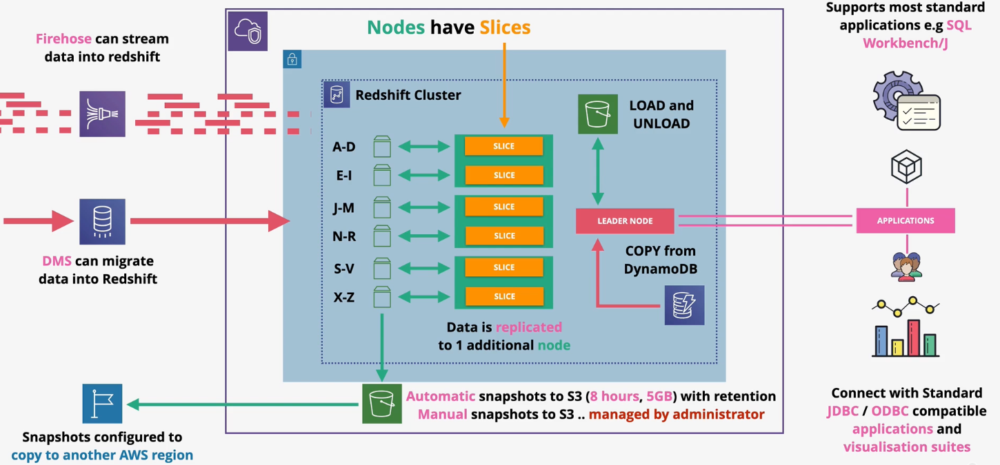

# Amazon Redshift

Amazon Redshift is a petabyte scale data warehouse. It is optimized for `column-based` online analytical processing (`OLAP`) tasks. 

This is in contrast to online transaction processing (`OLTP`) processing in which data is stored in rows (e.g., RDS).

Generally, data is loaded into Redshift before being query. However, Redshift has a few features that go beyond this normal scenario.

`Redshift Spectrum` allows you to query data in S3 directly without loading it into Redshift.

`Redshift Federated Query` allows you to query data in other databases directly without loading it into Redshift.

Redshift integrates into AWS tooling such as QuickSight.

Redshift is a provisioned server-based product (not serverless) that uses a cluster-based architecture. Redshift runs on multiple nodes with high-speed networking between the nodes.

When you interact with Redshift, you communicate with the `leader node`. The leader node is responsible for query inputs, splitting the task into `slices`, planning the execution of the slices, and aggregating the results.

The leader node delegates query execution to one or more `compute nodes`. Each compute node accepts tasks from the leader node, executes them, and responds with the result.

Redshift is a VPC service, therefore supports VPC security, IAM permissions, KMS at-rest encryption, and CloudWatch monitoring.

When you use Amazon Redshift `enhanced VPC routing`, Amazon Redshift forces all COPY and UNLOAD traffic between your cluster and your data repositories through your virtual private cloud (VPC) based on the Amazon VPC service. 

By using enhanced VPC routing, you can use standard VPC features, such as VPC security groups, network access control lists (ACLs), VPC endpoints, VPC endpoint policies, internet gateways, and Domain Name System (DNS) servers. 

You use these features to tightly manage the flow of data between your Amazon Redshift cluster and other resources. 

When you use enhanced VPC routing to route traffic through your VPC, you can also use VPC flow logs to monitor COPY and UNLOAD traffic.

Both DMS and Firehose natively support Redshift as a destination.

## Resiliency and Recovery

Redshift automatically creates and exports `snapshots` to S3 every 8 hours or 5 GB of data. By default, the snapshots are retained for 1 day (configurable up to 35 days).

Manual snapshots can be taken at any time. Manual snapshots are retained indefinitely.

Redshift can be configured to copy snapshots to another region for DR. The retention period can be configured separately than in-region snapshots.

Snapshots can be restored to a new cluster.