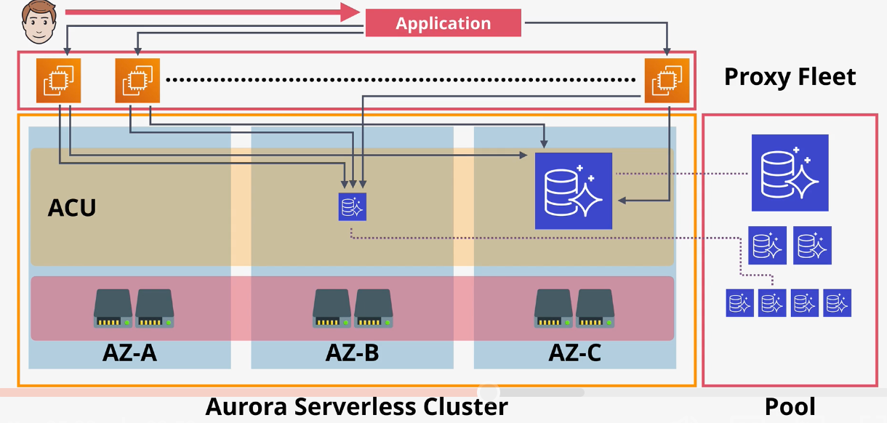

# Aurora

## Architecture 

An Aurora `cluster` consists of a single `primary` instance and zero or more `replicas`.

Aurora does not use any local storage. Instead, it uses a `cluster volume`. The cluster volume enables faster provisioning, improved availability, and improved performance. 

The cluster volume is SSD-based, resulting in high IOPS and low latency.

By default, Aurora maintains 6 replicas of the data across three AZs within the cluster volume. When data is written to the primary volume, it is synchronously replicated to the other volumes. The replication happens at the storage layer and does not affect the database instances at all.

When a disk fails in the cluster volume, Aurora automatically recovers from the failure.

Cluster volumes can be a max of 128 TiB.

When creating an Aurora cluster, you do not specify a volume size. The volume automatically scales as needed. 

Replicas can be added or removed without provisioning storage.

## Endpoints

Aurora supports cluster endpoints, reader endpoints, and custom endpoints.

The `cluster endpoint` always points to the primary instance. This endpoint can be used for reads and writes.

The `reader endpoint` is used for read workloads. It load balances requests between all available replicas in the cluster.

You can also define `custom endpoints` to point to specific instances or groups of instances.

## Backups

Backups in Aurora work in the same way as RDS. A restore from a snapshot creates a new cluster.

The `backtrack` feature can be used to allow in-place rewinds to a previous point in time.

A `fast clone` creates a new database using the same data. Instead of copying all the data to a new volume, it uses a `copy-on-write` strategy. All reads are performed from the existing cluster volume, but writes are written to a new volume.

## Billing

There is no free-tier option.

Customers are charged in two components: compute and storage.
- Compute: Customers are charged per hour, and per second (10 minute min).
- Storage: GB/month consumed, IO cost per request

Every cluster includes 100% database size in backups for free.

## Serverless

In contrast to `Aurora Provisioned`, `Aurora Serverless` removes the administrative overhead of provisioning instances.

Instead, Aurora serverless is based on ACUs (Aurora Capacity Units). The minimum and maximum ACUs are specified when creating a cluster. Within these constraints, Aurora automatically adjusts based on load.

The Aurora instance can be paused if no traffic is detected.

Consumption is billed on a per-second basis.

Aurora Serverless has the same resilience as Aurora Provisioned (six copies of the data across three AZs).

AWS manages a `proxy fleet` that brokers connections between clients and the database instances. The proxy fleet allows the Aurora serverless cluster to scale without affecting clients.

Use cases for Aurora Serverless:
- Infrequently used applications
- New applications in which usage patterns are unknown
- Variable or unpredicable workloads
- Development and test databases
- Multi-tenant applications in which your revenue is tied to usage

## Multi-Master