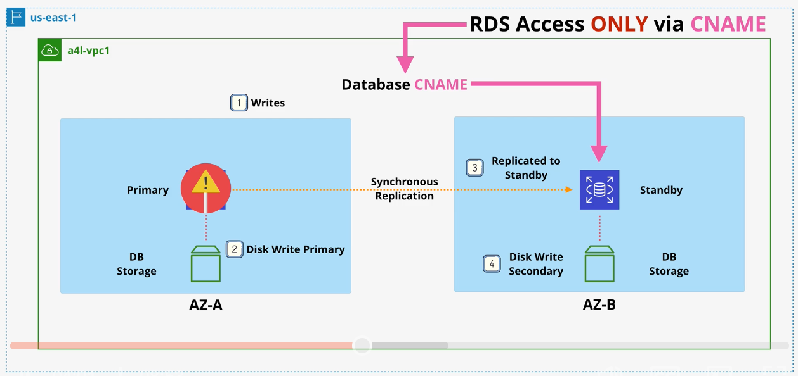
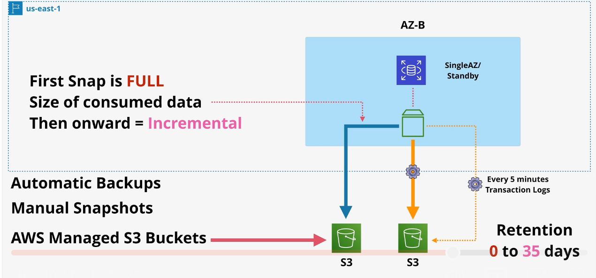
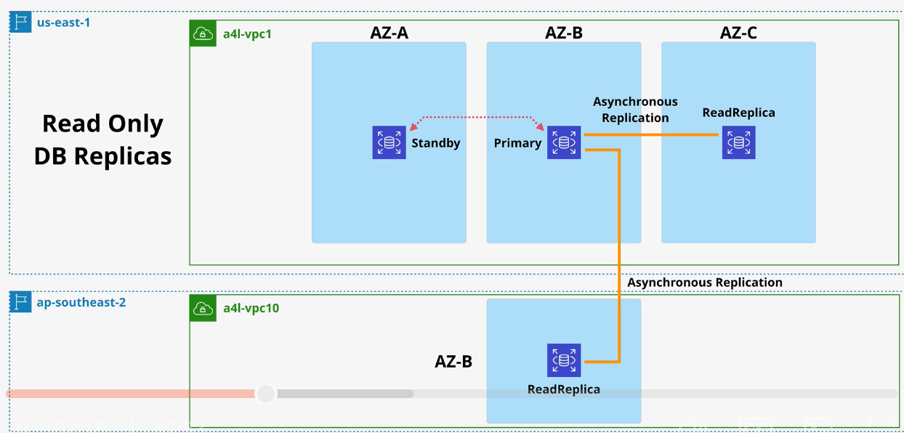
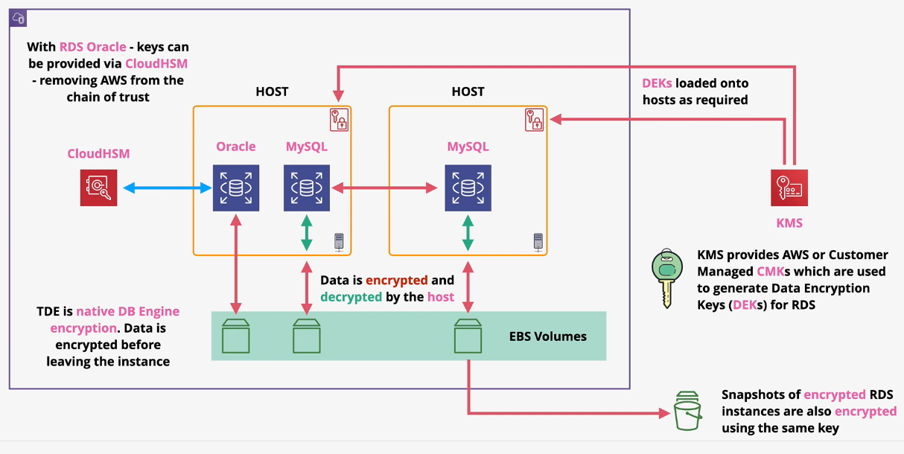
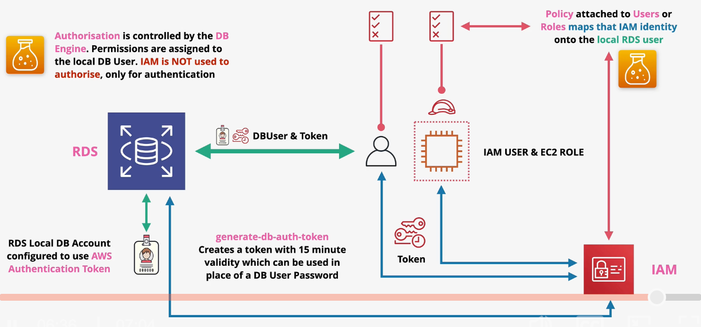

# RDS

RDS is a Database-as-a-service (DBaaS) product that provides managed database instances. Essentially, you're getting a managed EC2 server running a database.

RDS supports multiple database engines including MySQL, MariaDB, PostgreSQL, Oracle, Microsoft SQL Server and more.

The basic building block of RDS is an `RDS instance`, which can contain one or more databases. RDS Instances can be created using a variety of different database instance types (*e.g., db.m5, db.r5, db.t3*).

To connect to RDS, you must use the provided `CNAME` domain. Access to the instance is controlled via a security group.

When you create an RDS instance, it creates an EBS volume to store all data within the AZ. The EBS volume can use *io2*, *gp2*, or *magnetic* storage types.

RDS charges for compute and storage (GB/m).

## RDS Multi-AZ

RDS Multi-AZ is used to add resilience to an RDS database instance.

In addition to the primary instance, a `standby replica` is created in another AZ with its own EBS storage. The standby replica is kept in sync using `synchronous replication`.

The CNAME for the instance normally points to the primary instance. In the event of a primary failover, the CNAME is changed to point to the standby. The failover process can take 60-120 seconds.

Exam Powerups:
- The RDS MultiAZ feature is not available in the free tier.
- The standby instance cannot be directly used; It is only for failover.
- Failover to the standby instance takes about 60-120 seconds.
- RDS MultiAZ is same region only. You cannot have a standby instance in a different region.
- Database backups can be taken from the standby instance in order to eliminate performance impacts on the primary instance.
- A failover can be triggered by an AZ outage, primary instance failure, manual failver, instance type change, and software patching.

## Backups and Restores

**Recovery Time Objective** (**RTO**) - the time it takes to restore functionality due to a failure event.

**Recovery Point Objective** (**RPO**) - a measurement of the data loss due to a failure event. This could be the time between the most recent working snapshot and the failure event.

Lower RTO and RPO increase technical complexity and cost.

`Automated backups` are periodically and automatically taken from the database instance. The first backup is a full backup of the instance. Subsequent snapshots only capture incremental changes.

Automatic backups are taken from the primary instance, or the standby instance if the database is running in Multi-AZ mode.

When using automatic backups, RDS will export `transaction logs` every 5 minutes.

Automatic backups are retained for a configurable amount of time (0 to 35 days).

`Manual snapshots` can be initiated manually, and will remain in the S3 bucket until manually deleted.

Manual snapshots will be taken from the primary instance, or the standby instance if in Multi-AZ mode.

Automatic backups and snapshots capture all databases within an RDS instance.

Both automatic backups and manual snapshots stored in an AWS-managed S3 bucket (and is therefore not available from the AWS console).

**Exam Powerups**:
- When an RDS snapshot is restored, it creates a brand new RDS instance with a new endpoint.
- Since snapshots are representation of the database at a specific point in time, restoring from a snapshot will result in some data loss.
- Due to the automated backup of transaction logs every 5 minutes, restoring from an autaomtic backup reduces RPO. The backup is restored and transaction logs are *replayed* through the desired point in time.
- Restores are not fast.

## Read Replicas

Up to 5 read replicas can be added to an RDS instance. Read replicas are kept in sync using `asynchronous replication`.

Read replicas have their own endpoint.

Read replicas can be created within the same region, or across region (called a cross-region replica).

Read replicas can be used to distribute read traffic across instances or distribute data globally, improving global resilience of the database.

Read replicas can be created from other read replicas, but replication lag starts to be an issue.

Read replicas offer near zero RPO and low RTO since a read replica can be `promoted` quickly.

*Note: Read replicas will replicate data corruption.*

## Data Security

### Encryption

RDS supports SSL/TLS to provide encryption in transit. Through configuration, this can be made mandatory.

RDS supports encyrption at rest by using EBS encryption with a KMS key. Encryption is handled by the host and EBS service - it is transparent to the database.
- Supports AWS or CMK data keys for encryption operations.
- When encryption is enabled, all data, logs, snapshots, and replicas are encrypted.
- Encryption cannot be removed once added.

RDS MSSQL and RDS Oracle support *transparent data encryption* (TDE). With TDE, the encryption is handled by the database engine, not the host.
- RDS Oracle supports integration with CloudHSM, removing AWS from the chain of trust.

### IAM Authentication

RDS supports authentication using IAM roles. The local database users are configured to use AWS authentication tokens. IAM roles are mapped to database users. The `generate-db-auth-token` command can be used to generate a 15-minute token that can be used to access the database.

This feature only provides authentication. Authorization is still provided by the database engine.

