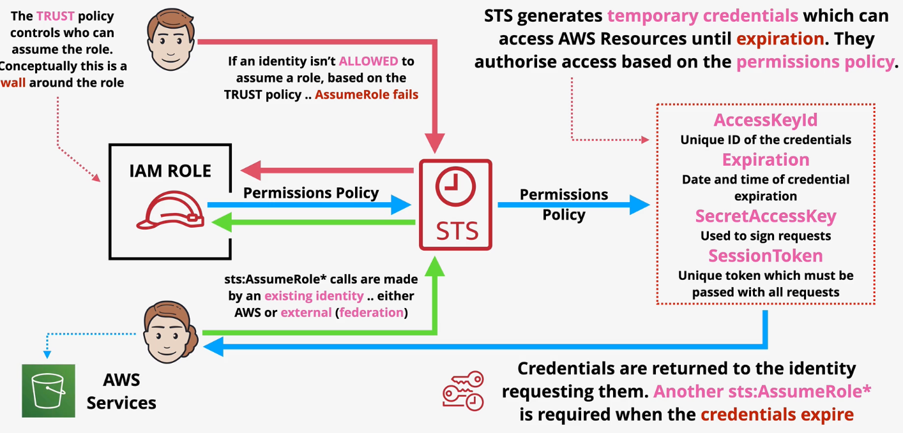
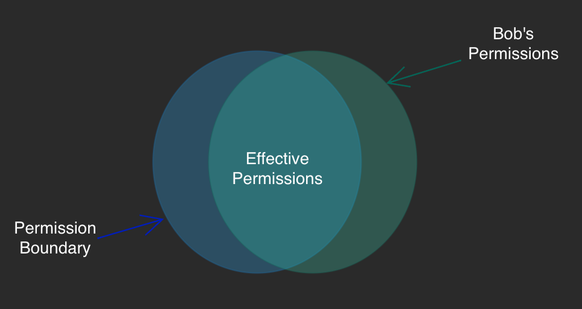

# STS

The Security Token Service generates temporary credentials (`sts:AssumeRole`) that can be used to access AWS resources.

STS tokens consist of several attributes:
- AccessKeyId: Unique ID of the credentials
- Expiration: The date and time of credential expiration.
- SecretAccessKey: Used to sign requests
- SessionToken: Unique token which must be passed with all requests.

STS tokens are temporary (expire) and do not belong to a specific identity.

In order to use the `sts:AssumeRole` call successfully, the identity must be in the trust policy of the role. STS then uses the permissions policy of the role to generate temporary credentials.



# Policy Examples

The following policy prevents principals from getting objects from S3 based on a time period. The deny statement overrides the ALLOW statement during the given time period.
```json
{
    "Version": "2012-10-17",
    "Statement": [
        {
            "Sid": "OpenXmasPresents!",
            "Effect": "Allow",
            "Action": [
                "s3:GetObject",
                "s3:GetObjectAcl"
            ],
            "Resource": "arn:aws:s3:::holidaygifts/*"
        },
        {
            "Sid": "NoPeekingUntilXmas",
            "Effect": "Deny",
            "Action": [
                "s3:GetObject",
                "s3:GetObjectAcl"
            ],
            "Resource": "arn:aws:s3:::holidaygifts/*",
            "Condition": {
                "DateGreaterThan": { 
                    "aws:CurrentTime": "2022-12-01T00:00:00Z" 
                },
                "DateLessThan": { 
                    "aws:CurrentTime": "2022-12-01T06:00:00Z" 
                }
            }
        }
    ]
}
```

The following policy will only allow actions in the `ap-southeast-2` and `eu-west-1` only. Any actions in other regions will be denied with the exception of cloudfront, IAM, Route53, and Support which are global services that *only* operate out of the us-east-1 region.
```json
{
    "Version": "2012-10-17",
    "Statement": [
        {
            "Sid": "DenyNonApprovedRegions",
            "Effect": "Deny",
            "NotAction": [
                "cloudfront:*",
                "iam:*",
                "route53:*",
                "support:*",
            ],
            "Resource": "*",
            "Condition": {
                "StringNotEquals": {
                    "aws:RequestedRegion": [ "ap-southeast-2", "eu-west-1" ] 
                }
            }
        }
    ]
}
```


```json
{
    "Version": "2012-10-17",
    "Statement": [
        {
            "Effect": "Allow",
            "Action": [
                "s3:ListAllMyBuckets",
                "s3:GetBucketLocation"
            ],
            "Resource": "*"
        },
        {
            "Effect": "Allow",
            "Action": "s3:ListBucket",
            "Resource": "arn:aws:s3:::animals4life",
            "Condition": {
                "StringLike": { 
                    "s3:prefix": [
                     "",
                     "home/",
                     "home/${aws.username}/*" 
                    ]
                },
            }
        },
        {
            "Effect": "Allow",
            "Action": "s3:*",
            "Resource": [
                "arn:aws:s3:::animals4life/home/${aws:username}",
                "arn:aws:s3:::animals4life/home/${aws:username}/*"
            ]
        }
    ]
}
```

## IAM Permission Boundaries

Permissions boundaries impact identity permissions only. Resource policies are not impacted. Boundaries can be applied to IAM users and IAM roles.

Boundaries define the maximum permissions an identity can recieve. Any permissions applied outside the boundaries are ineffective.

Permissions boundaries do not grant any access on their own. 

Permission boundaries should be used when you need to delegate permissions granting (e.g., Bob is an account administrator who can create IAM roles and policies, but should be prevented from granting access to certain services or actions).

*Caption: The cross-section of permissions that are within the permission boundary. All other permissions (those not in the boundary) are not effective.*


### Policy Evaluation

All relevant policies are considered when evaluating access to a bucket or objects including:
- Organizational SCP
- Bucket Policy or ACLs
- IAM Permission Boundaries
- Session Policies
- Identity Policies

Given an *effective policy* (the product of all relevant policy statements), access evaluation will follow these steps:

| Step # | Condition | Result if condition satisfied |
| --- | --- | --- |
| 1 | Check for explicit deny | DENY |
| 2 | Check for explicit allow | ALLOW |
| 3 | Implicit Deny | DENY |

When the request is coming from another AWS account, an explicit ALLOW is required from the bucket account *and* from the other AWS account.
