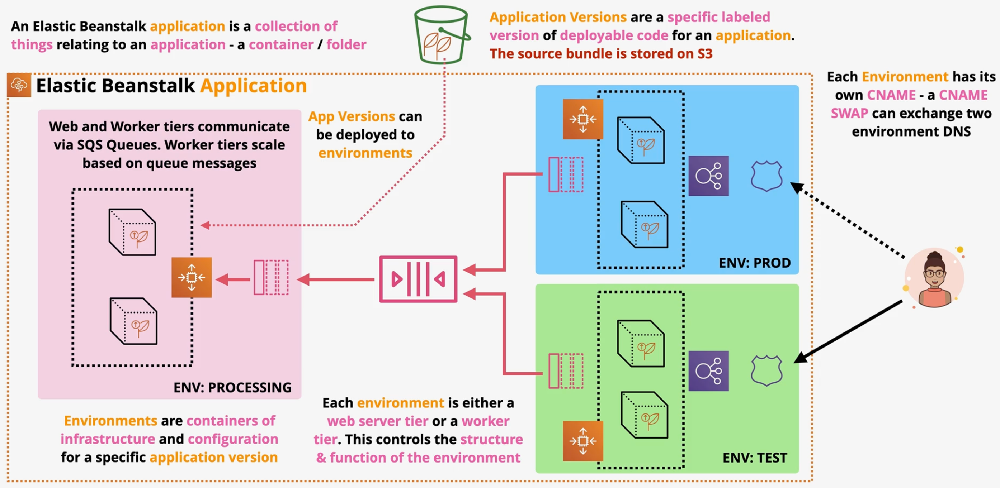
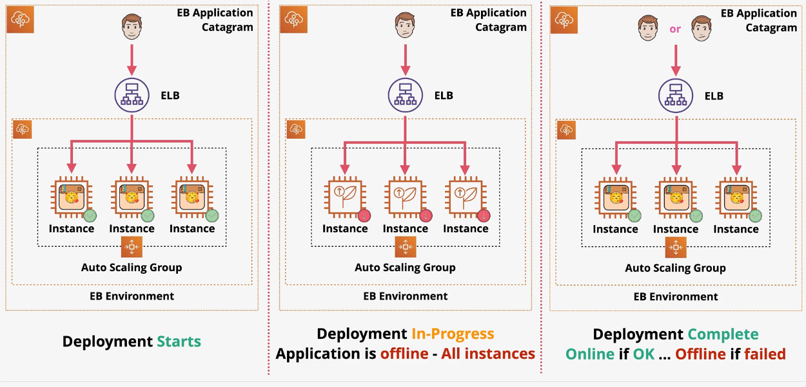
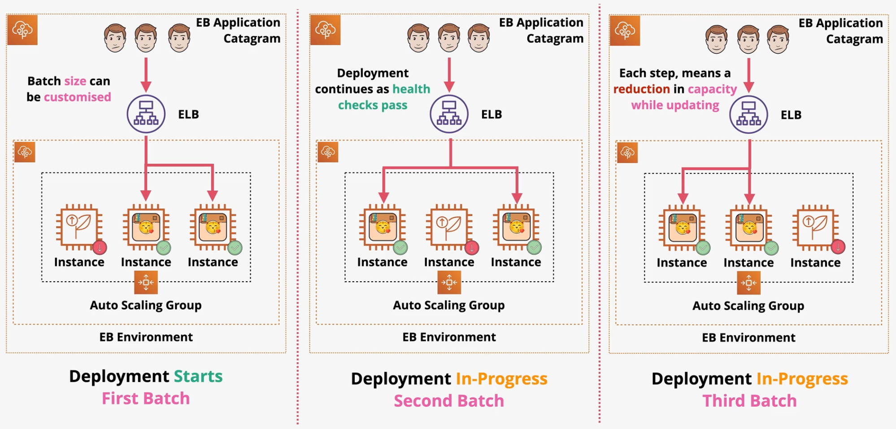
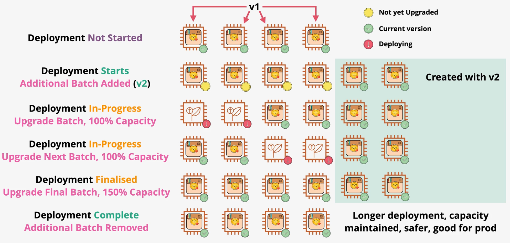
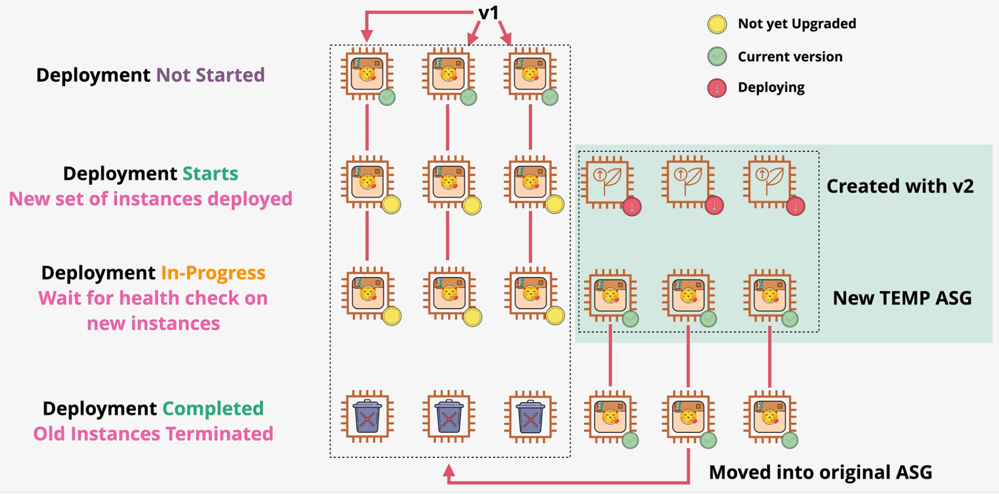
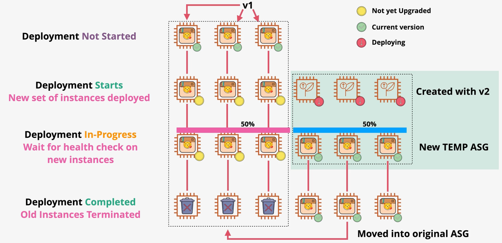
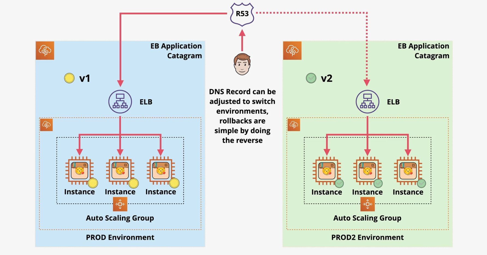

# Beanstalk

Elastic Beanstalk is an AWS PaaS service in which developers bring code and Beanstalk provides a managed application environment.

It allows a development team to focus on business code rather than infrastructure and environment configuration.

EB supports several **platforms** that can be categorized as native platforms, Docker platforms, and custom platforms.

**Navite platforms** include languages with built-in support such as Java, Go, NodeJS, Python, Ruby, .NET, and more.

Docker platforms are further broken down into:
- **Single-container**: Running a single container application
- **Multi-container**: Running multiple containers as part of the same application (uses ECS)
- **Preconfigured Docker**: Predefined images from AWS are typically used to support languages before they are supported natively.

**Custom platforms** use *Packer* to support custom runtimes.

An Elastic Beanstalk **application** is a logical collection of Elastic Beanstalk components, including environments, versions, and environment configurations. In Elastic Beanstalk an application is conceptually similar to a folder.

In Elastic Beanstalk, an **application version** refers to a specific, labeled iteration of deployable code for a web application. An application version points to an Amazon Simple Storage Service (Amazon S3) object that contains the deployable code, such as a Java WAR file.

An **environment** is a collection of AWS resources running an application version. Each environment runs only one application version at a time, however, you can run the same application version or different application versions in many environments simultaneously.

When you launch an Elastic Beanstalk environment, you first choose an **environment tier**. The environment tier designates the type of application that the environment runs, and determines what resources Elastic Beanstalk provisions to support it.
- Web server tier
- Worker tier

> [**Exam Tip**]
>
> Databases should always be created outside of Beanstalk.



## Deployment Policies

AWS Elastic Beanstalk provides several options for how deployments are processed, including deployment policies (All at once, Rolling, Rolling with additional batch, Immutable, and Traffic splitting) and options that let you configure batch size and health check behavior during deployments.

**All-at-Once**

Updates are deployed to all instances in the environment at the same time.

Outage: Yes  
Capacity Reduction: N/A  
Deployment time: Quick  
Rollback: Difficult  
Extra cost: No  



**Rolling**

Updates are deployed to each batch of instances (batch size is configurable) within an environment in turn.

Outage: No  
Capacity Reduction: Yes  
Deployment time: Slow  
Rollback: Moderate  
Extra cost: No  



**Rolling with Additional Batch**

Similar to rolling, but an additional batch of instances is created to maintain full capacity during the deployment.

Outage: No  
Capacity Reduction: No  
Deployment time: Slow  
Rollback: Easy   
Extra cost: Yes  



**Immutable**

Beanstalk creates a new ASG with new instances using the new application version. Once complete, the existing ASG will be updated to include the new instances.

Outage: No  
Capacity Reduction: No  
Deployment time: Slow  
Rollback: Easy  
Extra cost: Yes  



**Traffic Splitting**

Beanstalk creates a new ASG with new instances using the new application version. Traffic is split between the old version and the new version.

Outage: No  
Capacity Reduction: No  
Deployment time: Very slow  
Rollback: Easy  
Extra cost: Yes  



**Blue/Green**

Beanstalk creates another stack of your application with the updated application code. Once successfully validated, a CNAME can be switched to enable the new application version (i.e., green) and eliminate traffic on the old application version (i.e., blue).

Outage: No. 
Capacity Reduction: No  
Deployment time: Very slow  
Rollback: Easy  
Extra cost: Yes  



## RDS & EB

You can create an RDS database within an EB environment. When the environment includes an RDS database, the environment exposes several RDS environment variables that are necessary to connect:
- RDS_HOSTNAME
- RDS_PORT
- RDS_DB_NAME
- RDS_USERNAME
- RDS_PASSWORD

When creating an RDS database within an EB environment, you must select a database deletion policy. The policy applies when you decouple a database or terminate an environment coupled to it.
- Create snapshot: EB creates a snapshot of the database and then deletes it.
- Retain: The decoupled database will remain avialable and operational external to Elastic Beanstalk.
- Delete: Elastic Beanstalk terminates the database.

## .eb Extensions

Elastic Beanstalk uses CloudFormation to provision and manage resources.

**.ebextensions** are CloudFormation directives that can be used to customize Elastic Beanstalk environments.

Elastic Beanstalk will consider any *.config* files in the `.ebextensions` folder in the application source bundle (JAR/WAR) as an extension. The config files contain CloudFormation for new Resources or `option_settings` that enables the customization of Elastic Beanstalk resources.

## EB & SSL

In order to use HTTPs on an Elastic Beanstalk environment, there are some required settings:
1. Apply the SSL certificate to the Load Balancer via the EB console or via the `.ebextensions/secure-listener-[alb/nlb].config` file.
2. Add a listener to the Load Balancer via .ebextensions.

```yaml
option_settings:
    aws:elbv2:listener:443:
        ListenerEnabled: true
        Protocol: HTTPS
        SSLCertificate: # SSL ARN
```

3. Configure the security group to allow HTTPS traffic via .ebextensions.

```yaml
Resources:
    sslSecurityGroupIngress:
        Type: AWS::EC2::SecurityGroupIngress
        Properties:
            GroupId: { "Fn::GetAtt" : [ "AWSEBSecurityGroup", "GroupId" ] }
            IpProtocol: tcp
            ToPort: ...
            FromPort: ...
            SourceSecurityGroupName: { "Fn::GetAtt" : [ "AWSEBLoadBalancer", "SourceSecurityGroup.GroupName" ] }
```

## Environment Cloning

Cloning allows you to create a new environment by cloning an existing one (e.g., copy PROD to TEST).

RDS is cloned if included in the environment, but data is not cloned.

Unmanaged changes to resources are not cloned.

## EB and Docker

Docker on EB consists of two modes: single-container mode and multi-container mode.

**Single-container mode** deploys a Docker container on an EC2 instance.

In order to a single container on EB, you must provide:
- `Dockerfile`
- `Dockerrun.aws.json` (version 1)
- `Docker-compose.yaml`

**Multi-container** mode deploys multile containers within an ECS cluster. Multiple copies of the containers are deployed within an ECS cluster and an ELB is used for high availability.

In order to run in multi-container mode on EB, you must provide:
- `Dockerrun.aws.json` (version 2) - root directory of the application bundle
