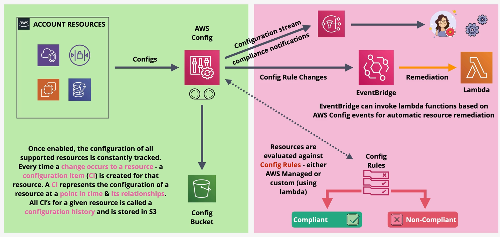
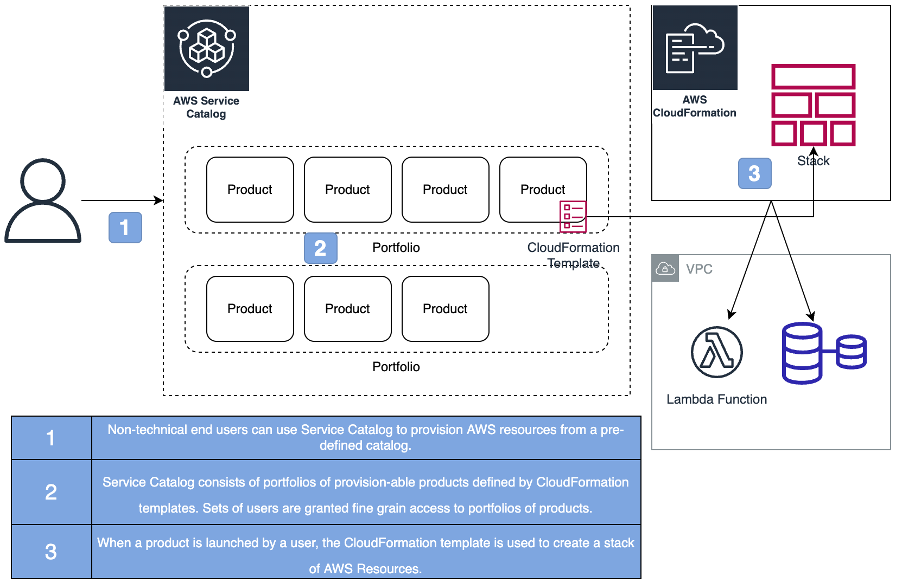

- [AWS Config](#aws-config)
- [Service Catalog](#service-catalog)

# AWS Config

AWS Config records configuration changes over time on AWS resources. Once enabled, the configuration of every resource is monitored. When the configuration on a resource changes, a `configuration item` is created to record what changed, who changed it, and other metadata related to the change. All configuration items are stored in S3.

AWS Config does not prevent changes from handling. Instead, it simply records them for review or automated remediation. Changes can generate SNS notifications and near-realtime events in EventBridge.

AWS Config is a regional service, but supports cross-region and account aggregation.

`Config rules` evaluate resources against a defined standard. The resource is deemed either `compliant` or `non-compliant`. `Custom rules` can be defined using Lambda.

# Service Catalog

The AWS Service Catalog is a self-service portal for provisioning pre-defined products. Administrators define the products and permissions using CloudFormation and Service Catalog configuration.

End-users can review and launch portfolios and products.

AWS Service Catalog is a regional service.
