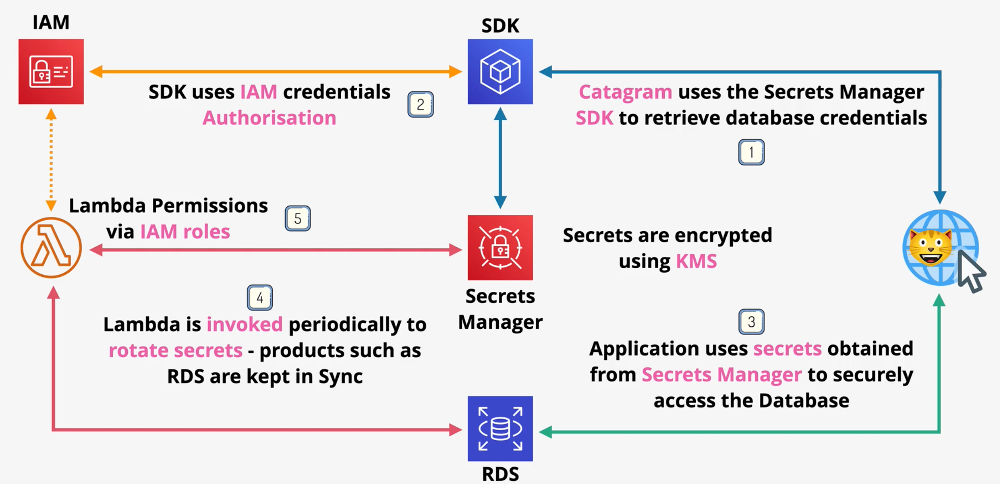

# Secrets Manager

AWS Secrets Manager is designed to enable secure and easy access to secrets from applications. Integration with the service can be done through the AWS console, AWS CLI, or AWS SDKs.

Secrets in Secrets Manager are encrypted using KMS keys.

Secrets Manager supports `automatic secret rotation` by periodically invoking a Lambda function. It can also directly integration with some AWS services (e.g., RDS) to update authentication information after a rotation.



# SSM Parameter Store

SSM Parameter Store is designed to store configuration and secrets for applications.

Parameters can be stored as `String`, `StringList`, or `SecureString`. Parameters of type *SecureString* are encrypted using KMS keys.

SSM Parameter Store supports `versioning` for parameters.

SSM Parameter Store supports `hierarchical parameter storage`. Permissions can be delegated to specific parameters, or a hierarchy of parameters.

*Caption (below): Parameters can be stored in a hierarchy. Permissions can be granted for the hierarchy (e.g., /wordpress).*
```
/wordpress/
  dbuser (/wordpress/dbuser)
  dbpassword (/wordpress/dbpassword)
```

SSM Parameter Store publishes some `public parameters` from AWS, such as the latest AMI per region.
