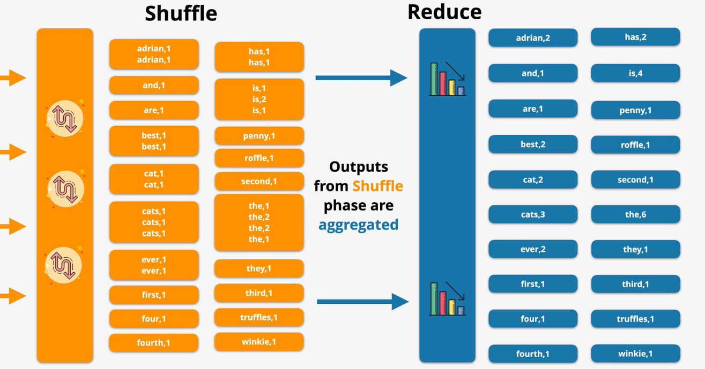

# Kinesis

Kinesis is a highly-scalable streaming service in which one or more `producers` send data in to a kinesis `stream` that can be processed by one or more `consumers`.

Kinesis streams can scale from low to near infinite data rates.

Kinesis is a highly-available public service.

In kinesis, kinesis `data records` (1 MB) are published to a `stream`. The stream consists of configurable `shards` to optimize throughput based on workload requirements.

A kinesis stream starts with a single shard. As required, additional shards are added to the stream to increase throughput. Each shard provides its own performance - 1 MB of ingestion capacity and 2 MB of consumption capacity.

Kinesis streams store a 24-hour moving window of data. Consumers can access any data within that 24 hours. For an additional cost, users can enable a 7-day moving window.

> [Exam Tip]
>
> It is important to understand when to pick Kinesis or SQS for a workload.
> - SQS is not designed to be highly scalable. Typically, SQS supports a small number of producers and consumers.
> - SQS is used to decouple components and facilitate asyncronous communication.
> - SQS does not support persistence of messages and there is no *window* in which the messages are available.
> - Once a message is read from an SQS queue, it is no longer available.
> - Kinesis is designed for *highly-scalable* data ingestion and thus supports many producers and consumers.
> - Kinesis data is persisted within a stream during the rolling data window.

## Firehose

Kinesis does not provide a way to persist data once the rolling data window expires.

Kinesis Firehose is a fully-managed service that can pump data from a Kinesis stream into supported destinations. This is useful to hydrate data lakes, populate data stores, and facilitate analytics services.

Kinesis Firehouse automatically scales to match the throughput requirements.

Kinesis Firehouse supports transformation of data on the fly using Lambda.

Kinesis Firehouse charges based on data volume.

Kinesis Firehose supports a limited number of destinations, including:
- Splunk
- ElasticSearch
- Redshift
- S3
- HTTP data

Note: When pushing data into Redshift, the data is actually written to an intermediate S3 bucket and the Redshift S3 Copy command is used to load it into the data warehouse.

Data producers can send data to a Kinesis stream or directly at a Kinesis Firehose. The Firehouse can accept data from producers or consume data from a Kinesis stream.

Kinesis Firehouse supports near real time delivery of data (within 60 seconds). The Kinesis Firehose will receive the data in realtime, but batches writes:
- For low throughput consumers, Kinesis Firehose will write to the destination every 60 seconds.
- For high throughput consumers, Kinesis Firehose will write to the destination every 1 MB.

## Kinesis Data Analytics

Kinesis Data Analytics is a service that provides real time processing of data using SQL.

The product ingests data from Kinesis Data Streams or Firehose.

Once the data is processed, it can be sent to AWS Lambda, Kinesis Data Stream, or Firehouse (and then onto S3, Redshift, ElasticSearch, Splunk).

Kinesis Data Analytics creates and maintains an `in-application input stream`. This stream is conceptually similar to a database table, but is constantly updated based on new input.

Additionally, Kinesis Data Analytics uses a `reference table` to encrich streaming input.

The reference table and in-application input streams are used to process input and produce output using application code and SQL.

The results of the processing are pushed to the `in-application output stream` and onto a Kinesis Stream or Kinesis Firehose.

Any errors during processing are sent to the `in-application error stream`.

Kinesis Data Analytics should be used on streaming data that requires real-time SQL processing (e.g., time-series analytics, real-time dashboards, real-time metrics).

> [Exam Tip]
>
> Kinesis Firehouse can trigger a Lambda to process data, but it is only near real-time. Kinesis Data Analytics provides real time data processing.

## Kinesis Video Streams

Kinesis video streams allows you to `ingest` live video data from producers such as security cameras, cars, smartphones, drones, time-serialized audio, thermal, depth, or RADAR.

Consumers can access data frame-by-frame or as needed via Kinesis Video Streams APIs. You cannot access the raw data directly.

The data can be persisted and encrypted.

Kinesis Video Streams can integrate with other AWS services (e.g., Rekognition, Connect).

*Caption (below): Example Kinesis Video Streams architecture using Rekognition to identify faces, Kinesis data streams to analyze findings, and Lambda/SNS to notify the owner

# AWS QuickSight

QuickSight is a business analytics and intelligence (`BA/BI`) service that provides visualizations and ad-hoc analysis of the underlying data.

QuickSight is able to discover and integrate with AWS data sources, as well as supports external data sources.

QuickSight supports a number of common AWS datasources:
- Athena
- Aurora
- Reshift
- Redshift Spectrum
- S3
- AWS IoT

It also supports external sources such as:
- Jira
- GitHub
- Twitter
- Salesforce

It supports several database engines:
- Microsoft SQL Server
- MySQL
- PostgreSQL

It supports several query languages:
- Apache Spark
- Snowflake
- Presto
- Teradata

> [Exam Tip]
>
> If you see the key words *dashboards* or *visualization*, QuickSight is the most likely answer.

# Amazon Redshift

Amazon Redshift is a petabyte scale data warehouse. It is optimized for `column-based` online analytical processing (`OLAP`) tasks. 

This is in contrast to online transaction processing (`OLTP`) processing in which data is stored in rows (e.g., RDS).

Generally, data is loaded into Redshift before being query. However, Redshift has a few features that go beyond this normal scenario.

`Redshift Spectrum` allows you to query data in S3 directly without loading it into Redshift.

`Redshift Federated Query` allows you to query data in other databases directly without loading it into Redshift.

Redshift integrates into AWS tooling such as QuickSight.

Redshift is a provisioned server-based product (not serverless) that uses a cluster-based architecture. Redshift runs on multiple nodes with high-speed networking between the nodes.

When you interact with Redshift, you communicate with the `leader node`. The leader node is responsible for query inputs, splitting the task into `slices`, planning the execution of the slices, and aggregating the results.

The leader node delegates query execution to one or more `compute nodes`. Each compute node accepts tasks from the leader node, executes them, and responds with the result.

Redshift is a VPC service, therefore supports VPC security, IAM permissions, KMS at-rest encryption, and CloudWatch monitoring.

When you use Amazon Redshift `enhanced VPC routing`, Amazon Redshift forces all COPY and UNLOAD traffic between your cluster and your data repositories through your virtual private cloud (VPC) based on the Amazon VPC service. 

By using enhanced VPC routing, you can use standard VPC features, such as VPC security groups, network access control lists (ACLs), VPC endpoints, VPC endpoint policies, internet gateways, and Domain Name System (DNS) servers. 

You use these features to tightly manage the flow of data between your Amazon Redshift cluster and other resources. 

When you use enhanced VPC routing to route traffic through your VPC, you can also use VPC flow logs to monitor COPY and UNLOAD traffic.

Both DMS and Firehose natively support Redshift as a destination.

## Resiliency and Recovery

Redshift automatically creates and exports `snapshots` to S3 every 8 hours or 5 GB of data. By default, the snapshots are retained for 1 day (configurable up to 35 days).

Manual snapshots can be taken at any time. Manual snapshots are retained indefinitely.

Redshift can be configured to copy snapshots to another region for DR. The retention period can be configured separately than in-region snapshots.

Snapshots can be restored to a new cluster.

# Athena

Amazon Athena is an interactive query service that makes it easy to analyze data in Amazon S3 using standard SQL. Athena is serverless, so there is no infrastructure to manage, and you pay only for the queries that you run.

Athena uses `schema-on-read` technology, which means that your table definitions applied to your data in S3 when queries are being executed. There’s no data loading or transformation required. You can delete table definitions and schema without impacting the underlying data stored on Amazon S3.

Output can be pushed to other AWS services.

Athena supports standard formats of structured, semi-structured, and unstructured data in S3, as well as AWS-data formats like CloudTrail, ELB Logs, and VPC Flow Logs.

Tables are defined in advance in a data catalog and data is projected through when read.

**Use Cases**:
- Use Athena when you need to query data without loading or transforming it in advance.
- For occasional or ad-hoc queries of data in S3.
- Low-cost serverless querying of data in S3.
- Querying AWS logs (e.g., VPC Flow logs, CloudTrail, ELB)
- Querying data defined in the AWS Glue data catalog

The `Athena Federated Query` feature is an extension to the Athena query engine that supports non-S3 data. The non-S3 data is queried using Lambda functions.

# MapReduce

Apache MapReduce is a high scale data analysis architecture that relies on parallel processing.

MapReduce consists of two phases: `map` and `reduce`. It can also contain other phases, such as `combine` and `partition`.

The general flow of a MapReduce job is as follows:
1. Input data is received by the job.
2. Data is separated into `splits`. Each split is assigned to a `mapper`.
3. Operations are performed at on each split based on the requirements.
4. Optionally, other phases are applied to the data such as `shuffling` or `partitioning`.
5. Data is `combined` into results.
6. The combined data is `reduced` into a form that meets the requirements.

MapReduce uses the `Hadoop File System` (HDFS). Unlike traditional file systems which store data across multiple data notes, HDFS is highly fault tolerant since it replicates data between nodes.

In HDFS, the `name node` provides the *namespace* for the file system and controls access to HDFS.

A `block` is a segment of data on HDFS (generally 64 MB).

*Caption (below): Input data is fed into a MapReduce job. It is split based on the split size and mapped to nodes for processing.*

*Caption (below): The result of the mapper is shuffled so that results are consolidated.*

*Caption (below): The result of the shuffle phase is aggregated into a meaningful result.*

*Caption (below): The result of the reduce phase is transformed into some desired format and stored.*

# EMR

EMR is a managed implementation of Apache Hadoop. EMR also includes other components of the MapReduce ecosystem such as Spark, HBase, Presto, Flink, Hive, and Pig.

EMR can support long-running architectures, or transient one-use infrastructure. 

EMR uses EC2 for compute. EMR supports spot instances, instance fleets, reserved instances, or on-demand instances.

EMR auto scales automatically based on configuration.

EMR is used for big data processing, manipulation, analytics, indexing, transformation, data pipelining, and more.

EMR runs in a VPC within a single AZ so it is not highly available.

EMR runs within a cluster consisting of at least one node. The `master node` manages the cluster, distributes workloads, and acts as the `name node` within MapReduce. The master node supports SSH.

Clusters can have zero or more `core nodes`. Core nodes run critical tasks including running task trackers and acting as data nodes for HDFS. Core nodes can also run tasks.

Clusters can also have zero or more `task nodes`. Task nodes are only responsible for running tasks. They do not have any responsibility supporting critical tasks such as HDFS and task trackers and are therefore ideal for spot instances.

`EMRFS` is a resilient S3-backed file system supported natively within EMR. Unlike HDFS, it is regionally resilient. EMRFS automatically persists data past the lifetime of the cluster and is resilient to core node failures.

