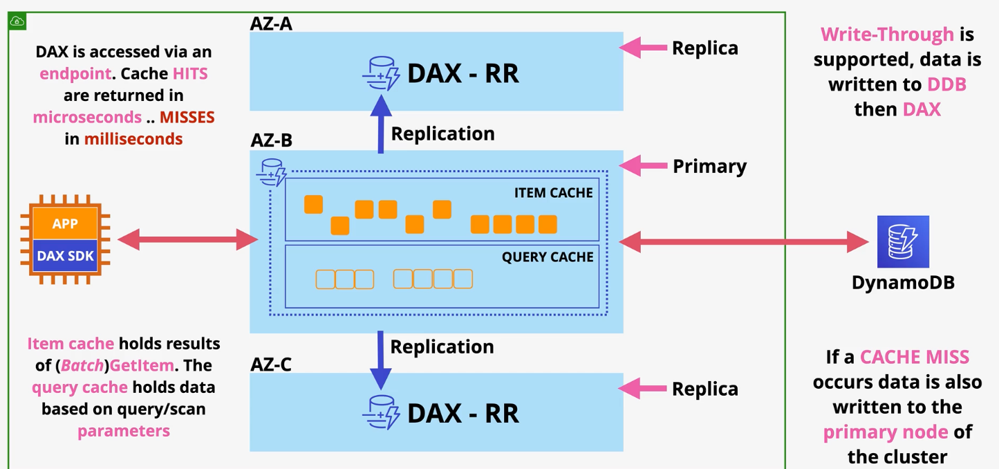

# DynamoDB

DynamoDB is a NoSQL public DBaaS service that supports key/values & documents.

DynamoDB is regionally resilient and can be made globally resilient with DynamoDB Global Tables.

DynamoDB provides single-digit millisecond latency for first byte retrieval.

DynamoDB tables can use a **primary key** of a single partition key or a composite key which consists of a partition and sort key. Each item in the table must have a unique primary key.

Each item in the table must be 400KB or less. There are no limits on the number of items in a DynamoDB table.

Billing in DynamoDB is based on RCU, WCU, storage, and additional features. Customers can purchase reservations to reduce cost.

## Performance (Throughput)

DynamoDB supports two capacity modes: on-demand and provisioned.

The **On-demand** mode is used for unknown, unpredictable, or low admin workloads in which the service will be automatically scale throughput to match demand. On-demand mode is charged per million RCU/WCU.

The **provisioned** mode requires customers to set the number of RCU/WCUs on a table by table basis.

DynamoDB capacity (throughput) is measured in RCUs (read capacity units) and WCUs (write capacity units).
- RCU (stongly consistent)= up to 4KB per second 
- RCU (eventually consistent) = up to 8KB per second
- WCU = up to 1KB per second

Each DynamoDB table has an RCU and WCU burst pool (300 seconds) that is used when additional RCU/WCUs are used.

Calculating WCU on a DynamoDB table:
- Determine the average size per item
- Calculate WCU per item ROUND_UP((item size / 1KB))
- Multiply by average writes per seconds

Calculating RCU on a DynamoDB table:
- Determine the average size per item
- Calculate RCU per item ROUND_UP((item size / 4KB))
- Multiply by average reads per seconds
- If eventually consistent, divide by 2

## Operations

Data can be retrieved from a DynamoDB table using queries or scans.

The **query** operation accepts a single PK value and an optional SK value or range. The query operation will return zero or more items with the specified primary key. 

The RCUs consumed equals the size of all returned items. Conditional filtering or projects discard data *after* capacity is calculated.

The **scan** operation is the most flexible read operation, but also the least efficient. The scan operation reads every item in the table, consuming the capacity of *every item*. 

## Consistency

DynamoDB can read data in two consistency modes: eventual and strong consistency.

A DynamoDB cluster consists of a leader node and at least two storage nodes in different AZs. Every piece of data written to a DynamoDB table is asyncronously replicated across the nodes. Replication typically happens within milliseconds.

**Eventually consistent** reads will send the query or scan to a randomly chosen node, which may or may not have the most up-to-date data.

**Strongly consistent** reads will always run against the leader node so you are guarenteed to receive the most up-to-date data.

## Indexes

DynamoDB supports two types of indexes: LSIs and GSIs.

| | Keys | Capacity | Limits |
| --- | --- | --- | --- |
| LSI | Same PK as table, different SK | Share WCU/RCU with table | Must be created with table; 5 LSIs per table |
| GSI | Different PK and SK as table | Have its own WCU/RCU | Can be created @ any time; 20 GSIs per table; Always eventually consistent |

Indexes can include all attributes of the table, or some attributes. This is known as a *projection*.
- `ALL`: All attributes are stored in the index.
- `KEYS_ONLY`: Only key attributes are stored in the index.
- `INCLUDE`: Specify which attributes are stored in the index.

> [**Exam Tip**]
>
> AWS recommends using GSIs unless strongly consistent reads are required.

## Streams & Triggers

A DynamoDB stream is a time-ordered list of item changes within the table for a 24-hour rolling window. DynamoDB streams are enabled on a per-table basis.

Different view types determine what is in the stream:
- `KEYS_ONLY`: The stream only includes the keys of the table.
- `NEW_IMAGE`: The stream stores the entire item as it was *after* the change.
- `OLD_IMAGE`: The stream stores the entire item as it was *before* the change.
- `NEW_AND_OLD_IMAGE`: The stream stores the entire item as it was *before* and *after* the change.

Streams can be used to trigger actions based on data changes within a DynamoDB table.

## Backups

DynamoDB offers on-demand and point-in-time recovery (PITR) backups.

**On-demand backups** create a full copy of the table and are retained until explicitly removed. On-demand backups can be encrypted using KMS, with or without indexes, and restored to the same or another region.

When **point-in-time recovery** is enabled on a DynamoDB table, the service continously records changes that can be replayed at any point (1 second interval) in the 35-day recovery window.

## DAX

DynamoDB Accelerator (DAX) is an in-memory cache that provides microsecond latency that can be used with DynamoDB.

DAX is deployed as a cluster within a VPC. It should be deployed to multiple AZs for high availability.

DAX is capable of scaling out or scaling up.

Applications interacting with DAX must use the DAX SDK.

DAX consists of two cache types: item and query caches.
- **item cache**: caches individual items retrieved via the `GetItem` or `BatchGetItem` operations.
- **query cache**: caches results (and parameters) based on the query or scan operation.

DAX supports write-through caching in which the data being written to the table is also written into the DAX cache.

DAX only supports eventually consistent reads.

## Global Tables

DynamoDB global tables provide multi-master cross-region replication.

Tables are created in multiple regions and added to the same global table.

Global tables use **last-writer-wins** conflict resolution.

Reads and writes can be completed in any region. Writes are replicates asyncronously to all regions in the global table. replication is typically done within a second.

Strongly consistent reads can be performed on the table in which the data was written. All other reads are eventually consistent.

## TTL

TTL is a timestamp, defined in epoch format, at which the item in a DynamoDB table should be deleted.

TTL must be explicitly enabled on the table. When using TTL, you must specify the attribute that represents the TTL value.

A per-partition process periodically runs, checks the current time to the value in the TTL attribute. Items for which the TTL attribute is older than the current time are set as **expired**.

A second per-partition background process scans for expired items and removes them from tables and indexes. A delete is added to the DynamoDB stream (if enabled).

Delete operations on the table are performed by a background process and do not affect table performance and are not chargable.