# HA vs FT vs DR

**High availability** (HA): Aims to ensure an agreed level of operational performance (SLA), usually uptime, for a higher than normal period.

**Fault tolerance** (FT): A property of a system to continue operating properly in the event of the failure of some of its components.

**Disaster recovery** (DR): A set of policies, tools, and procedures to enable the recovery or continuation of vital technology infrastructure and systems following a natural or human-induced disaster.  

# Disaster Recovery

There are four types of DR architectures:
- Backup & Restore
- Pilot Light
- Warm Standby
- Active/Active

In order to choose a DR plan for your business, you must evaluate the recovery time objective (RTO) and recovery point objective (RPO) requirements.

## Backup & Restore

Backups are performed regularly at the primary sight. The backed-up data is transferred or transported to a backup location.

When needed, the backups can be restored to a secondary site.

Backup & Restore is very inexpensive, but requires a long RTO and RPO.

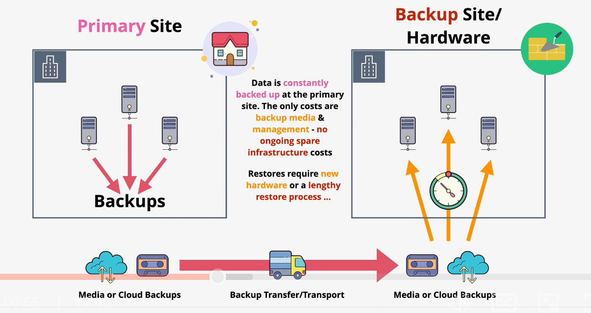

## Pilot Light

A secondary environment is provisioned in advanced running the absolute minimum of infrastructure (like the pilot light in a heater). 

Critical components, like datastores and databases, are constantly synchronized so they are ready to be used at any time.

The secondary environment can be "powered on" when needed.

Pilot light is a low cost solution that offers a bit better RTO than backup & restore.

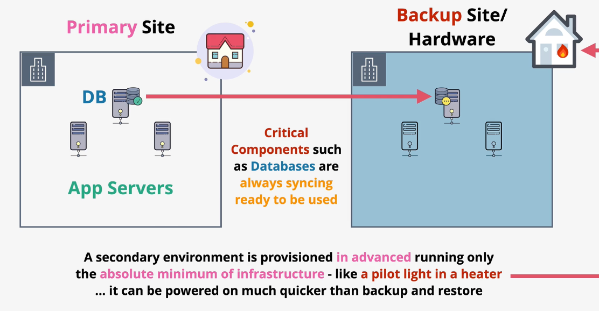

## Warm Standby

All instances and infrastructure are running in a secondary "warm standby" environment. The environment is fully functional, but running with lower spec hardware to reduce costs (e.g., smaller EC2 instance size).

When required, the instance types can be scaled up in order to handle full traffic. This process is significantly faster than creating infrastructure from scratch.

## Active/Active

The Active/Active DR plan does not require any provisioning time.

When using `active/active`, an identical tech stack is provisioned in another site. Data is constantly replicated from the primary site to the backup.

Costs are generally 200% since a full copy is always running.

In addition to DR benefits, you can load balance traffic across both environments, improving high availability and performance of your workloads.

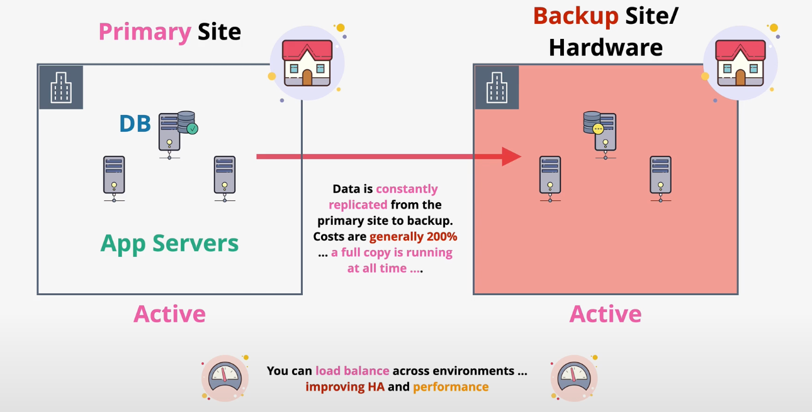

## Comparing DR Architectures

| | Cost | RTO |
| --- | --- | --- |
| Backup & Restore | $ | High |
| Pilot Light | $$ | Medium | 
| Warm Standby | $$$ | Low  |
| Active/Active | $$$$ | Zero |

## DR Storage Architecture

Instance store volumes are attached to a host in an AZ. If either the host or the AZ fail, the instance store is lost.

EBS can be used to increase data durability. EBS data is replicated within a single AZ (cannot replicate across AZs). Failure of the AZ will result in data loss, but now the data is protected from an instance failure.

S3 can also be used to increase data durability since data within a bucket is replicated across multiple AZs in a region. S3 can also be configured to perform cross-region replication. By exporting snapshots of EBS to an S3 bucket, you are protecting that data from an AZ failure.

*Note: This does not apply to S3 objects in the OneZone storage class.*

EFS can also be used to increase data durability. Data in EFS is replicated across multiple AZs therefore EFS volumes are regionally-resilient by default. However, if a region becomes unavailable, the EFS volume may be lost.

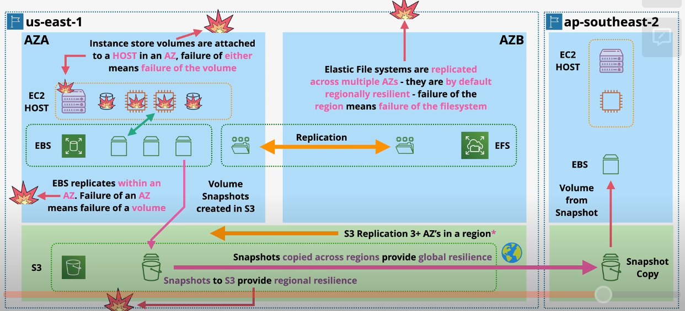

## DR Compute Architecture

`EC2 instances` themselves are not resilient. Instead, we deploy multiple identical instances to account for failures of specific instances.

In order to account for an AZ failure, we can use an auto scaling group to provision instances across multiple AZs.

`ECS clusters` can be run in EC2 mode or Fargate mode. When running in EC2 mode, the DR characteristics are identical to that of EC2. In Fargate mode, containers use ENI's in a VPC. ECS Services can be used to accomplish similar outcomes to an auto scaling group (ASG).

Lambda functions are allocated in each subnet. Failure of a specific AZ will result in the function launching in a subnet in another AZ. 

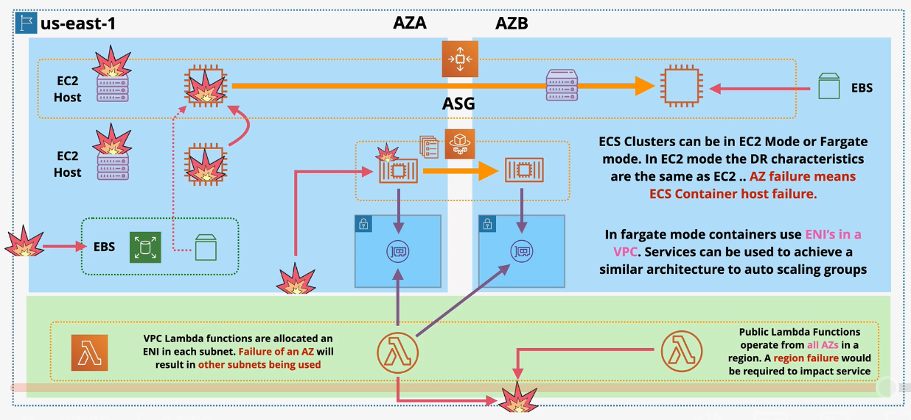

## DR Database Architecture

`DynamoDB` runs within the AWS network (not within a customer's VPC). Data in DynamoDB is replicated across AZs within a region. A full region outage would be required to impact a DynamoDB table.

DynamoDB also supports global tables which results in multi-master replication between regional replicas.

A subnet group in `RDS` allows you to run an RDS cluster across more than one AZ. Data from the primary instance is replicated into the secondary instance in another AZ.

When a failure happens that affects the primary instance, the secondary instance is promoted to be primary. A failure of both the primary and secondary instances may result in a failure.

RDS supports `cross-region read replicas` which use asynchronous replication.

`Aurora` provides significant DR benefits over RDS. An Aurora cluster is able to support one ore more read-replica instances in every AZ within the region.

Additionally, Aurora uses a cluster storage architecture in which data is replicated across all AZs in the region. 

Aurora supports `global databases`. When running a global Aurora database cluster, secondary *read-only* instances can be deployed in other AWS regions.

## DR Network Architecture

`VPCs` are regionally resilient which means a complete AWS region failure would be required to significantly affect a VPC. VPC Routers and IGW are also regionally resilient.

`Subnets` are tied to an AZ. Therefore, if the AZ fails, the subnet also fails. ELBs (regionally resilient) can be used to distribute traffic across multiple AZs. When accessing an application through a load balancer, a regional outage would be required to significantly impact users.

`VPC Endpoints` exist within a single AZ and are therefore subject to AZ failures. You can deploy multiple VPCEs for regional high availability.

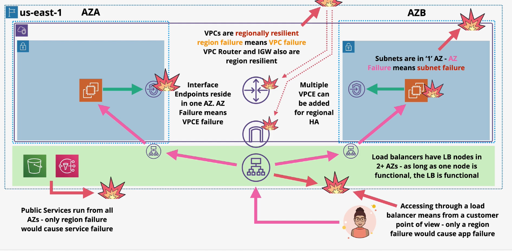

`Route53` is a global service - Route53 entry points can survive multiple regional failures. Route53 Health Checks can be used to globally distribute traffic for global high availability.

# Elastic Load Balancers (ELB)

ELBs monitor for, and accept, connections on a specific port from clients and distribute the traffic among one or more backend compute.

ELBs can support `IPv4` or `support dual stack` (IPv4 and IPv6).

ELBs are created with a DNS name (A record) that resolve to all the `nodes` of an ELB. The ELB will automatically scale (add more nodes) as traffic requires.

ELB nodes are configured in all AZs within a region (at least 2 AZs).

ELBs can be `internet-facing`, which means it is accessible from the public internet, or `internal`, which means it is only accessible from within the VPC by a private IP address.

ELBs require 8+ free IP addresses in a subnet in order to operate. AWS recommends a subnet with at least a /27 subnet mask.

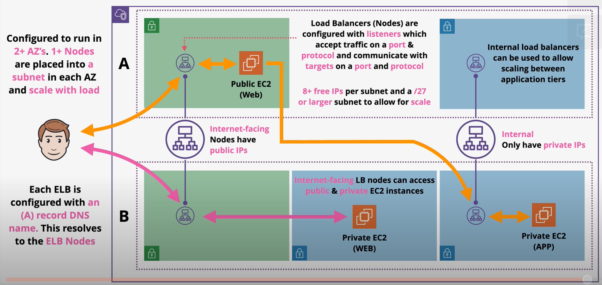

ELBs allow architecture teirs to scale independent of each other.

Originally, each ELB node could only distribute load to compute within the same AZ. However, ELBs now support `cross-zone load balancing`. This enhancement allows the load balancer to distribute load across zones.

## Session Stickiness

Session data is stored on a specific server that persists while you have a valid session with the application.

If an application does not store session state, it is known as `stateless`.

`Session stickiness` is a feature supported by ALBs that temporarily maps users to instances on which their session is stored. As a result, all requests from the same user will be forwarded to the same instance.

Session stickiness is enabled at a `target group` level.

This feature generates a `cookie` (called `AWSALB`) which temporarily locks the user to a specific backend instance. Cookies can last any duration from 1 second to 7 days.

If the cookie fails or expires, a new instance will be chosen for that user.

Session stickiness can result in uneven loads on backend instances.

## Load Balancer Types

Load balancers are split between two versions: v1 (deprecated) and v2 (standard).

There are three types of load balancers on AWS:
- Classic Load Balancer (v1)
- Network Load Balancer (v2)
- Application Load Balancer (v2)

### Classic Load Balancers

Classic Load Balancers are a v1 product that is deprecated. CLBs can only be used with the Classic VPC architecture.

*Caption (below): CLBs do not scale efficiently because they only support 1 SSL and one domain name per load balancer.*
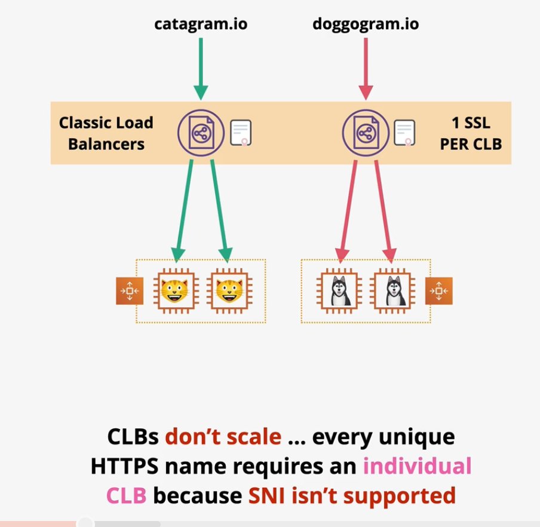

### Application Load Balancer

Application Load Balancers (`ALB`) are layer-7 load balancers that have advanced HTTP features. 

ALBs support `HTTP` and `HTTPS` protocol. They cannot support other layer-7 protocols such as SMTP, SSH, or gaming protocols. ALBs also do not support layer-4 protocols such as TCP, UDP, or TLS.

ALBs require `SSL termination`. SSL termination is a situation in which SSL connections are terminated on the load balancer and the traffic is forwarded to the target on a brand new connection. As a result, the ALB must have an SSL if HTTPS is used.

ALB processing is slower than NLBs.

ALBs support health checks.

You are able to create `load balancing rules`. Rules determine what happens to the connection when it arrives at the load balancer. Rules are processed in priority order. The last rule is always a "catch-all" default rule.

ALB rules support conditions that analyze host headers, http headers, http request method, path pattern, query string, and source IP address.

ALB rules can result in a one action: forward, redirect, fixed-response, authenticate-oidc, or authenticate-cognito.

> [Exam Tip]
>
> ALBs do not support end-to-end encryption!

### Network Load Balancer

NLBs are layer-4 load balancers that support the `UDP`, `TCP`, `TLS`, and `TCP_UDP` protocols. NLBs can be used to support `SMTP`, `SSH`, and game servers.

NLBs cannot support HTTP features such as conditional forwarding. They do not support features such as headers, cookies, or session stickiness.

NLBs are very fast and can support millions of requests per second.

NLBs support simple health checks based on `ICMP/TCP` handshakes.

NLBs can have static IPs which can be useful for whitelisting.

NLBs support end-to-end encryption by forwarding the SSL connection onto the target.

NLBs are used for private link to access many AWS services.

### Comparing Load Balancers

| | OSI Layer | Supported Protocols | Use Cases |
| --- | --- | --- | --- |
| Application Load Balancer | Layer 7 | HTTP/S | HTTP/S protocols, conditional forwarding based on HTTP, advanaced health checks |
| Network Load Balancer | Layer 4 | UDP, TCP, TLS | UDP/TCP/TLS protocols, Unbroken encryption, Static IP, Very high throughput, PrivateLink |

## Connection Draining

When instances are deemed unhealthy or deregistered, the default action is to close all connections and prevent any new connections to the instance from being established.

The `connection draining` feature allows all in-flight requests to complete. When enabled, connection draining can be configured to timeout after 1 - 3600 seconds.

> The term *connection draining* is only used in relation to Classic Load Balancers. The setting is applied directly on the CLB (since it does not use a target group architecture).

The `deregistration delay` feature is similar to connection draining. It is supported by ALBs, NLBs, and GWLBs.

The deregistration delay feature is configured on the target group (not the load balancer itself).

## X-Forwarded-For & Proxy Protocol

When a server receives a request, it has access to the clients IP address. When a load balancer is used, the client IP address represents the LB, not the end user.

### X-Forwarded-For

`X-FORWARDED-FOR` is an HTTP header. As traffic passes through a LB, the LB adds or appends its IP address to the header. The application server can use this header to see the full chain of clients involved in the request, including the end user.

The `X-Forwarded-For` header is supported by CLBs and ALBs, but not NLBs since it does not support Layer 7.

### PROXY Protocol

The `Proxy protocol` works at Layer 4 and therefore supports TCP, SMTP, HTTP, etc.

Similar to *X-Forwarded-For* header, the proxy protocol adds a header to track IPs of components traversed in a request.

The *proxy protocol* feature is supported by CLBs (v1) and NLBs.

### Comparing X-Forwarded-For and PROXY Protocol

| | OSI Layer | Support | Use Case |
| --- | --- | --- | --- |
| X-Forwarded-For | Layer 7 | ALB, CLB | HTTP applications that use ALBs or CLBs. |  
| PROXY Protocol | Layer 4 | NLBs, CLB (v1) | Applications that use NLB or CLB (v1).

## Gateway Load Balancers (GWLB)

A transparent security appliance scans data after it leaves the application instance and before it enters the application instance. Using this type of appliance does not scale well and becomes complex when protecting multiple applications.

The `Gateway Load Balancer` helps you run and scale 3rd party security appliances (e.g., firewalls, IDS, IPS). GWLBs provide transparent inspection for both inbound and outbound traffic.

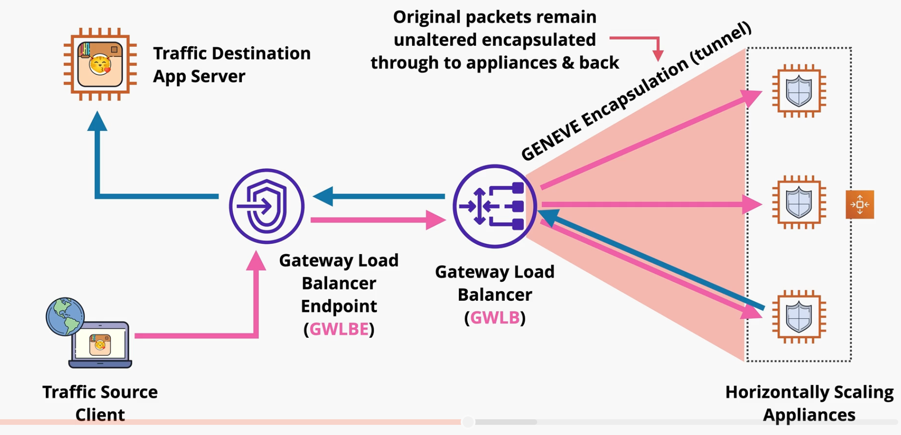

GWLBs `endpoints` are used to ingress/egress traffic to/from the appliance. The GWLB load balances packets across the backend security appliances. Traffic and metadata are tunneled using the `GENEVE` protocol. Traffic is routed using `route tables`.

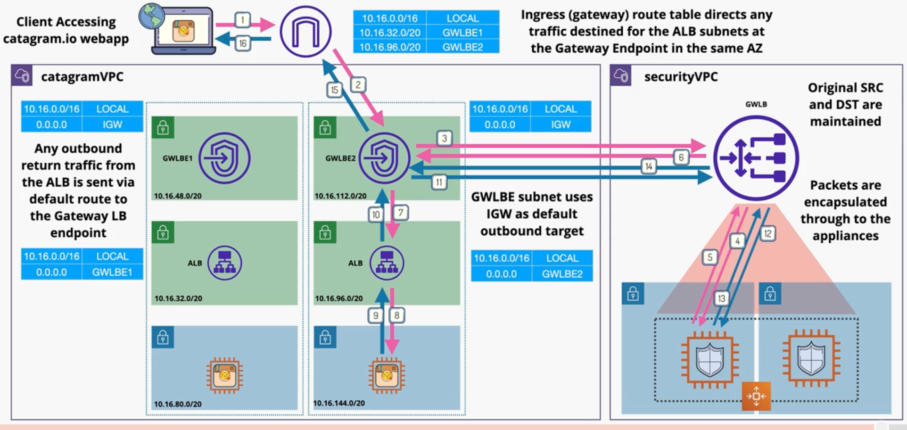

# Launch Configurations & Launch Templates

Both **launch configurations** and **launch templates** allow you to define the configuration of an EC2 instance in advance, including the AMI, instance type, storage, key pair, networking, security groups, userdata, and IAM role.

Both launch configurations and launch templates are immutable. Once they are created, they cannot be changed. Launch templates allow for versions.

Launch templates provide newer features including T2/T3 unlimited, placement groups, capacity reservations, and elastic graphics.

*Launch configurations can only be used within Auto Scaling Groups (ASG).*

*Launch templates can be used within ASGs, but can also be used to launch EC2 instances manually.*

> [Exam Tip]
>
> AWS recommend using launch templates over launch configurations since they offer a superset of features.

# Auto Scaling Groups

An **Auto Scaling Group** contains a collection of Amazon EC2 instances that are treated as a logical grouping for the purposes of automatic scaling and management.

ASGs provide automatic scaling and self-healing for EC2 using launch templates or launch configurations. All instances launched from the ASG are based on the LC or LT.

ASG define the *minimum*, *desired*, and *maximum* number of instances for an application. The ASG will ensure the cluster is running the *desired* number of instances by provisioning or terminating clusters.

When instances are provisioned, the ASG makes an attempt to spread instances across AZs.

Scaling policies define the criteria by which the ASG should scale a cluster up or down.
- **Manual scaling** - manually adjusting the desired capacity
- **Scheduled scaling** - Scaling a cluster based on a specific time
- **Dynamic scaling** - includes simple scaling, stepped scaling, and target tracking 
    - **Simple scaling** - Scale the cluster based on a single metric (e.g., CPU above 50% +1, CPU below 50% -1)
    - **Stepped scaling** - Scale the cluster proportionally to a metric value (e.g., CPU above 50% +1, CPU above 80% +2, CPU above 90% +3)
    - **Target tracking** - Scale based on the target value of a metric (e.g., Desired CPU = 40%)

ASG use *cooldown periods* to reduce the cost of scaling. Once an instance scales up, that instance will not be scaled down until the cooldown period has passed.

ASGs use *health checks* (EC2 status checks) to ensure instances in the target group are healthy. ASGs can also use an ELB's health check rather than EC2 status checks for application awareness.

Instances created/terminated by an ASG can be automatically added/removed as a target of a load balancer.

The ASG performs several stages when scaling:
- Launch - Launch and instance
- Terminate - Terminate an instance
- AddToLoadBalancer - Add to ELB on launch
- AlarmNotification - accept notification from CloudWatch
- AZRebalance - balances instances evenly across all AZs
- HealthCheck - Instance health checks on/off
- ReplaceUnhealthy - Terminate unhealthy and replace
- ScheduledActions - Schedule is on/off
- Standby - Instances can be *inservice* or *standby*

Any of these stages can be set to SUSPEND or RESUME. When suspended, the ASG will not perform the stage.

## ASG Lifecycle Hooks

**ASG Lifecycle Hooks** allow developers to perform custom actions on instances during the launch and terminate ASG actions.

When custom actions are defined, instances are paused in the stage until (1) the configurable timeout value is reached or (2) the process is resumed from a `CompleteLifecycleAction` event. If the timeout value is reached, the instance launch/termination process can be continued or abandoned.

Lifecycle hooks can be integrated with EventBridge or SNS notifications.

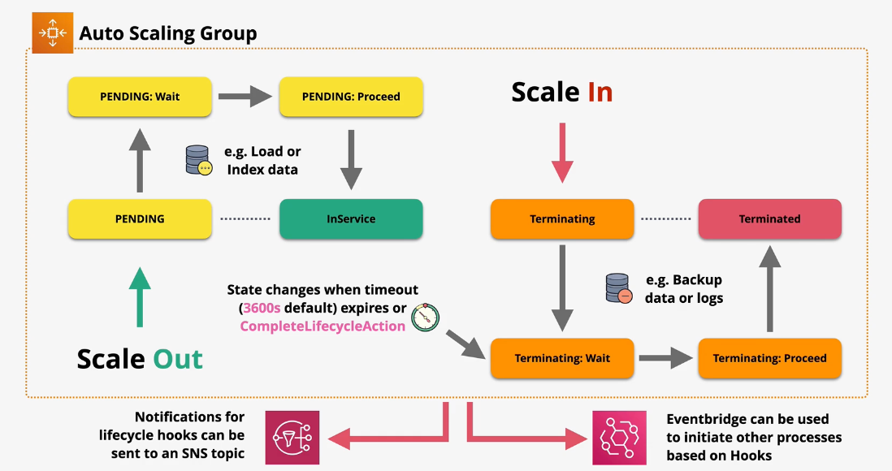

## ASG Health Checks

There are three types of health checks that can be used with an ASG:
- EC2 status (default)
- ELB
- Custom

EC2 status checks are based on the status of an EC2 instances. If the instance is in the stopping, stopped, terminated, shutting down, or impaired status, the instance is deemed unhealthy.

ELB health checks are layer-7 aware which allows developers to test the health and readiness of an application, rather than the instance itself.

Custom health checks mark an instance as healthy or unhealthy by an external system.

Health checks observe a **grace period** (default 300 seconds) before starting health checks. This gives the application enough time to initialize and get into a healthy state before being marked as unhealthy.

## ASG Termination Policies

Amazon EC2 Auto Scaling uses termination policies to determine which instances it terminates first during scale-in events. Termination policies define the termination criteria that is used by Amazon EC2 Auto Scaling when choosing which instances to terminate.

Predefined termination policies include:
- `AllocationStrategy` - terminate instances strategically to achieve the desired allocation strategy (e.g., on-demand vs spot).
- `OldestLaunchTemplate` - Terminate instances that have the oldest launch template.
- `OldestLaunchConfiguration` - Terminate instances that have the oldest launch configuration. This policy is useful when phasing out the instances from a previous configuration.
- `ClostestToNextInstanceHour` - Terminate instances that are closest to the next billing hour.
- `Newest Instance`
- `Oldest Instance`

EC2 Auto Scaling always balances instances across AZs first, regardless of which termination policy is used.

Custom termination policies can be created using Lambda.