# Lambda

Lambda is a function-as-a-service (`FaaS`) that provides the infrastructure to create short running and focused pieces of code.

Lambda supports multiple `runtimes` including Python, Ruby, Java, Go, C#, and NodeJS. Custom runtimes, such as Rust, are possible using Lambda `layers`.

When invoked, functions are loaded and run into a `runtime environment`. The environment has a `direct memory` (indirect CPU) allocation. Developers directly control the memory allocated for Lambda functions. Based on the memory configuration, vCPU is allocated.

By default, Lambda functions have 512MB of storage available in the `/tmp` directory.

Lambda can run for up to 15 minutes.

You are billed for the duration of the function execution.

At its most basic, a Lambda function is a deployment package that the Lambda service executes. The deployment package must be smaller than `50 MB zipped` or `250 MB unzipped`.

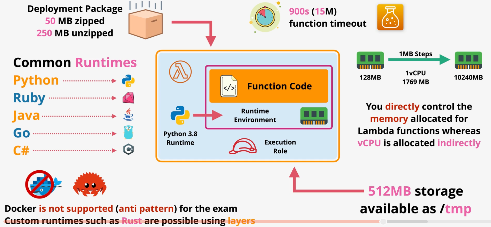

> [Exam Tip]
>
> For the purposes of the exam, Docker is not supported in Lambda. Lambda supports containers, but the term Docker refers to a more traditional container runtime.

## Networking

Lambda has two networking modes: public and private.

By default, Lambda functions are given public networking and run within the AWS public zone. Public Lambda functions can access public AWS services and the public internet, but they cannot access private VPC resources.

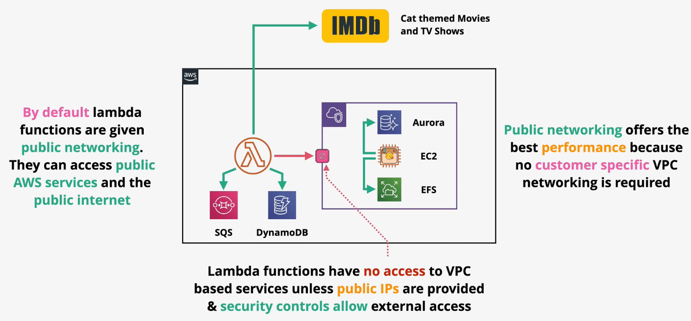

Alternatively, Lambda functions can be configured to be accessible within a private VPC. Private Lambda functions must obey all VPC networking rules. Private Lambda functions can access private and public resources (using a NAT).

Private Lambda functions execute in the AWS Lambda Service VPC with an ENI injected into the customer VPC.

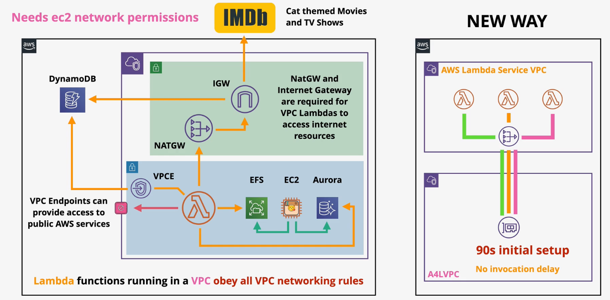

## Permissions

Lambda functions have permissions defined in the `execution role`. Lambda execution roles are IAM roles attached to a Lambda function which control the permissions the function receives.

Lambda functions also support a `resource policy`. The resource policy controls which services and accounts can invoke the Lambda function.

## Logging

Lambda uses CloudWatch, CloudWatch Logs, and X-Ray. Logs are ingested into CloudWatch Logs. Lambda is integrated with X-Ray for distributed tracing. Lambda also publishes metrics (e.g., invocation successes/failures, retries) to CloudWatch.

In order for Lambda to push logs to CloudWatch Logs, it must have the proper permissions in the execution role.

## Invocation

There are three types of invocation models:
- Syncronous
- Asynchronous
- Event-based

Lambda functions can be executed `synchronously`, in which the client waits for the function to complete execution.

A common pattern for synchronous execution is using the API Gateway to invoke a Lambda.

Lambda functions can also be executed `asynchronously`, in which the invoker does not wait for execution to complete. 

When execution failure occurs during asynchronous invocation, the Lambda service will retry execution between 0 and 2 times (configurable).

It is important that Lambda functions are idempotent to avoid unintended bugs.

Function invocations can also be `event-based`. Events typically come from streams or queues such as Kinesis, SQS, or DynamoDB streams.

Event-based invocation is faciliated through Lambda `event source mapping`. The event source mapping handler polls the stream or queue for messages, batches them, and invokes a function with a given batch.

Batches will succeed (`OK`) or fail (`FAIL`) as a batch.

Developers should be careful to limit batch sizes so that all execution is completed within 15 minutes.

When using an event source mapping, the functions execution role must have permissions to read from the event source.

SQS queues or an SNS topic can be used to handle any discarded or failed event batches.

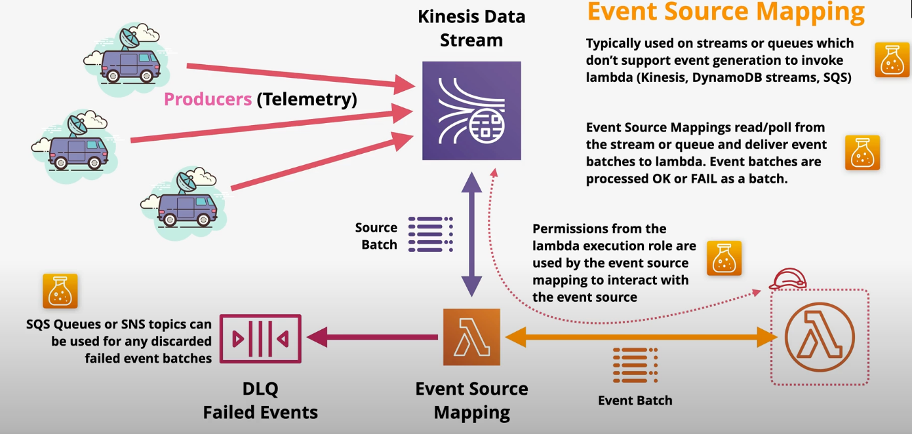

## Versions

The Lambda service supports `versioning` for functions. The `version` of a function represents the code and configuration.

When functions are `published`, Lambda creates an immutable version that can be referenced. You cannot edit a published version. Published versions are assigned a `qualified ARN` that uniquely identifies that version from others.

`arn:aws:lambda:us-east-1:123456789:function:myfunction:2`

In contrast, an `unqualified ARN` points at the function, but not a specific version ($LATEST).

`arn:aws:lambda:us-east-1:123456789:function:myfunction`

Lambda `aliases` can be created to point to a specific version. All functions have a `$latest` alias that points to the latest version of the function.

Each alias has a unique ARN.

Alias can be updated so that the version of the function that it points to changes. 

Services can be configured to point to aliases rather than specific versions. As a result, updating alias alleviates the need to make system changes when new function versions are deployed.

Using `alias routing`, you can direct a certain percentage of traffic to one alias and the rest to another alias.

## Destinations

Lambda supports `destinations` such as SQS, SNS, Lambda, and EventBridge. Developers can configure behavior so that a successful or failed execution will be sent as an event to some AWS service.

## Failures

Lambda supports `dead-letter queues`, in which executions that repeatedly failure are sent to an SQS queue for manual processing.

## Cold Starts

A Lambda `execution context` is the environment in which a Lambda function runs. The environment must be prepared (e.g., downloading code & packages) before execution can take place.

A `cold start` is a full creation and configuration of a Lambda function, including downloading the code.

The same Lambda function may reuse an existing execution context, but the amount of time an execution context remains around is indeterminant.

When a Lambda function executes within an existing execution context, this is known as a `warm start`. Since warm starts do not need to download the deployment context, it starts much more quickly than a code start.

`Provisioned concurrency` can be used to keep execution contexts warm and ready to use to improve startup speeds.

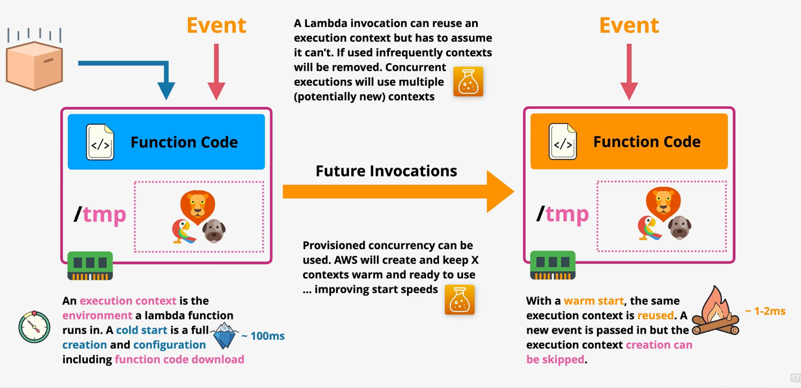

## Handler

Lambda functions execute with a predictable `lifecycle`.
1. **Initialization** - Creates or unfreezes execution environment.  
    1A. Extension Init  
    1B. Runtime Init  
    1C. Function Init  
2. **Invocation** - Runs the function handler  
3. **Shutdown** - The execution environment is shut down  
    3A. Runtime shutdown  
    3B. Extension shutdown  

Function initailization code (code that is written outside the handler) is executed once every cold start, during the `function init` phase.

Lambda attempts to reuse an execution environment for multiple invocations of the same function. After a period of inactivity, the execution environment is shut down (unless using provisioned concurrency).

To improve initialization time, put as much code into the initialization code (outside the handler function) as possible.

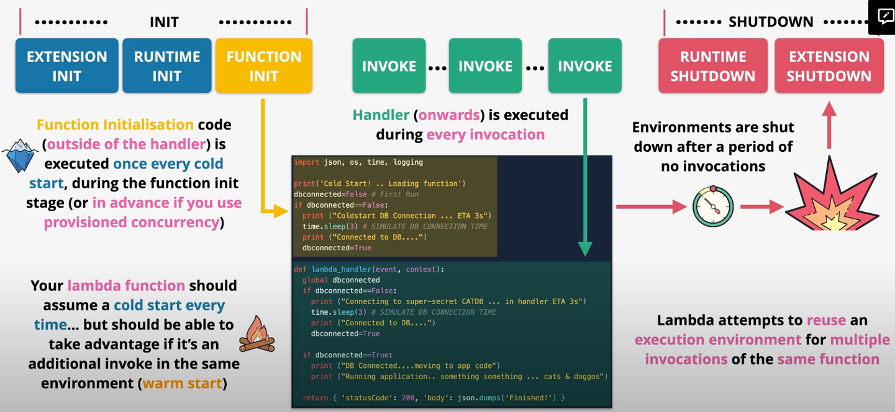

## Environment Variables

Environment variables are key-value pairs that are available to the functions runtime. Each function can have 0 or more environment variables.

Environment variables are fixed when published as part of a version.

Environment variables can be accessed within the execution environment.

```python
import os

def lambda_handler(event, context):
    print (os.environ['ENV'])
```

Environment variables can be encrypted with KMS.

## Layers

Without layers, a single zip archive contains code and the dependencies to run that code. In some cases, the dependencies are very large and take a significant amount of time to download.

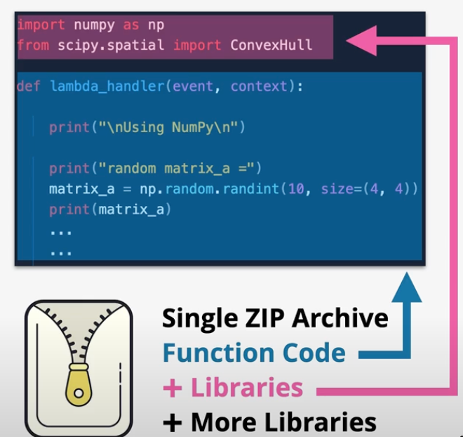

Lambda Layers help alleviate this issue. Developers can define a layer that contains shared and reusable libraries. The libraries are extracted into the `/opt` directory of the function so they're available to the function in the same way.

Layers enable efficient sharing of dependencies between functions, enable new runtimes, and allow libraries to be externalized.

As a result of using layers, deployment zips are much smaller.

## Containers on Lambda

When you create a Lambda function, you package your function code into a deployment package. Lambda supports two types of deployment packages: container images and zip file archives.

The `AWS Lambda Runtime Interface Emulator` (`RIE`) is a proxy for the Lambda Runtime API that allows you to locally test your Lambda function packaged as a container image. The emulator is a lightweight web server that converts HTTP requests into JSON events to pass to the Lambda function in the container image.

## Integrating Lambda with ALB

Lambda functions can be represented in target groups within an ALB. The ALB `synchronously` invokes the Lambda (and waits for a response) when it receives an HTTP/S request from a client.

The ALB is responsible for translating the HTTP request into a Lambda-compatible JSON event. It also translates the JSON response from the function into an HTTP response.

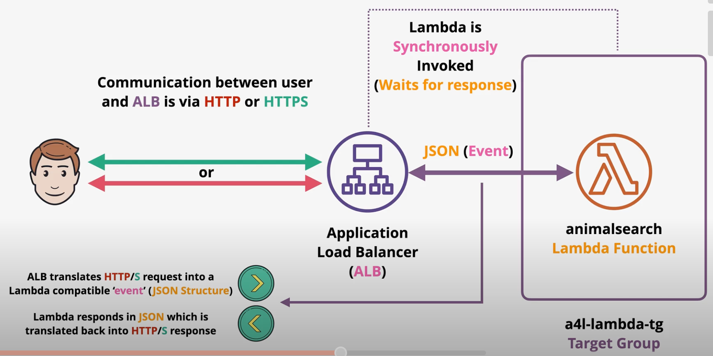

Using `multi-value headers`, the load balancer collects all identical parameter keys and represents them in the `multiValueQueryStringParameters` attribute within the Lambda event.

Without multi-value headers, the Lambda would only receive the last value for each parameter key.

Given this query in which two search terms are provided:  

`http://host.com?search=aria&search=james`

Without multi-value headers, the Lambda function will only receive the `james` search term in the event.

```json
{
    "queryStringParameters": {
        "search": "james"
    }
}
```

With multi-value headers, both terms are represented in the `multiValueQueryStringParameters` attribute:

```json
{
    "multiValueQueryStringParameters": {
        "search": ["aria", "james"]
    }
}
```

## Monitoring, Logging, and Tracing on Lambda

All Lambda metrics (e.g., invocations, errors, duration, DeadLetterErros) are available within CloudWatch for the function name, resource (alias/version), executed version (combination alias and version), and all functions dimensions.

Lambda execution logs are sent to CloudWatch Logs, including stdout and stderr. The Lambda execution role must have the proper permissions to interact with CloudWatch.
- Log group: `/aws/lambda/<fundction-name>`
- Log stream: `YYYY/MM/DD/[$LATEST]||version]<random>`

X-Ray can be used for tracing by enabling `Active Tracing` on a function. This can be done using the CLI using the `aws lambda update-function-configuration --function-name my-function --tracing-config Mode=Active`.

The execution of the function must have the proper permissions to interact with the X-Ray service (e.g., `AWSXRayDaemonWriteAccess` managed policy).

The X-Ray SDK is automatically available in the function and can be used to publish traces.


# API Gateway

Amazon API Gateway is a fully-managed service that allows you to create and manage APIs. By default, API Gateway is highly available, scalable, handles authorization, throttling,  caching, CORS, transformations, OpenAPI specification, direct integration with other AWS services, and more.

There are three phases in most API Gateway interactions:
- `Request` - authorizes, validates, and transforms the request
    - `Method Request`
    - `Integration Request`
- `Integrations` - invokes other AWS services (e.g., DynamoDB, Lambda, HTTP Endpoints, Step Functions)
- `Response` - transforms, prepares, and returns the response
    - `Integration Response`
    - `Method Response`

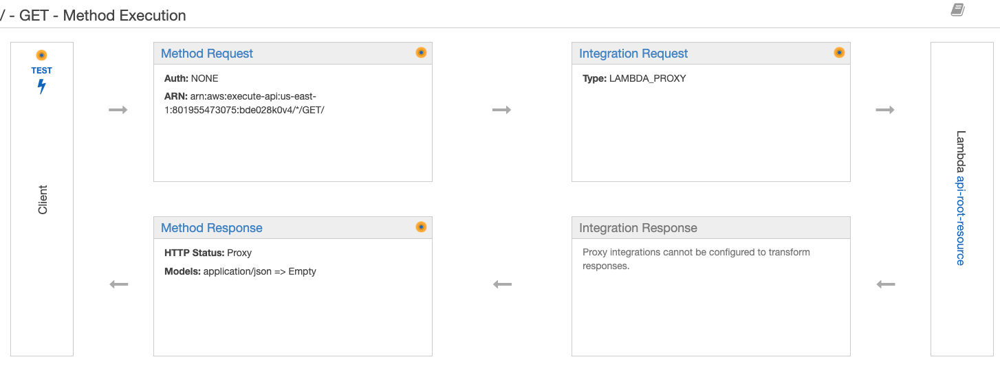

API Gateway integrations with CloudWatch Logs to store and manage full stage request and response logs. CloudWatch Metrics is used for capturing metrics.

The API Gateway can handle data caching.

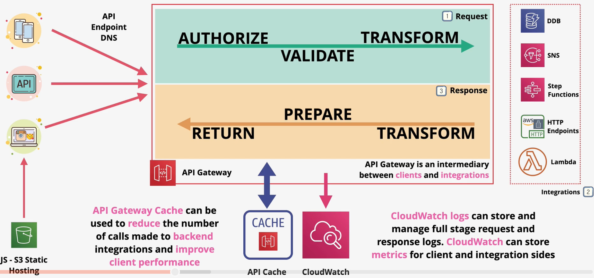

## Authentication

API Gateway supports direct integration with `Cognito` to authenticate API requests.

API Gateway can also support a `custom Lambda authorizer`. When a request is received by the API Gateway, it invokes a Lambda authorizer that is responsible for validating the token supplied in the request. If successful, an IAM policy and principal identifier is returned.

If authentication fails, a 403 FORBIDDEN response is returned.

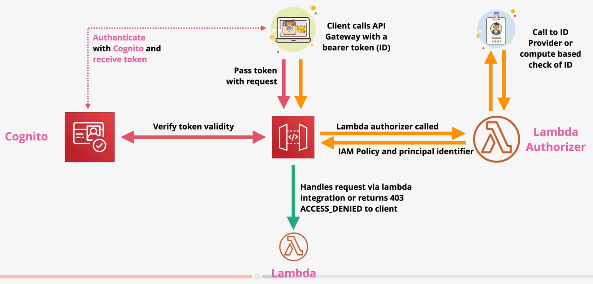

## API Types


## Endpoint Types

API Gateway supports multiple endpoint types:
- `Edge-optimized` endpoints route traffic to the nearest CloudFront point-of-presence. 
- `Regional` endpoints can be used to support API clients within the same region.
- `Private` endpoints are only accessible within a VPC through an interface endpoint.

## Stages & Deployments

APIs are deployed to a `stage`. A stage represents a snapshot of the API, including methods, integrations, models, mapping templates, and Lambda authorizers.

Each version of your API can be deployed to a different stage. In order for changes to an API to take effect, they must be deployed to a stage.

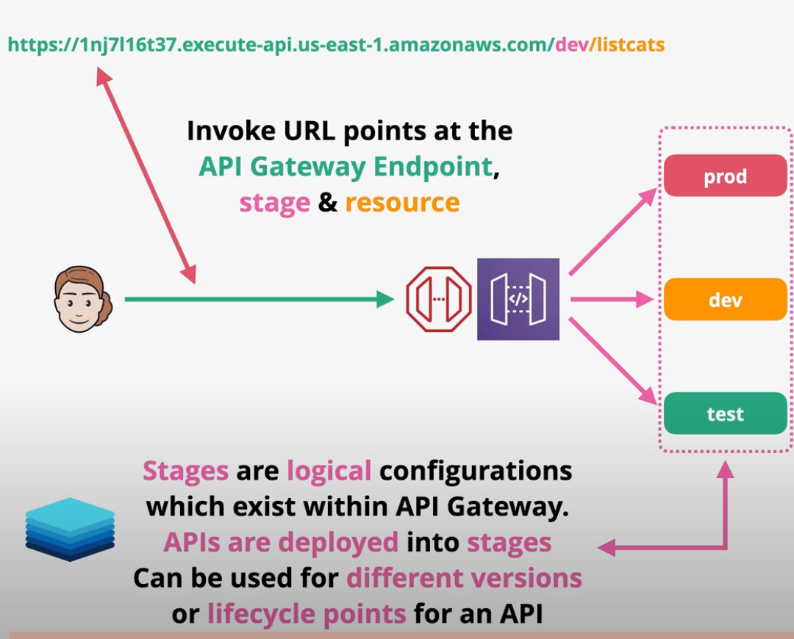

It is common to use stages to represent environments (e.g., dev, test, and prod) or versions of an API (e.g., v1, v2, v3).

Stages are `not immutable` - they can be overwritten and rolled back.

You can use `stage variables` to configure dynamic integrations with Lambda aliases.

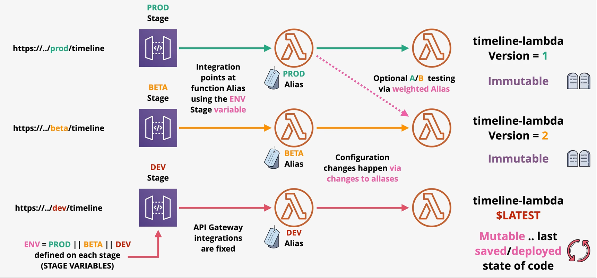

Stages can be enabled for `canary deployments`. Stages enabled for canary deployments can be configured so a certain percentage of traffic is sent to the canary. This can be adjusted over time - or the canary can be promoted to make it the new base stage.

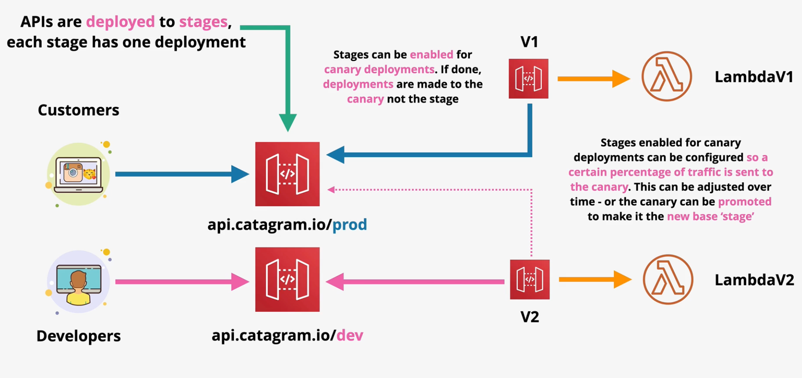

## Errors

Error codes from API Gateway are either 400s (client errors) or 500s (server errors).

| | Likely Cause |
| --- | --- |
| 400 BAD REQUEST | Invalid Request |
| 403 ACCESS DENIED | Authentication or authorization failed |
| 429 TOO MANY REQUESTS | The API Gateway is throttling requests |
| 502 BAD GATEWAY | The backend system (e.g., Lambda function) is returning an error |
| 503 SERVICE UNAVAILABLE | Major servie issue |
| 504 GATEWAY TIMEOUT | Integration failure or timeout (29 seconds) |

## Caching

Caching is configured per stage within API Gateway.

The cache `TTL` default is 300 seconds, but is configurable from 0 to 3600 seconds. Cache can be `encrypted`.

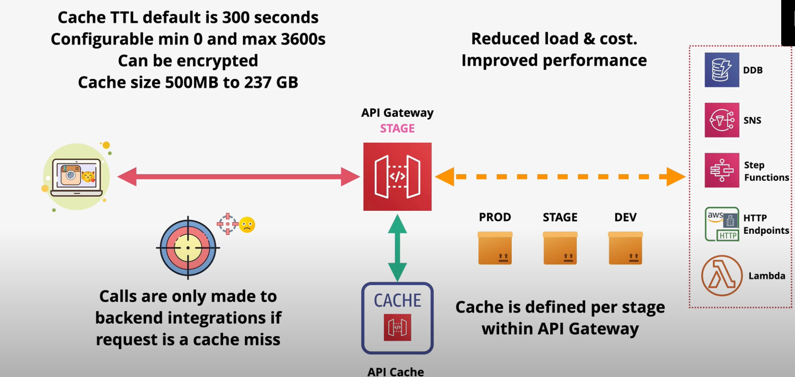

## Integrations

There are several types of integrations available within the API Gateway:
- `Mock` - used for testing with no backend involvement
- `HTTP` - used for backend HTTP endpoints; This integration requires some transformation in the *integration request* and *integration response* stages so that the request conforms to the backend HTTP service.
- `HTTP Proxy` - The request and response are passed through to the integration and back to the client unmodified.
- `AWS` - Allows an API endpoint to integrate with another AWS service.
- `AWS Proxy` - Low admin overhead Lambda endpoint

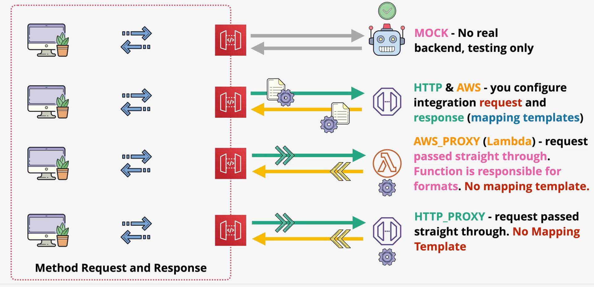

`Mapping templates` are used to transform requests and responses in non-proxy integrations. Mapping templates are able to rename or modify parameters and filter out unneeded data. Mapping templates use `Apache VTL` (Velocity Template Language).

> [Exam Tip]
>
> A common exam scenario is to shim a backend SOAP API with a REST API Gateway API. In order to this, you must transform the request using a mapping template.

# SNS

SNS is a fully-managed pub-sub messaging service. SNS runs in the public zone.

SNS supports messages up to 256KB payloads. Alternatively, a larger message can be saved in an S3 bucket and a reference to the S3 object can be added to the payload.

In SNS, `publishers` send messages to a `topic` where it can recieved by one or more `subscribers`. SNS supports many subscriber protocols including HTTP(S), email, SQS, mobile push, SMS messages, and Lambda. 

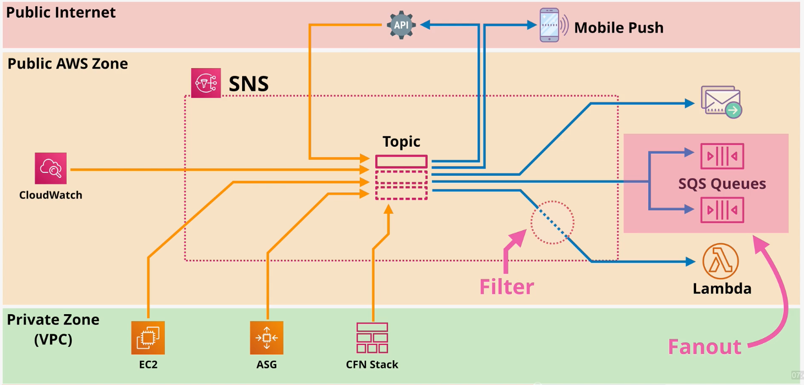

SNS offers several key features:

**Delivery Status** - Some subscriber protocols support delivery status (e.g., HTTP, Lambda, SQS).

**Delivery Retries** - Reliable delivery is achieved via an automatic retry strategy.

**Regionally Resilience** - SNS data is automatically replicated across multiple AZs in a region to provide in-region scalability and high availability.

**Server Side Encryption (SSE)** - SNS can be configured to encrypt data.

**Topic Policy** - SNS supports resource policies to define access permissions for the topic. Using a topic policy, you can enable cross-account access.

# EventBridge

EventBridge is replacing CloudWatch Events for near-real time processing. Unlike CloudWatch Events, EventBridge can receive events from 3rd parties.

In EventBridge, events are received by an **event bus**. Each account has a default bus. Additionally, teams can create custom buses to receive events.

EventBridge rules match incoming events (or schedules) and route the event to one or more targets (e.g., Lambda function).
