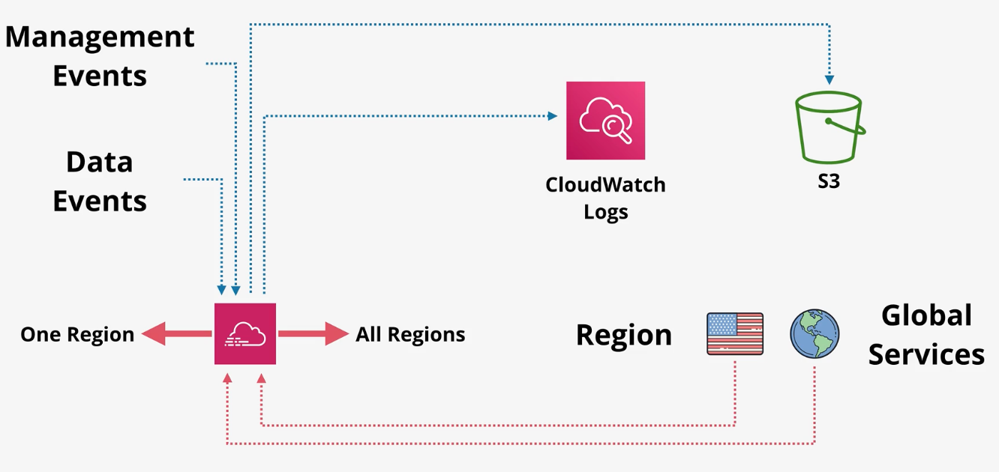
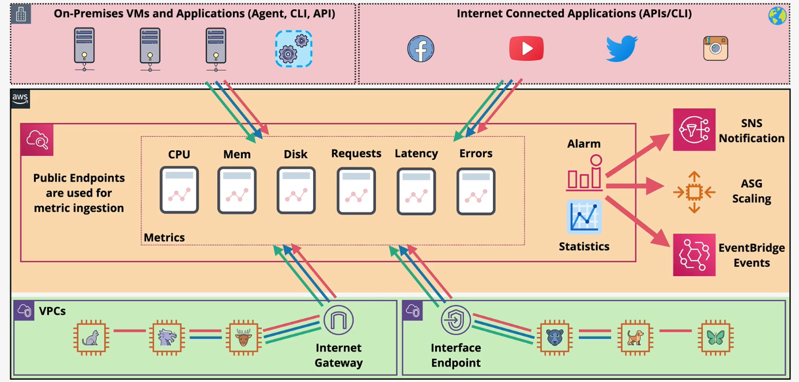
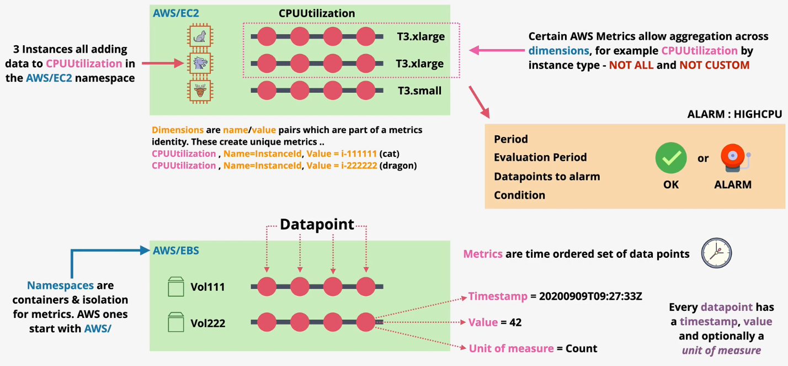
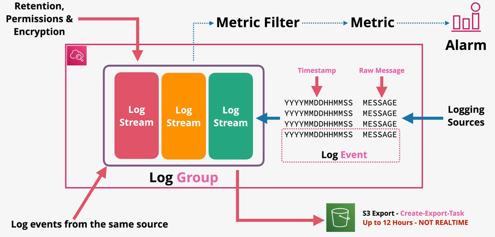
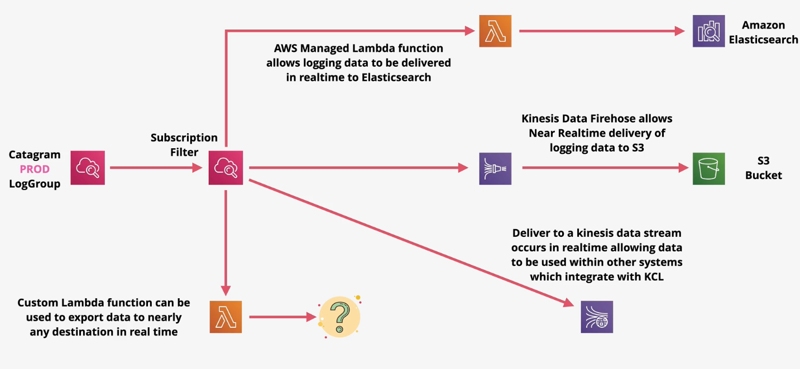

# Contents

- [CloudTrail](#cloudtrail)
    - [CloudTrail Pricing](#cloudtrail-pricing)
- [CloudWatch](#cloudwatch)
    - [Metrics](#metrics)
        - [Notable EC2 Metrics](#notable-ec2-metrics)
    - [Alarms](#alarms)
    - [Logs](#logs)

# CloudTrail

AWS CloudTrail monitors and records account activity across your AWS infrastructure, giving you control over storage, analysis, and remediation actions.

A `CloudTrail event` is a single API call or activity within your AWS account (e.g., Create S3 bucket).

CloudTrail automatically stores event history for 90 days for no cost. In order to store events longer, you must create one or more `CloudTrail trail`.

CloudTrail trails can be configured to support one event type:
- Management events: provide information about control-plane operations (e.g., creating/terminating an EC2 instance).
- Data events: provide information about events within a resource (e.g., accessing an object in an S3 bucket).
- Insight events

By default, only management events are logged.

CloudTrail is a regional service that, by default, only logs events within region. CloudTrail trails can be configured to log for one region, or for all regions.

In addition to regional events, a CloudTrail trail can be enabled to log global service events (i.e., CloudFront, IAM, STS).

A trail can export events in a standard format to S3 or CloudWatch Logs. CloudWatch metric filters can then be used to analyze CloudTrail logs.

CloudTrail supports the concept of `Organization` trails in which you can configure trails for every account in the AWS Organization.

CloudTrail typically publishes events within 15 minutes of activity. There is no way to get realtime logging.

By default, CloudTrail is enabled on the account for management events only without any trails configured.

Enabling **log validation** directs CloudTrail to create and sign digest files for every hour of log delivery. The digest files are stored in a different prefix within the same S3 bucket, allowing fine-grain access controls to be applied.

The digest files contain hashes of each log file for the past hour. By calculating the hash on the log files in the S3 bucket and comparing it to the hash in the digest, teams can gain confidence in the integrity of the S3 log files. 

CloudTrail signs each digest file with its private key. **Each digest file can be verified using the public key and CLI** (*validate-logs*).

When creating a new CloudTrail trail, you can specify several parameters.
- Destination S3 bucket
- Enable/disable SSE-KMS encryption
- Enable/disable log file validation
- Enable/disable SNS notification delivery
- Enable/disable publishing to CloudWatch Logs
    - If enabled, you must provide an IAM role that can publish to CloudWatch Logs
- Enable/disable management events and which management events to exclude (e.g., KMS events, RDS data API events)
- Enable/disable data events and which types of events (e.g., read, write) from which services (e.g., S3, DynamoDB) and optional selectors to limit events to a specific bucket/table.
- Enable/disable insight events and which types of insights to enable

## CloudTrail Pricing

You can view, filter, and download the most recent 90 days of your account activity for all management events in supported AWS services at no cost. Additional copies of management events are charged $2.00 per 100,000 events.

Data events are recorded only for Lambda functions and S3 buckets you specify and are charged at $0.10 per 100,000 events.

# CloudWatch

## Metrics

CloudWatch ingests, stores, and manages metrics. CloudWatch is a public service that can be accessed via the public space endpoints.

CloudWatch integrates with many AWS services. Some services, such as EC2, require a CloudWatch agent to be installed on the instance to publish metrics.

CloudWatch metrics can be integrated with on-prem servers and custom applications via the CloudWatch agent and API.

CloudWatch metrics can trigger `alarms` that monitor and react to metrics. Alarms can be used to notify or perform configured actions.

A CloudWatch `namespace` is a container for metrics (e.g., AWS/EC2, AWS/Lambda).
A CloudWatch `metric` is a specific type of measurement within a namespace (e.g., *CPUUtilization in AWS/EC2*).
A CloudWatch `dimension` is a name-value pair that form part of the unique identifier for a metric. For instance, many EC2 metrics publish `InstanceId` as a dimension name, and the action instance ID as the value for that dimension (e.g., *`Name=InstanceId, Value=i-11111111`*).
    - CloudWatch automatically adds some dimensions in order to apply aggregations to metrics (e.g., `AutoScalingGroupName`, `ImageId`, `InstanceId`, `InstanceType`).
A CloudWatch `datapoint` is an instance of a measurement of a metric. Datapoints consist of a timestamp, value, and unit of measure (e.g., 42% CPUUtilization).

When metrics are published into CloudWatch, they are published according to a `resolution`. By default, metrics are published according to the `standard` resolution (every 60 seconds). Optionally, and for a cost, users can choose to enable `high` resolution which publishes metrics every 1 second.

CloudWatch metrics are retained based on these rules:
- Metrics collected once per hour are retained for 455 days.
- Metrics collected once every five minutes are retained for 63 days.
- Metrics collected once per minute are retained for 15 days.
- Metrics collected more than once per second are retained for 3 hours.

As data ages, it is aggregated and stored for longer with less resolution according to the schedule above.

CloudWatch `statistics` is an aggregation over a period (e.g., min, max, sum, average).

CloudWatch `percentiles` is a calculation that show the distribution of your metrics (e.g., p95 shows the 95th percentile of your data).

### Notable EC2 Metrics

- `SurgeQueueLength` (ELB): ELBs queue requests if it is unable to establish a connection with a healthy instance. The max queue size is 1024. The `SurgeQueueLength` represents the number of requests in the queue.
- `SpilloverCount` (ELB): After the ELB queue is full, new requests are rejected. The `SurgeQueueLength` represents the number of requests rejected when the queue is full.
- `StatusCheckFailed` (EC2): Reports whether the instance has passed both the instance status checks and system status checks.
- `CPUCreditUsage` (EC2): The number of CPU credits spent by the instance for CPU utilization.
- `CPUCreditBalance` (EC2): The number of earned CPU credits that an instance has accrued since it was launched or started.
- `HTTPCode_Backend_5xx` (ELB): The number of 500 requests being returned from a backend server.
- `HTTPCode_ELB_4xx` (ELB): The number of 400 requests returning a 400 HTTP status code.

## Alarms

CloudWatch `Alarms` monitor a metric over a time period and trigger one or more actions if the metric passes some threshold.

CloudWatch Alarms can be in `OK` or `ALARM` status.

CloudWatch Alarms support resolutions of standard or high (10 seconds or 30 seconds). You can also set a regular alarm with a period of any multiple of 60 seconds.

## Logs

CloudWatch logs can store and organize log data from AWS, on-prem, and IOT servers or any custom application.

In order to publish logs to CloudWatch, the server must have the CloudWatch agent installed.

CloudWatch Logs is used to store VPC flow logs, CloudTrail logs, Elastic Beanstalk, ECS Container logs, API Gatway logs, Lambda execution logs, Route53 DNS request logs, and more.

A `log event` is a single logging statement sent by an application, server, or AWS service. Log events consist of a timestamp and raw message.

A `log stream` is a sequence of log events that share the same source (e.g., Lambda function). Each separate source of logs in CloudWatch Logs makes up a separate log stream.

A `log group` is a group of log streams that share the same configuration settings such as retention, permissions, and encryption are set on the log group.

A `metric filter` can apply a regex filter against a log stream to identify important events. A custom CloudWatch metric can be created from a metric filter. CloudWatch can then monitor and trigger actions on the metric using CloudWatch Alarms.

CloudWatch logs can be exported to S3 using the S3 export feature (i.e., `Create-Export-Task`). Exports of this type can take up to 12 hours to export and only support the SSE-S3 encryption mode.

CloudWatch Logs also support `log subscriptions`. Log subscriptions can be attached to a log group. Subscription filters stream log events to the configured destinations.
- *Kinesis Data Firehose* provides near-realtime delivery
- *AWS Lambda* can be used to write the log data to Amazon ElasticSearch in near-realtime.
- *AWS Lambda* can be used to process log data or export data to any destination in near-realtime.
- *Kinesis Data Stream* can be used to publish logs to any KCL consumers.

It is a best practice to aggregate logs across environments and applications to a single S3 bucket.