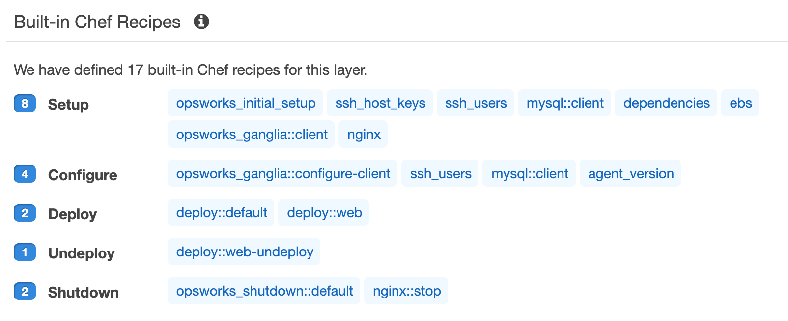
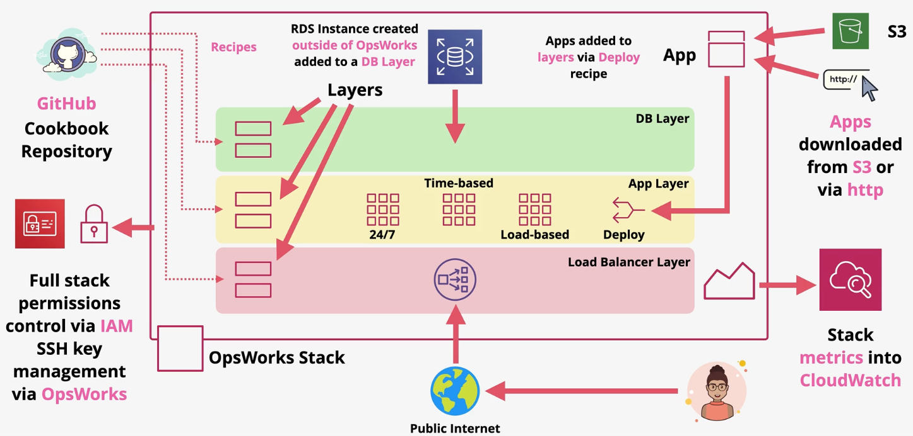

# OpsWorks

OpsWorks is configuration management service that provides an AWS-managed version of Chef and Puppet.

OpsWorks has recently been split into three separate products:
- **OpsWorks Stacks**: Define, group, provision, deploy, and operate your applications in AWS by using Chef in local mode.
- **OpsWorks for Puppet Enterprise**: Create Puppet servers that include Puppet Enterprise features. Inspect, deliver, update, monitor, and secure your infrastructure.
- **OpsWorks for Chef Automate**: Create Chef servers that include Chef Automate premium features, and use the Chef DK or any Chef tooling to manage them.

Chef and Puppet are tools that allow you to write code to manage server configuration.

> [Exam Tip]
>
> If a question mentions recipes, cookbooks, or manifests, then the answer is likely related to OpsWorks.

AWS OpsWorks Stacks is a configuration management service that helps you build and operate highly dynamic applications and propagate changes instantly. Chef and OpsWorks Stacks are declarative desired state engines in which you state what what you want to happen and Chef/Opworks Stacks handles how it happens.

*Below: Example of a chef recipe that installs and configures an httpd server.*
```chef
package "httpd" do
    action :install
end

service "httpd" do
    action [:enable, :start]
    supports :restart => :true
end

template "/var/www/html/index.html" do
    source "index.html.erb"
    owner "apache"
    group "apache"
    mode "0644"
    notifies :restart, "service[http]"
end
```

In Chef, a **cookbook** (*.erb*) is the primary unit of configuration and policy distsribution.

OpsWorks Stacks consists of stacks, layers, recipes, and cookbooks.
- Stacks: A set of layers, instances and related AWS resources whose configuration you want to manage together.
- Layers: A blueprint for a set of instances. It specifies the instance's resources, installed packages, profiles and security groups.
- Instances: An instance represents a server. It can belong to one or more layers, that determine the instance's resources and configuration.

OpsWorks can be instructed to scale instances using one of several strategies:
- 24/7: Always running
- Time-based: Runs during the specified time
- Load-based: Runs when needed, based on memory, CPU, or other metrics

OpsWorks operates using lifecycles including setup, configure, deploy, undeploy, and shutdown.



A **bookshelf** is a feature within OpsWorks that allows you to use community cookbooks.



## Troubleshooting

**Server creation failed with an error message similar to the following: "The following resource(s) failed to create: [EC2Instance]. Failed to receive 1 resource signal(s) within the specified duration."**

Ensure the instance has outbound Internet access, and the AWS service agent is able to issue commands. Be sure that your VPC (a VPC with a single public subnet) has DNS resolution enabled, and that your subnet has the Auto-assign Public IP setting enabled.

**Server creation fails with an error message that states, "Not authorized to perform sts:AssumeRole."**

This can occur when the service role you are using lacks adequate permissions to create a new server. Open the OpsWorks for Puppet Enterprise console; use the console to generate a new service role and an instance profile role. If you would prefer to use your own service role, attach the AWSOpsWorksCMServiceRole policy to the role. Verify that opsworks-cm.amazonaws.com is listed among services in the role's Trust relationships. Verify that the service role that is associated with the Puppet master has the AWSOpsWorksCMServiceRole managed policy attached.