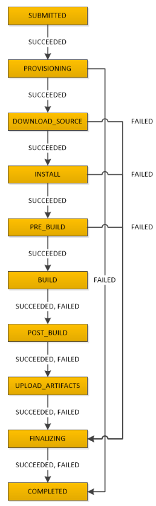

# Contents

- [CI/CD](#cicd)
- [CodePipeline](#codepipeline)
  - [Troubleshooting](#codepipeline-troubleshooting)
- [CodeCommit](#codecommit)
- [CodeBuild](#codebuild)
- [CodeDeploy](#codedeploy)
- [ECR](#ecr)

# CI/CD

Conceptually, there are four stages for code:
- Code (e.g., CodeCommit)
- Build (e.g., CodeBuild)
- Test (e.g., CodeBuild)
- Deploy (e.g., CodeDeploy)

AWS CodePipeline is the orchestrator to facilitate the code pipeline.

# CodePipeline

**AWS CodePipeline** is a continuous delivery service you can use to model, visualize, and automate the steps required to release your software. You can quickly model and configure the different stages of a software release process. CodePipeline automates the steps required to release your software changes continuously

Pipelines consist of **stages**. Movement between stages can be automatic or require manual approval. When a stage completes successfully, fails, or is canceled, an event is published to EventBridge.

Artifacts can be passed into stages and stages can result in an artifact as output.

Stages consist of one or more **actions** (single, sequential, or parallel).

   

Pipelines can be outfitted with a **manual approval** stage. In order for the current pipeline to continue, manual approval is required. If manual approval is not obtained within 7 days, the pipeline execution fails.

## CodePipeline Troubleshooting

**CodePipeline is not able to access a GitHub repository.**

CodePipeline uses GitHub OAuth tokens and personal access tokens to access your GitHub repositories.

- Check that no permissioned were revoked on the OAuth token in GitHub.

# CodeCommit

**CodeCommit** is a Git repository hosted by AWS.

Developers can clone repos using HTTPS (credentials), SSH (using a key-pair), or SSH (GRP). Developers are authorized to specific repositories using IAM roles.

In order to use SSH for CodeCommit, you must upload a public key for the user in IAM:  

CodeCommit supports notifications based on Git hooks. Notifications can be sent to SNS or AWS ChatBot (Slack).

CodeCommit also support SNS and Lambda triggers based on supported events.

CodeCommit can integrate with **Amazon CodeGuru**. Amazon CodeGuru is a developer tool that provides intelligent recommendations to improve code quality and identify an application’s most expensive lines of code. CodeGuru Reviewer uses machine learning and automated reasoning to identify critical issues, security vulnerabilities, and hard-to-find bugs during application development and provides recommendations to improve code quality.

# CodeBuild

CodeBuild is a fully-managed code build as a service product. Customers pay only for the resources consumed during the build. CodeBuild can be used to build and test code as part of a CI/CD pipeline.

By default, CodeBuild uses Docker for the build environment. The image can be customized.

CodeBuild code is sourced from GitHub, CodeCommit, CodePipeline, and S3.

Builds are defined as **Build Projects**.

The `buildspec.yaml` (or json) is a file that can be used to customize builds through CodeBuild. `buildspec.yaml` must be in the root of the project.

[Build Spec Documentation](https://docs.aws.amazon.com/codebuild/latest/userguide/build-spec-ref.html)

The buildspec defines four main phases of a build:
- `install`: install packages into the build environment (e.g., frameworks)
- `pre_build`: Sign into services and install code dependencies
- `build`: commands are run during the build process
- `post_build`: create artifacts/packages, push docker images, explicit notifications

The `buildspec.yaml` file can define environment variables that are available in the build process.

The `buildspec.yaml` file allows developers to customize artifact creation and storage.

CodeBuild supports **triggers**. Triggers allow developers to schedule builds based on Cron.

## CodeBuild Phases

# CodeDeploy

CodeDeploy can deploy applications to EC2, Lambda, AWS Elastic Beanstalk, AWS OpsWorks, CloudFormation, ECS (blue/green), Service Catalog, Alexa Skills Kit, and S3. It can also deploy to on-prem servers.

When deploying to EC2 or on-prem servers, the **CodeDeploy agent** must be installed.

Within CodeDeploy, developers create *Applications*. You can specify one or more *deployment groups* for a CodeDeploy application. The deployment group contains settings and configurations used during the deployment.

The deployment group requires a *service role* with permissions to deploy the application.

The following configurations are available to a deployment group:
- Deployment type (i.e., in-place or blue/green)
- Optionally specify an ASG or Load Balancer
- Deployment settings customize how the deployment operates, including:
    - Reroute traffic immediately or choose when to reroute traffic by specifing a wait period
    - Terminate or keep instances that have been replaced
    - Choose a default or custom deployment strategy
        - EC2 default deployment strategies include `CodeDeployDefault.AllAtOnce`, `CodeDeployDefault.HalfAtATime`, and `CodeDeployDefault.OneAtATime`
        - ECS/Lambda default deployment strategies include CodeDeployDefault.[Lambda,ECS]AllAtOnce, Linear, Canary
- Deployment triggers: CodeDeploy can publish up to 10 notifications to SNS based on lifecycle events (e.g., Deployment starts, Deployment succeeds, Deployment fails). Then, when that event occurs, all subscribers to the associated topic receive notifications through the endpoint specified in the topic, such as an SMS message or email message.
- Alarm configuration: The CodeDeploy deployment group will monitor up to 10 CloudWatch alarms. If the Alarm enters ALARM status, the deployment is stopped.
- Rollback configuration: The Deployment Group can be configured to roll back when a deployment fails, Roll back when alarm thresholds are met, or disable roll backs.
- Deployment group tags

If configured, CodeDeploy will install the AWS CodeDeploy agent on new instances through Systems Manager. The instances must already have the Systems Manager agent installed.

Custom Deployment Configurations can be created within CodeDeploy. 
  - When creating a new Deployment Configuration for Lambda or ECS, developers can choose between linear or canary deployments and customize the step and interval in which traffic is routed.
  - When creating a new Deployment Configuration for EC2/On-prem, developers can specify the minimum number or percentage of healthy EC2 instances that must be available at any time during the deployment.

The `appspec.yaml` (for json) is a file that can be used to customize deployments through CodeDeploy. `appspec.yaml` allows developers to define build configuration and lifecycle hooks for a deployment.

In the configuration section of `appspec.yaml`, there are three sections:
- `Files` (applies to EC2/On-prem servers only): provides information to CodeDeploy as to which files should be installed on the target server.
- `Permissions` (applies to EC2/On-prem servers only): details any special permissions and how they should be configured for the files in the `Files` section
- `Resources` (applies to ECS/Lambda only): defines metadata related to the Lambda function or ECS task

`appspec.yaml` also allows you to define lifecycle hooks for a deployment. The supported lifecycle hooks depend on the target (e.g., EC2 vs ECS vs Lambda).

Some examples of lifecycle phases include: `ApplicationStop`, `DownloadBundle`, `BeforeInstall`, `Install`, `AfterInstall`, `ApplicationStart`, and `ValidateService`.

The `ValidateService` is the phase that CodeDeploy uses to determine if a deployment was successful.

Developers can create Lambda functions to run during each of these phases.

[AppSpec Documentation](https://docs.aws.amazon.com/codedeploy/latest/userguide/reference-appspec-file.html)

> **Cross-Account Deployments**  
> CodeDeploy does not support cross-account deployments (e.g., adding EC2 instances from another account to a deployment group in the CodeDeploy account). Instead, team members must assume a role in the other account to deploy resources.

# ECR

The Elastic Container Registry (ECR) is a managed container image registry service (similar to DockerHub). Each AWS account has a public and private registry.

Each registry consists of one or more repositories. Each repository contains many images. Images contain a tag. The image name and tag must be unique within a registry.

ECR is integrated with IAM permissions for authorization.

Basic or enhanced static image scanning is available using Inspector.

ECR supports cross-region and cross-account replication.