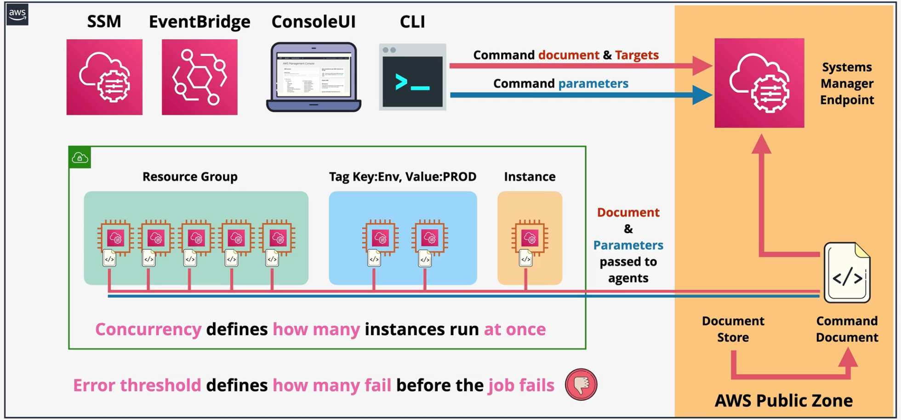

# Systems Manager (SSM)

Systems Manager enables visibility and control of AWS and on-prem infrastructure at scale.

Systems Manager is agent-based; The agent must be installed on Windows and Linux AWS AMIs.

Systems Manager enables system administrators to manage inventories, patch assets, run commands on instances, and manage desired state of instances.

Systems Manager also contains a **parameter store** which can be used to securely store configuration and secrets.

EC2 instances must satisfy some requirements in order to use systems manager:
- The systems manager agent must be installed.
- The instance must be able to reach the Systems Manager endpoint (in the public zone) via IGW or VPCE.
- The instance profile must have the necessary permissions to interact with systems manager.

On-prem instances must also satsify these requirements, but the details differ:
- **Activations** securely join on-prem servers to Systems Manager. The activation is assigned an IAM role that the on-prem servers will indirectly use to communicate with Systems Manager.

Hybrid instance (instances running outside of AWS) IDs are prefixed with `mi-`. EC2 instance IDs are prefixed with `i-`.

## Run Command

The SSM `Run command` feature enables administrators to run command documents, that contain scripts, on managed instances without using SSH/RDP.

The SSM Run Command feature is capable of running commands on individual instances, all instances part of a `resource group`, or instances with specific tag values.

Command documents can be parameterized and reused.

`Rate control` can be used to define:
- Concurrency: How many instances should updated in parallel?
- Error threshold: How many failures will it take before the entire RunCommand fails?

The output of commands can be written to S3, sent as a message to SNS for notifications, or sent as an event to EventBridge to enable trigger-based architectures.

SSM Run Commands can be triggered in SSM, the CLI, console UI, or via EventBridge events. When invoking a Run Command, you must supply the command document to be run, the target instances, and any command parameters required.

## SSM Documents

SSM Documents are JSON or YAML documents that are used by SSM to configure target instances. SSM documents consist of one or more `steps`.

SSM documents are stored in the `SSM Document Store`.

| Document types | Use case | 
| --- | --- |
| Command documents | Used by Run Command, State Manager, and maintenance windows. |
| Automation documents | Used by Automation, State Manager, and maintenance windows.  |
| Package documents | Used by distributor to distribute packages. |

SSM documents can be owned by AWS, owned by the customer, or shared with the customer (via the AWS Marketplace).

SSM includes more than 100 pre-configured documents that you can use by specifying parameters at runtime.

## SSM Patch Manager

SSM Patch Manager enables administrators to patch Windows and Linux instances.

The `patch baseline` defines what patches or hotfixes need to be installed.

The `patch group` defines which set of resources should be patched.

The `maintenance window` defines the time frame during which SSM Patch Manager can patch resources.

SSM Patch Manager uses an SSM Run Command to implement the update.

After patches or hotfixes are applied, SSM Patch Manager can verify the resource for **compliance**.

SSM Patch Manager has several pre-defined patch baselines which explicitly define a set of patches:
- For Linux: AWS-[OS]DefaultPatchBaseline (e.g., `AWS-AmazonLinux2DefaultPatchBaseline`, `AWS-UbuntuDefaultPatchBaseline`)
- For Windows: `AWS-DefaultPatchBaseline`, `AWS-WindowsPredefinedPatchBaseline-OS` (critical and security updates), `AWS-WindowsPredefinedPatchBaseline-OS-Applications` (includes MS application updates)

> [Exam Tip]
> 
> For the exam, you must know the following:
> - `AWS-DefaultPatchBaseline` includes critical and security updates for **Windows**.
> - `AWS-WindowsPredefinedPatchBaseline-OS` is identical to the above.
> - `AWS-WindowsPredefinedPatchBaseline-OS-Applications` contains critical and security updates (like the previous), but also contains Microsoft application updates.

Generally, the following steps must be taken in order to use Patch Manager:
1. Define one or more patch baselines that defines which updates will be installed.
2. Create a patch group to define the target instances that will receive the updates.
3. Define a maintenance window, which includes the schedule, duration, targets, and tasks to be run.
4. During the maintenance window, the SSM `AWS-RunPatchbaseline` run command is executed with the baseline and targets.
5. Once patches are applied and the job completes successfully, `SSM Inventory` performs compliance checks on the target groups to ensure patches were applied properly.