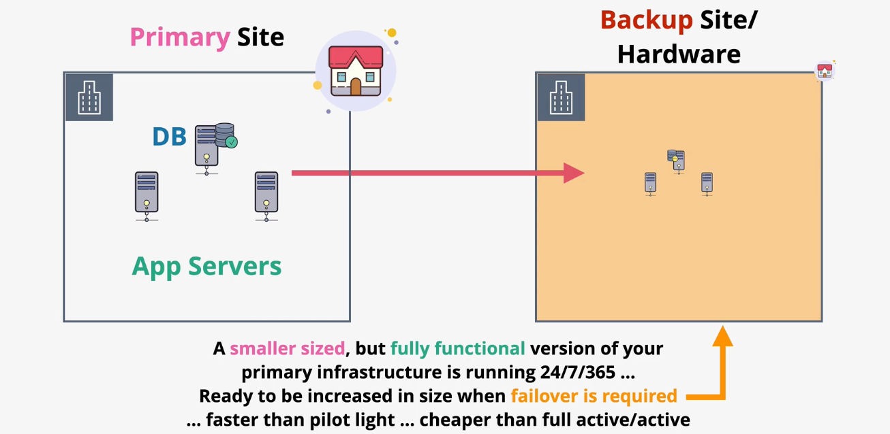
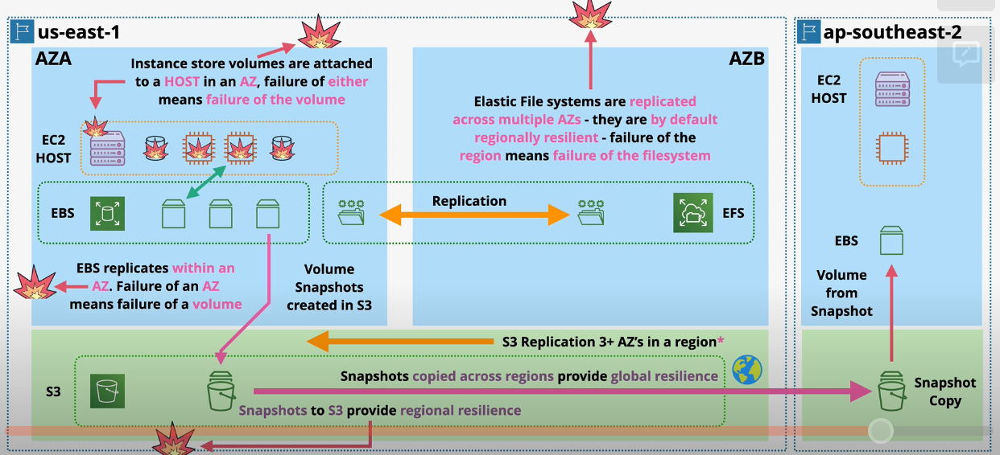

# Disaster Recovery

There are four types of DR architectures:
- Backup & Restore
- Pilot Light
- Warm Standby
- Active/Active

In order to choose a DR plan for your business, you must evaluate the recovery time objective (RTO) and recovery point objective (RPO) requirements.

## Backup & Restore

Backups are performed regularly at the primary sight. The backed-up data is transferred or transported to a backup location.

When needed, the backups can be restored to a secondary site.

Backup & Restore is very inexpensive, but requires a long RTO and RPO.

## Pilot Light

A secondary environment is provisioned in advanced running the absolute minimum of infrastructure (like the pilot light in a heater). 

Critical components, like datastores and databases, are constantly synchronized so they are ready to be used at any time.

The secondary environment can be "powered on" when needed.

Pilot light is a low cost solution that offers a bit better RTO than backup & restore.

## Warm Standby

All instances and infrastructure are running in a secondary "warm standby" environment. The environment is fully functional, but running with lower spec hardware to reduce costs (e.g., smaller EC2 instance size).

When required, the instance types can be scaled up in order to handle full traffic. This process is significantly faster than creating infrastructure from scratch.

## Active/Active

The Active/Active DR plan does not require any provisioning time.

When using `active/active`, an identical tech stack is provisioned in another site. Data is constantly replicated from the primary site to the backup.

Costs are generally 200% since a full copy is always running.

In addition to DR benefits, you can load balance traffic across both environments, improving high availability and performance of your workloads.

## Comparing DR Architectures

| | Cost | RTO |
| --- | --- | --- |
| Backup & Restore | $ | High |
| Pilot Light | $$ | Medium | 
| Warm Standby | $$$ | Low  |
| Active/Active | $$$$ | Zero |

## DR Storage Architecture

Instance store volumes are attached to a host in an AZ. If either the host or the AZ fail, the instance store is lost.

EBS can be used to increase data durability. EBS data is replicated within a single AZ (cannot replicate across AZs). Failure of the AZ will result in data loss, but now the data is protected from an instance failure.

S3 can also be used to increase data durability since data within a bucket is replicated across multiple AZs in a region. S3 can also be configured to perform cross-region replication. By exporting snapshots of EBS to an S3 bucket, you are protecting that data from an AZ failure.

*Note: This does not apply to S3 objects in the OneZone storage class.*

EFS can also be used to increase data durability. Data in EFS is replicated across multiple AZs therefore EFS volumes are regionally-resilient by default. However, if a region becomes unavailable, the EFS volume may be lost.

## DR Compute Architecture

`EC2 instances` themselves are not resilient. Instead, we deploy multiple identical instances to account for failures of specific instances.

In order to account for an AZ failure, we can use an auto scaling group to provision instances across multiple AZs.

`ECS clusters` can be run in EC2 mode or Fargate mode. When running in EC2 mode, the DR characteristics are identical to that of EC2. In Fargate mode, containers use ENI's in a VPC. ECS Services can be used to accomplish similar outcomes to an auto scaling group (ASG).

Lambda functions are allocated in each subnet. Failure of a specific AZ will result in the function launching in a subnet in another AZ. 

## DR Database Architecture

`DynamoDB` runs within the AWS network (not within a customer's VPC). Data in DynamoDB is replicated across AZs within a region. A full region outage would be required to impact a DynamoDB table.

DynamoDB also supports global tables which results in multi-master replication between regional replicas.

A subnet group in `RDS` allows you to run an RDS cluster across more than one AZ. Data from the primary instance is replicated into the secondary instance in another AZ.

When a failure happens that affects the primary instance, the secondary instance is promoted to be primary. A failure of both the primary and secondary instances may result in a failure.

RDS supports `cross-region read replicas` which use asynchronous replication.

`Aurora` provides significant DR benefits over RDS. An Aurora cluster is able to support one ore more read-replica instances in every AZ within the region.

Additionally, Aurora uses a cluster storage architecture in which data is replicated across all AZs in the region. 

Aurora supports `global databases`. When running a global Aurora database cluster, secondary *read-only* instances can be deployed in other AWS regions.

## DR Network Architecture

`VPCs` are regionally resilient which means a complete AWS region failure would be required to significantly affect a VPC. VPC Routers and IGW are also regionally resilient.

`Subnets` are tied to an AZ. Therefore, if the AZ fails, the subnet also fails. ELBs (regionally resilient) can be used to distribute traffic across multiple AZs. When accessing an application through a load balancer, a regional outage would be required to significantly impact users.

`VPC Endpoints` exist within a single AZ and are therefore subject to AZ failures. You can deploy multiple VPCEs for regional high availability.

`Route53` is a global service - Route53 entry points can survive multiple regional failures. Route53 Health Checks can be used to globally distribute traffic for global high availability.