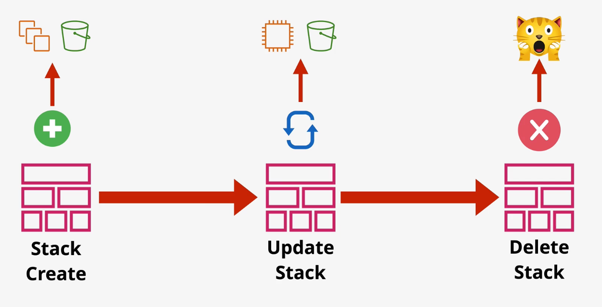

# CloudFormation

`CloudFormation templates` can be written in YAML or JSON.

Templates are used to create one or more CloudFormation `stacks`. The goal of the template is to create physical resources from the logical definition of the resource.

CloudFormation contains logical resources. In a CloudFormation template, you define what needs to be created, and the CloudFormation services determines how to create them.

When a CloudFormation template is deployed, the logical resources in the template are now tied to the physical resources that were created. Therefore, if the logical resources within a template are changed (deleted), the physical resources are changed (deleted) as well.



## Parameters

CloudFormation supports parameters sourced from SSM.

```yaml
Parameters:
  LatestAmiId:
    Description: "AMI for EC2"
    Type: 'AWS::SSM::Parameter::Value<AWS::EC2::Image::Id>'
    Default: '/aws/service/ami-amazon-linux-latest/amzn2-ami-hvm-x86_64-gp2'
```

## Intrinsic Function

The `!GetAZs` returns a list of AZs in the current region. The function accepts an optional parameter to specify a different region.

The `!Select` function returns an object from a list.

*Caption (below): Using `GetAZs` and `Select` to select an AZ.*
```yaml
Instance:
    Type: 'AWS::EC2::Instance'
    Properties:
        AvailabilityZone: !Select [0, !GetAZs 'us-east-1']
```

The `!Split` function splits a single String into a list of Strings based on some delimiter.

The `!Join` function concatenates a list of individual Strings into one String.

The `!Base64` function base64-encodes plain text. This is especially useful when defining `UserData` within an EC2 instance.

The `!Sub` function substitutes variables into the input. The `!Sub` function cannot be used to reference itself.

```yaml
UserData:
    Fn::Base64: !Sub |
        #!/bin/bash -xe
        yum -y update
```

The `!Cidr` function returns an array of CIDR address blocks based on the `count` parameter.

## Mappings

CloudFormation templates support a `Mappings` section which allows for a key-value pair map that can be used to lookup values based on input.

```yaml
Mappings:
    RegionMap:
        us-east-1:
            HVM64: 'ami-0'
            HVMG2: 'ami-1'
        us-west-1:
            HVM64: 'ami-2'
            HVMG2: 'ami-3'
        eu-west-1:
            HVM64: 'ami-4'
            HVMG2: 'ami-5'
```
*Caption (above): Defines a `RegionMap` that defines a top level key corresponding to the AWS region. It also defines second-level keys based on the architecture set of the AMI.*

```yaml
!FindInMap ['RegionMap', !Ref 'AWS::Region', 'HVM64']
```
*Caption (above): The `FindInMap` intrinsic function can be used to get information out of the map.*

## Outputs

CloudFormation templates support the use of optional *Outputs*. Values can be declared in the Outputs section. By doing so, they become visible as outputs in the CLI and console UI. 

Outputs are also accessible from a parent stack when using Nested Stacks.

Outputs can be exported, allowing for cross-stack references.

```yaml
Outputs:
    WordPressUrl:
        Description: "Instance Web URL"
        Value: !Join ['', ['https://', !GetAtt Instance.DNSName]]
```