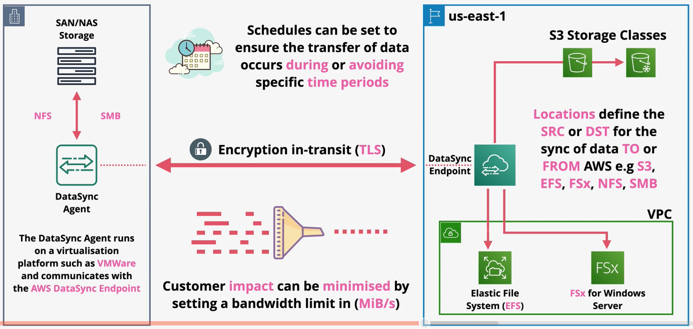

# AWS DataSync

AWS DataSync is a service that enables data transfer into and out of AWS.

DataSync can be used for migrations, data processing transfers, archival, cost-effective storage, or DR/BC.

DataSync is designed to work at huge scales (e.g., 10 Gbps per agent). The service supports `bandwidth limiters` to artificially limit the throughput of an agent to avoid link saturation.

DataSync will preserve metadata (e.g., permissions and timestamps).

The DataSync agent runs on a virualization platform (e.g., VMWare) and communicates with the `AWS DataSync Endpoint`. The DataSync agent is capable of accessing data via `NFS` (Linux) or `SMB` (Windows).

A DataSync `task` is a job within DataSync that defines the data being synced, how quickly, from where, and to where.

The DataSync `agent` is software used to read or write to on-prem data stores using `NFS` or `SMB`.

Every DataSync task has at two `locations` - one FROM and one TO.

**Key Features**:
- 'Data validation` in which the data is validated after it is migrated.
- `Incremental` and `scheduled` transfer options
- `Compression`
- `Encryption`
- `Automatic recovery` from transit errors
- AWS service integration (e.g., S3, EFS, FSx)
- Pay per GB transferred

