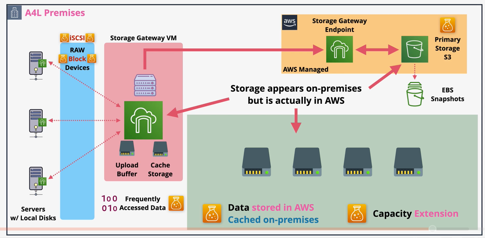

# Storage Gateway

Storage Gateway is a family of services that can be used to assist in cloud migrations, extending on-prem storage into the cloud, storage tiering, disaster recovery, and replacement of backup systems.

A Storage Gateway is typically run on an on-prem VM, but can also be run as a hardware appliance.

Storage gateway presents storage using `iSCSI`, `NFS` (Linux environments), or `SMB` (Windows environments) and writes data to EBS, S3, and Glacier within AWS.

Storage Gateway is made up of three types of gateways:
- [Storage Gateway - Volume Gateway](#volume-stored)
- [Storage Gateway - Tape Gateway](#tape-gateway)
- [Storage Gateway - File Gateway](#file-gateway)

## Volume Stored

On-prem servers typically use the `iSCSI` protocol for network block storage on a `Network Attached Storage` (NAS) device.

A `Volume Gateway` can be used to replace on-prem NAS/SAM devices. Volume gateway presents NAS/SAM compliant devices to be used by on-prem servers, exactly the same way they would for on-prem NAS servers.

Storage gateway (volume) runs in two modes:
- [Stored Mode](#stored-mode)
- cached mode

### Stored Mode

In stored mode, all data is stored locally. All data written locally is also written to the `upload buffer`. Once on the upload buffer, the data is asynchronously copied as `EBS snapshots` into S3 via the public `Storage Gateway Endpoint`.

Storage gateway volume stored mode should be used for:
- Full disk backups of servers
- Assist with disaster recovery by creating EBS volumes from the EBS snapshots

**Stored mode does not improve database capacity.** All data is stored locally!

### Cached Mode

Volume gateway `cached mode` shares the same basic architecture as stored mode, but the primary location of the data is no longer on-prem. Instead, all data is stored in an AWS-managed part of `S3` (cannot be viewed from the console).

The only data that is stored locally (`cached`) is the frequently accessed data.

Cached mode can be used for `data-center extension`, in which all data is stored in S3, but accessed as if it were on-prem.

### Stored vs Cached Mode

Stored and Cached mode of a Volume Gateway share some similarities.
- In both modes, a Storage Gateway is deployed on-prem as a VM or hardware appliance. The Gateway is a iSCSI device that provides `raw block storage` over a network.
- In both modes, an `upload buffer` is used to temporarily hold day until it is `asynchronously` copied to S3.
- In both modes, the data is copied via the public Storage Gateway `endpoint`.
- In both modes, data is stored as an `EBS snapshot`. New EBS volumes can be created from the snapshots in the event of a disaster.

Storage and Cached mode differ in other ways:

| Stored Mode | Cached Mode |
| --- | --- |
| All data is stored locally. Data is backed up to the cloud. | All data is stored in S3. Only frequently accessed data is cached locally. |
| Data is stored in a customer-managed S3 bucket. | Data is stored in an AWS-managed S3 bucket. |
| Does not increase the capacity of a data center. | Increases the capacity of a data center. |
|  All data is accessed quickly since it is stored locally. | Only cached data is accessed quickly. |

## Tape Gateway

## File Gateway