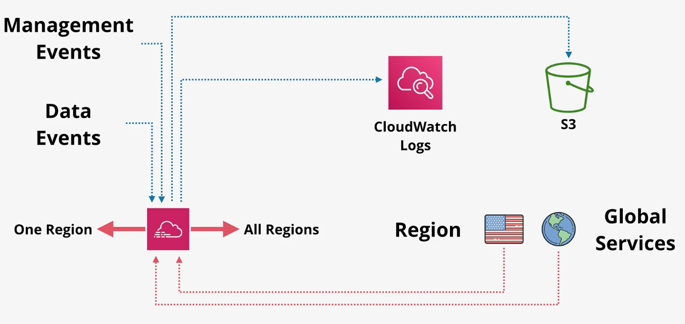

# CloudTrail

AWS CloudTrail monitors and records account activity across your AWS infrastructure, giving you control over storage, analysis, and remediation actions.

A `CloudTrail event` is a single API call or activity within your API call (e.g., Create S3 bucket).

CloudTrail automatically stores event history for 90 days for no cost. In order to store events longer, you must create one or more `CloudTrail trail`.

CloudTrail trails can be configured to support one event type:
- Management events: provide information about control-plane operations (e.g., creating/terminating an EC2 instance).
- Data events: provide information about events within a resource (e.g., accessing an object in an S3 bucket).
- Insight events

By default, only management events are logged.

CloudTrail is a regional service that, by default, only logs events within region. CloudTrail trails can be configured to log for one region, or for all regions.

In addition to regional events, a CloudTrail trail can be enabled to log global service events (i.e., CloudFront, IAM, STS).

A trail can export events in a standard format to S3 or CloudWatch Logs. CloudWatch metric filters can then be used to analyze CloudTrail logs.

CloudTrail supports the concept of `Organization` trails in which you can configure trails for every account in the AWS Organization.

CloudTrail typically publishes events within 15 minutes of activity. There is no way to get realtime logging.

By default, CloudTrail is enabled on the account for management events only without any trails configured.

## Pricing

You can view, filter, and download the most recent 90 days of your account activity for all management events in supported AWS services at no cost. Additional copies of management events are charged $2.00 per 100,000 events.

Data events are recorded only for Lambda functions and S3 buckets you specify and are charged at $0.10 per 100,000 events.