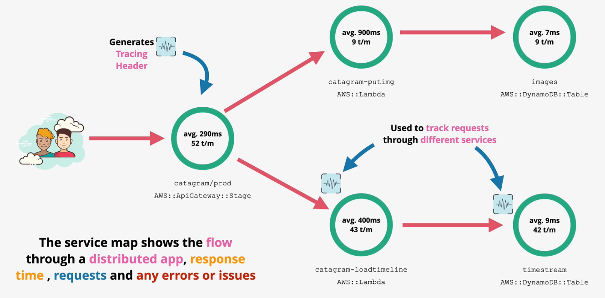

# X-Ray

`X-Ray` is a distributed tracing service.

On the first component in a distributed application, a `tracing header` is generated and used to track a request across all the components in a distribution applications.

Supported services send data in the X-Ray service in the form of `segments`. Segments are data blocks consisting of host/ip, request, response, work completed, and issues like exceptions. `Subsegments` can also be used to specify more granular data such as URLs for calls to another dependent service.

The X-Ray `service graph` is a JSON document detailing services and resources which make up your application. The service graph can be visualized on the AWS console, which is known as a `service map`.

In order to send segments to the X-Ray service, the X-Ray agent must be installed and the service must have permissions to publish segments using an IAM role.
- EC2: X-Ray agent must be installed
- ECS, Lambda, Beanstalk, API Gateway, SNS, SQS: X-Ray agent is preinstalled

