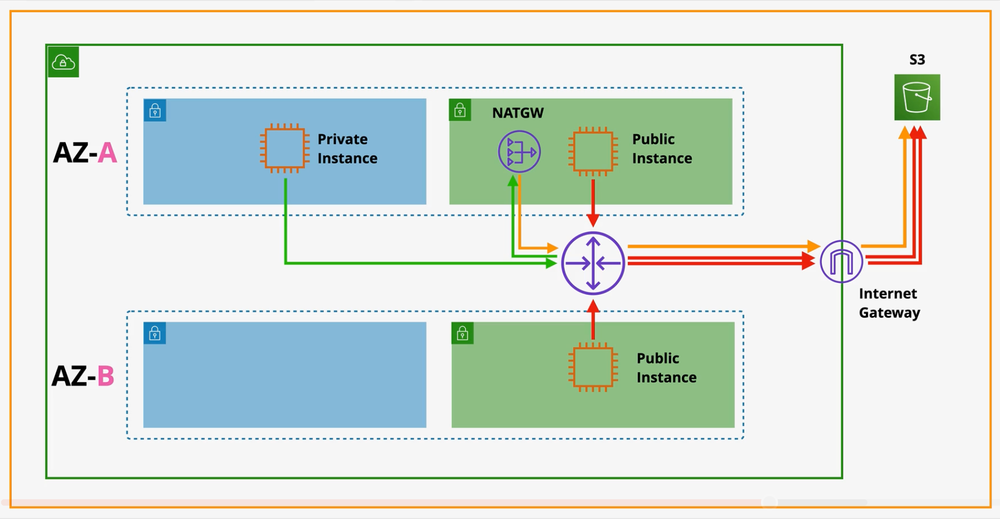
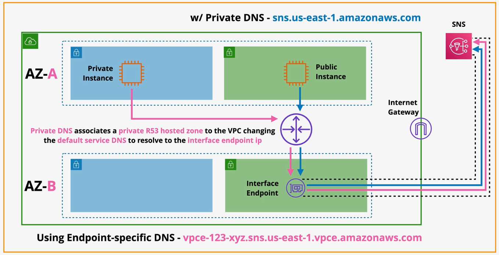
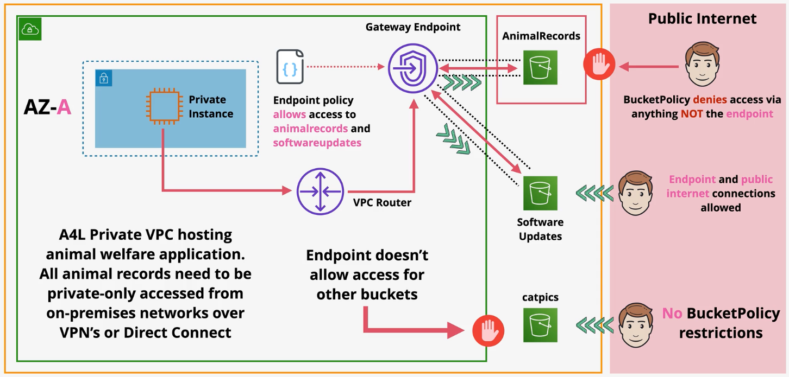
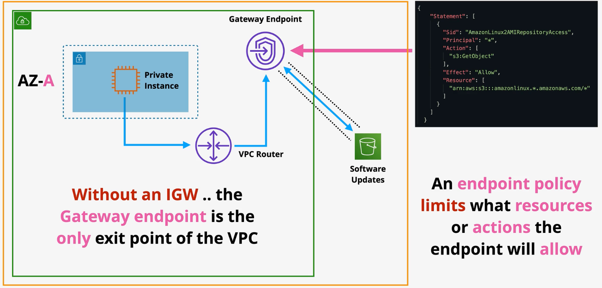
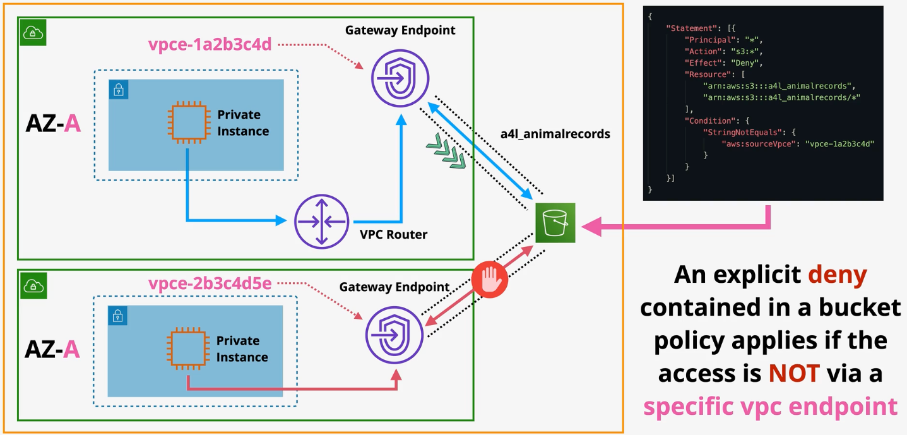

# Gateway Endpoints

`Gateway endpoints` provide private access to in-region S3 and DynamoDB, without traversing the public internet.

When you provision a gateway endpoint, a `prefix list` is added to the VPC route table that points to the endpoint.

By default, gateway endpoints are highly available across all AZs in a region.

Gateway endpoints only give access to regional services. Gateway endpoints cannot be used to access cross-region services.

When you create an interface endpoint or a gateway endpoint, you can attach an `endpoint policy`. The endpoint policy controls which AWS principals can use the VPC endpoint to access the endpoint service.

*Caption: S3 access without a gateway endpoint.*

*Above: Without Gateway endpoints, S3 must be accessed over the public internet.*  
- *Public subnets, which have a route to an IGW, can access via the public S3 URL.*  
- *Private subnets must be connected to a NATGW in the public subnet to be forwarded to the IGW.*  

*Caption: S3 access with a gateway endpoint.*

*Above: After a gateway endpoint is provisioned pointing to S3, prefixes are added to the route table in a private subnet allowing resources in the private subnet to access S3 without going through the public internet.*

Use cases:
- Prevent S3 data leakage: By provisioning a gateway endpoint pointed to S3 and updating the S3 bucket policy to only allow access from the gateway endpoint, you can ensure that S3 buckets are only accessible to authorized principals.
- Avoid accessing DynamoDB or S3 over the public internet.

# Interface Endpoints

`Interface endpoints` allow private access to public AWS services.

Interface endpoints can be used to provide access to all AWS services except DynamoDB. This means that Gateway endpoints or Interface endpoints can be used to access S3.

Interface endpoints add an `ENI` to specific subnets. Therefore, by default, interface endpoints are not highly available.

For a highly available solution, add one endpoint to at least one subnet in every AZ used in the VPC.

Interface endpoints support security groups to control network access. Additionally, endpoint policies can be used to restrict what principals can use the endpoint.

Interface endpoints support TCP and IPv4 only (does not support IPv6).

Under the covers, interface endpoints are built using AWS PrivateLink.

Interface endpoint provides several service endpoint domain names (*e.g., vpce-123-xyz.sns.us-east-1.vpce.amazonaws.com*).
 - The `regional domain name` can be used to access the interface in the region.
 - The `zonal domain name` can be used to point to a specific AZ.

Applications can optionally use the regional/zonal domain to access the endpoint, or they can use `PrivateDNS`.

`PrivateDNS` associates a Route53 private hosted zone with the VPC. This action overrides the default DNS for services like S3. As a result, applications require no code changes to use interface endpoints.

*Caption (below): SNS access without an interface endpoint*

- *By default, resources in private subnets cannot access public resources to public AWS services like SNS without a path (e.g., NATGW).*
- *Resources in a public subnet can access public services like SNS by using the regional service domain name (e.g., sns.us-east-1.amazonaws.com) over the public internet.*

Introducing an interface endpoint to access public AWS services improves security as well as simplifies access for resources in private subnets.

*Caption (below): SNS access with an interface endpoint*

- *Interface endpoints use DNS to access public AWS services. Applications can access the service via the interface endpoint domain names or by enabling the PrivateDNS feature.*

# Gateway vs Interface Endpoints

| | Gateway Endpoint | Interface Endpoint |
| --- | --- | --- |
| Highly Available | Yes | Not by default |
| Resolution Strategy | Route tables to direct traffic | DNS |
| Support | S3 and DynamoDB | All public AWS services except DynamoDB. |

# Endpoint Policies

*Caption: Example of how an endpoint policy can be applied to a Gateway Endpoint to control which S3 buckest can be accessed.*

- *Resources in the private subnet can access S3 through the gateway endpoint.*
- *The endpoint policy applied to the gateway endpoint restrict access to the AnimalRecords and SoftwareUpdates buckets only. The catpics bucket is not available through the endpoint.*
- *Principals with the appropriate permissions can still access the buckets from the public internet.*
- *The AnimalRecords bucket policy prevents any access from outside the endpoint.*

*Caption: A gateway endpoint is the only egress point from a subnet, ensuring resources can only access approved buckets.*

Endpoint policies can be referenced in the S3 bucket policy to restrict access to only traffic coming from the endpoint.

*This bucket policy ensures that all traffic from outside the vpc endpoint is denied.*

There are two common terms that will be used to control traffic within a policy:
- `aws:sourceVpce` - used when doing conditional matches for VPC endpoints.
- `aws:sourceIp` - used to match *external* IP addresses. This will not work for private IP addresses.