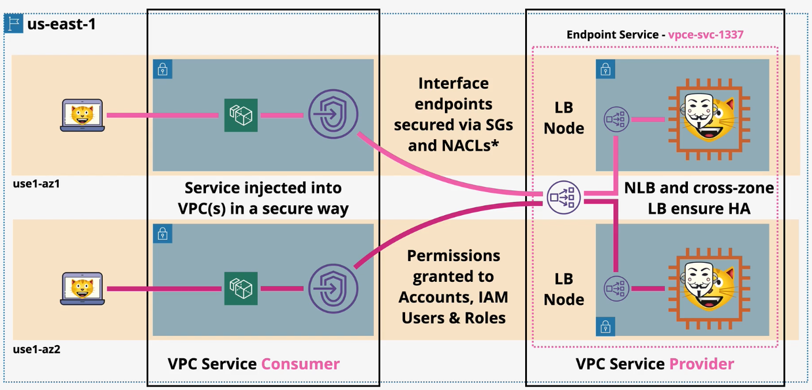

# AWS Private Link

AWS PrivateLink provides private connectivity between VPCs, AWS services, and your on-premises networks, without exposing your traffic to the public internet.

Interface VPC endpoints, powered by AWS PrivateLink, connect you to services hosted by AWS Partners and supported solutions available in AWS Marketplace.

To ensure a service is highly available, it should be provided via multiple endpoints.

Features:
- IPv4 & TCP only (IPv6 is not supported)
- Private DNS is supported
- Private link resources can be accessed over Direct Connect, S2S vPN, and VPC Peering.

