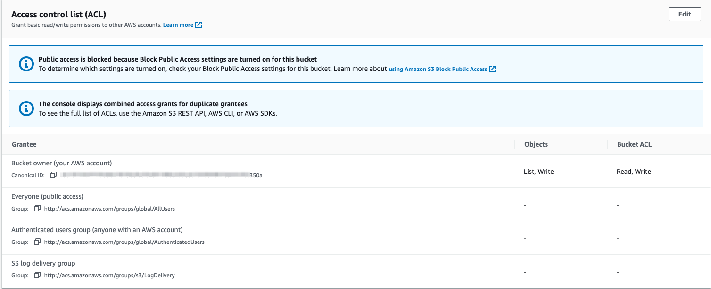

# S3 - Cross Account Access

There are three ways to grant access to S3 buckets across AWS accounts.
- [Bucket and Object ACLs](#bucket-and-object-acls)
- [Bucket Policies](#bucket-policies)
- [Assume Role](#assume-role)

## Bucket and Object ACLs

Bucket ACLs enable you to manage access to buckets and objects. Each bucket and object has an ACL attached to it as a subresource. It defines which AWS accounts or groups are granted access, and the type of access.

> Bucket ACLs are a legacy concept that is no longer recommended by AWS.

Bucket ACLs cannot be used to manage access within the same AWS account as the bucket.



Bucket ACLs grant access based on Cononical Account IDs (a legacy account identifier). The *Account canonical user ID* can be found on the *Security Credentials* console.

By adding a target account's canonical user id to a bucket or object's ACL, you can grant access to that account.

## Bucket Policies

A *bucket policy* is a resource-based policy that you can use to grant permissions to your bucket and the objects in it.

Bucket Policy permissions do not apply to objects owned by other AWS accounts.

```json
{
  "Version": "2012-10-17",
  "Statement": [
      {
          "Effect": "Allow",
          "Principal": {
              "AWS": "arn:aws:iam::1234567890:user/iamadmin"
          },
          "Action": [
              "s3:GetObject",
              "s3:PutObject",
              "s3:PutObjectAcl",
              "s3:ListBucket"
          ],
          "Resource": [
              "arn:aws:s3:::<bucket-name>/*",
              "arn:aws:s3:::<bucket-name>"
          ]
      }
  ]
}
```
*Caption: Bucket policy granting S3 access to the iamadmin user in the 1234567890 account.*

## Assume Role

S3 across-account access can also be setup using IAM roles.

Generally, cross account access using assume role looks like:

- The bucket exists in account A. 
- An IAM role exists in account A that has permissions to the S3 bucket. This IAM role grants trust permissions to another AWS account B.  
- An identity within B can assume the role and operate on the S3 bucket.  

The IAM role must grant `sts:AssumeRole` permissions to an identity in the other AWS account, or delegate access via the account root.

```json
{
    "Version": "2012-10-17",
    "Statement": [
        {
            "Effect": "Allow",
            "Principal": {
                "AWS": "arn:aws:iam::1234567890:root"
            },
            "Action": "sts:AssumeRole"
        }
    ]
}
```
*Caption: Trust policy that grants the `sts:AssumeRole` permissions to the 1234567890 account.*

## Object Ownership

When S3 ACLs are enabled, bucket owners can choose the preferred object ownership strategy.

.

- **Bucket owner preferred** - if new objects written to the bucket specify the bucket-owner-full-control canned ACL, they are owned by the bucket owner. Otherwise, they ware owned by the object writer.
- **Object writer** - The object writer remains the object owner.

If the assume role strategy is being used for object writers, then the objects will be owned by the bucket account.

## Policy Evaluation

All relevant policies are considered when evaluating access to a bucket or objects including:
- Organizational SCP
- Bucket Policy or ACLs
- IAM Permission Boundaries
- Session Policies
- Identity Policies

Given an *effective policy* (the product of all relevant policy statements), access evaluation will follow these steps:

| Step # | Condition | Result if condition satisfied |
| --- | --- | --- |
| 1 | Check for explicit deny | DENY |
| 2 | Check for explicit allow | ALLOW |
| 3 | Implicit Deny | DENY |

When the request is coming from another AWS account, an explicit ALLOW is required from the bucket account *and* from the other AWS account.