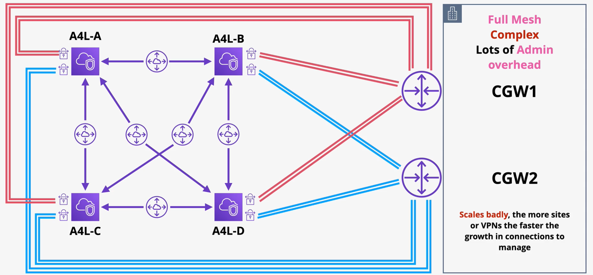
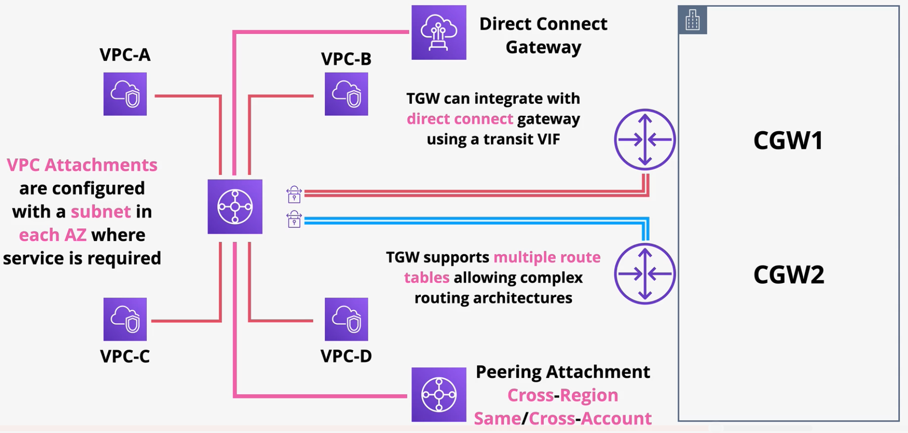

# Transit Gateway

Due to the fact that VPN connections are not transitive, even moderately complex networks require a lot of connections between disparate networks.

This solution has several drawbacks:
1. Requires a lot of administrative overhead
2. Its not scalable

The **AWS Transit Gateway** allows all these networks to connect to each other without the complexity of individual connections. The **transit gateway (TGW)** is a network transit hub to connect VPCs to on-prem networks.

A transit gateway can be attached to multiple networks, including VPCs, S2S VPNs, and Direct Connect Gateways via attachments. 

VPC attachments are configured with a subnet in each AZ where the service is required.

Transit gateways support up to 50 peering attachment across different regions and accounts.

**VPC Peering Attachments**:
- VPCs can be peered together using transite gateways.
- VPC peering attachments do not support route propagation. Instead, static routes must be used.
- VPCs that are peered should use unique ASNs.
- Public IPs do not resolve to private IPs over a peer connection.
- Cross-region data is encrypted across a peering connection.

**Route Tables**:
- By default, transit gateways have one route table. All attachments use this route table for routing decisions.
- Attachments can only be associated with a single route table, but route tables can be associated with many attachments.
- Attachments can propagate to many route tables, even when not associated to the route table.

Summary:
- Transit gateway supports transitive routing
- Transit gateway can be used to create global networks
- Transit gateways can be shared between accounts using AWS RAM
- Transit gateways can be used to peer networks in different regions in the same or different accounts.
- Transit gateway offers much less complexitiy vs a solution without a transit gateway.