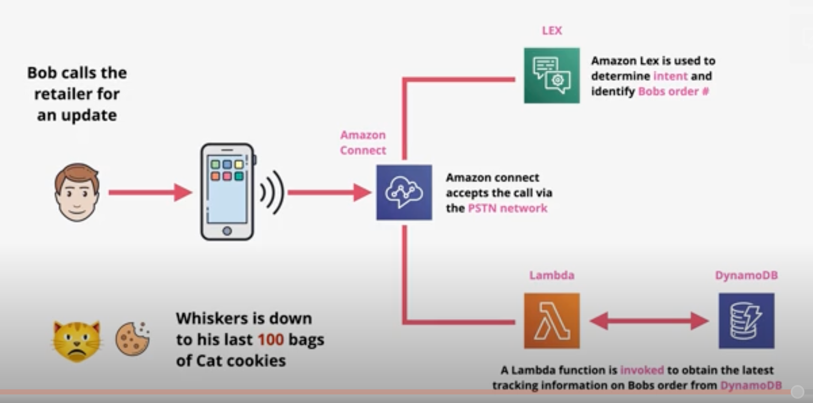
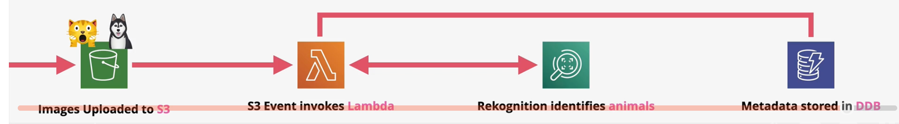
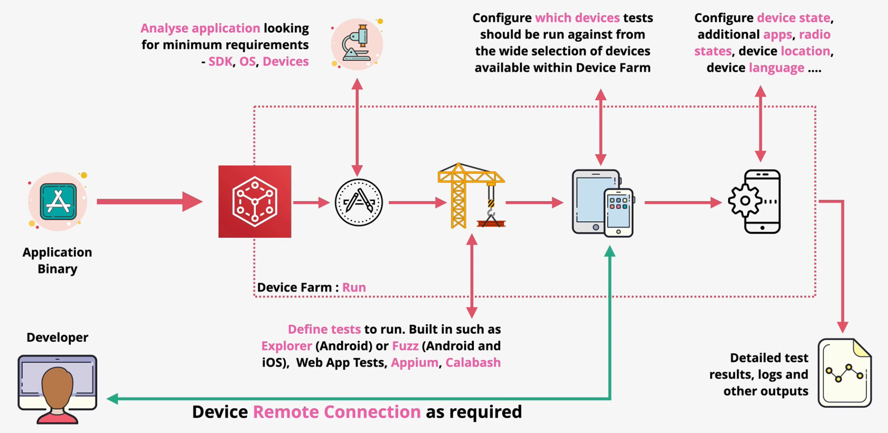
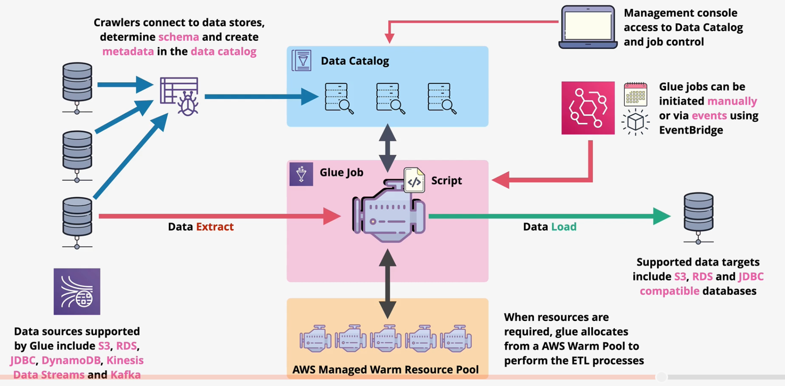

# Lex

Lex provides text or voice conversational interfaces (e.g., Alexa).

Lex provides `automatic speech recognition` (ASR) (speech to text) and `Natural Language Understanding` (NLU) which can decode intent from data.

Lex allows you to integrate ASR and NLU into your products. Lex scales, integrates, and is quick to deploy.

Lex can be used for chatbots, voice assistants, or Q&A bots.

# Amazon Connect

Amazon Connect is a cloud-based `contact service` as a service. It integrates with `PSTN` networks for the traditional voice experience. Agents can connect using the public internet from anywhere.

Amazon Connect can integrate with others AWS services (e.g., Lambda/LEX) for additional requirements.

*Caption (below): An example architecture for a call center that automatically retrieves order information.

# AWS Rekognition

Rekognition is a `deep-learning` image and video analysis service.

Rekognition can identify objects, people, text, activities, content moderation, face detection, face analysis, face comparison, pathing, and much more.

Rekognition is charged per image or per minute (video).

Applications can integrate with Rekognition via APIs or using event-driven architectures.

Rekognition can analyze live video when paired with Kinesis Video Streams.

# Device Farm

Device Farm provides managed web and mobile application testing.

Users can test on a fleet of real browsers and devices, including mobile phones, tablets, various languages, sizes, and operating systems.

Device Farm supports built-in or supported automated testing frameworks.

Device Farm can output detailed testing reports.

Device Farm supports remote connection to devices for issue reproduction and testing.

AWS provides all the devices so your company does not need to.

# Glue

AWS Glue is a serverless extract, transform, and load (ETL) service based on `Apache Spark`. This is in contract to a "server-full" data pipeline product like EMR.

Glue moves and transforms data between a source and destination.

The `Glue crawler` can crawl data sources, automatically identify the schema, and create Glue catalog tables.

Glue can automatically connect to S3, RDS, JDBC-compatible databases, and DynamoDB. It can also connect to streaming services such as Kinesis data streams and Apache Kafka.

Glue can automatically connect to S3, RDS, and JDBC-compliant databases as targets.

The `Glue Catalog` provides one default catalog per region per account. Data catalogs are great for avoiding data silos.

