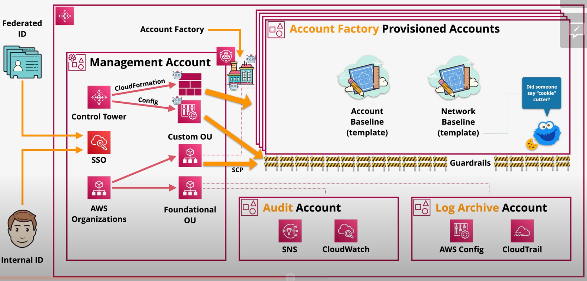

# AWS Control Tower

If you have multiple AWS accounts and teams, cloud setup and governance can be complex and time consuming, slowing down the very innovation you’re trying to speed up. 

AWS Control Tower provides the easiest way to set up and govern a secure, multi-account AWS environment, called a landing zone. It creates your landing zone using AWS Organizations, bringing ongoing account management and governance as well as implementation best practices based on AWS’s experience working with thousands of customers as they move to the cloud.

There are several concepts in AWS Control Tower:
- The `landing zone` facilitates the creation of a well-architected multi-account environment.
- `Guard rails` are used to detect and mandate standards across all of your AWS accounts.
- The `account factory` automates and standardizes new account creation.
- The `home region` is the default Region where resources in your shared accounts will be provisioned.
- The `Region deny` feature prohibits access to AWS services based on your AWS Control Tower Region configuration. It denies access to AWS Regions with status `Not governed`.
- The `Security OU` is an AWS OU consisting of the `Log Archive` and `Audit` accounts.
- The `Sandbox OU` consists of test environments with less rigid security configuration.

AWS Control Tower uses IAM Identity Center (formerly AWS SSO) to support federated logins to your AWS accounts.

Guard rails can be *mandatory*, *strongly recommended*, or *elective*. 

Guard rails can be preventative - preventing you from doing certain things within your AWS Organization via a service control policy (SCP).

Guard rails can also be detective - detecting violations in your AWS accounts via AWS Config. Detective guard rails can be in `clear`, `in violation`, or `not enabled` status.

Guard rails can be automatically applied to accounts created from the account factory.

The account factory can close or repurpose accounts within the AWS Organization. 

*Caption (above): AWS Control Tower creates two foundational OUs: Sandbox and Security. In each OU, it creates two accounts: the Audit account is used for multi-account monitoring and notifications and the Log Archive account is used to aggregate logs from all accounts in the OU. In addition, users can define custom OUs and accounts.*