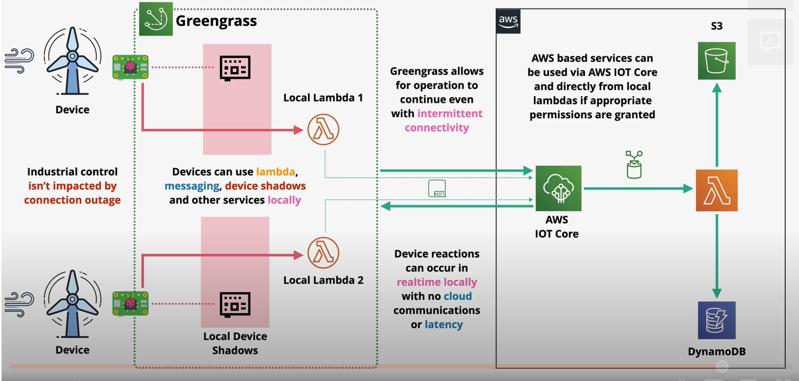

# AWS Greengrass

AWS Greengrass extends some AWS services to the edge, including compute, messaging, data management, sync and ML capabilities.

This allows developers to run Lambda, containers, IOT device shadows, messaging, and hardware access locally.

Greengrass enables device reactions to occur in realtime without potentially unreliable cloud communications or latency.

